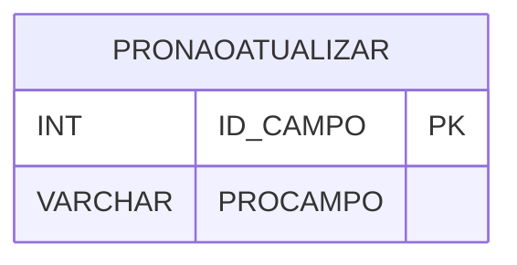

# PRONAOATUALIZAR - Documentação Completa de Relacionamentos

## 📊 Informações Gerais

- **Nome da Tabela**: PRONAOATUALIZAR (Produto Não Atualizar)
- **Total de Registros**: 76
- **Total de Colunas**: 2
- **Chave Primária**: ID_CAMPO
- **Chaves Estrangeiras**: 0
- **Índices**: 0
- **Tabelas Dependentes**: 0
- **Banco de Dados**: Firebird

## 📝 Descrição

**PRONAOATUALIZAR** é uma tabela de configuração que armazena campos de produtos que não devem ser atualizados automaticamente. Com **76 registros**, esta tabela define quais campos de produtos devem ser protegidos contra atualizações automáticas.

Esta tabela é essencial para:
- **Configuração**: Definir campos protegidos
- **Integridade**: Proteger campos importantes contra atualizações
- **Rastreamento**: Rastrear campos protegidos
- **Manutenção**: Facilitar manutenção de configurações

---

## 🔑 Estrutura de Colunas

| Coluna | Tipo | Descrição |
|--------|------|-----------|
| **ID_CAMPO** 🔑 | INT | Identificador único do campo (PK) |
| **PROCAMPO** | VARCHAR(37) | Nome do campo protegido |

---

## 🗺️ Diagrama de Relacionamentos



---

## 💡 Exemplos de Uso

### Consulta Básica

```sql
SELECT ID_CAMPO, PROCAMPO
FROM PRONAOATUALIZAR
WHERE ID_CAMPO = ?;
```

### Verificar se Campo Está Protegido

```sql
SELECT COUNT(*) 
FROM PRONAOATUALIZAR
WHERE PROCAMPO = ?;
```

---

## ⚡ Performance e Otimização

### Índices Recomendados

#### 1. Índice em PROCAMPO
```sql
CREATE INDEX IDX_PRONAOATUALIZAR_CAMPO 
ON PRONAOATUALIZAR (PROCAMPO);
```

**Justificativa:** Facilita verificações rápidas se um campo está protegido.

---

## 📊 Estatísticas e Insights

- **Total de Registros**: 76
- **Campos Protegidos**: 76 campos protegidos contra atualização

---

**Documentação gerada em**: 2025-01-27

**Banco de dados**: Firebird

