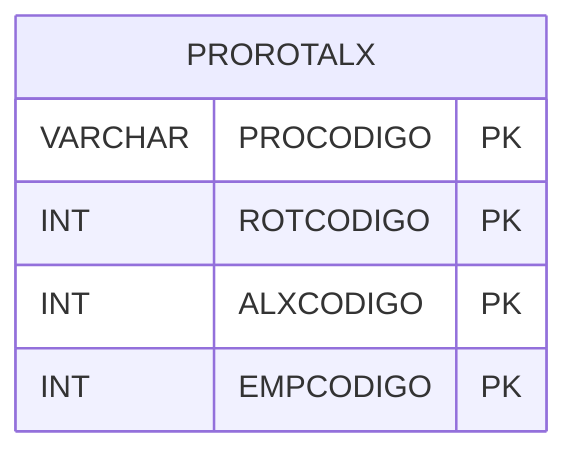

# PROROTALX - Documentação Completa de Relacionamentos

## 📊 Informações Gerais

- **Nome da Tabela**: PROROTALX (Produto Rota AlmoX)
- **Total de Registros**: 1.336.457
- **Total de Colunas**: 4
- **Chave Primária**: PROCODIGO, ROTCODIGO, ALXCODIGO, EMPCODIGO (composite)
- **Chaves Estrangeiras**: 0
- **Índices**: 0
- **Tabelas Dependentes**: 0
- **Banco de Dados**: Firebird

## 📝 Descrição

**PROROTALX** é uma tabela de relacionamento que associa produtos com rotas e almoxarifados por empresa. Com **1.336.457 registros**, esta tabela registra quais produtos estão disponíveis em quais rotas e almoxarifados para cada empresa.

Esta tabela é essencial para:
- **Rotas**: Gerenciar produtos por rota
- **Almoxarifados**: Gerenciar produtos por almoxarifado
- **Rastreamento**: Rastrear produtos por rota e almoxarifado
- **Relatórios**: Gerar relatórios de produtos por rota e almoxarifado

---

## 🔑 Estrutura de Colunas

| Coluna | Tipo | Descrição |
|--------|------|-----------|
| **PROCODIGO** 🔑 | VARCHAR(14) | Código do produto (PK) |
| **ROTCODIGO** 🔑 | INT | Código da rota (PK) |
| **ALXCODIGO** 🔑 | INT | Código do almoxarifado (PK) |
| **EMPCODIGO** 🔑 | INT | Código da empresa (PK) |

---

## 🗺️ Diagrama de Relacionamentos



---

## 💡 Exemplos de Uso

### Consulta Básica

```sql
SELECT PROCODIGO, ROTCODIGO, ALXCODIGO, EMPCODIGO
FROM PROROTALX
WHERE PROCODIGO = ?;
```

---

## ⚡ Performance e Otimização

### Índices Recomendados

#### 1. Índice Composto na Chave Primária (Já existe implicitamente)
```sql
-- Índice primário já existe implicitamente
```

#### 2. Índice em PROCODIGO
```sql
CREATE INDEX IDX_PROROTALX_PROCODIGO 
ON PROROTALX (PROCODIGO);
```

**Justificativa:** Facilita buscas por produto (crítico devido ao volume).

---

## 📊 Estatísticas e Insights

- **Total de Registros**: 1.336.457
- **Tamanho Total Estimado**: ~53 MB

---

**Documentação gerada em**: 2025-01-27

**Banco de dados**: Firebird

