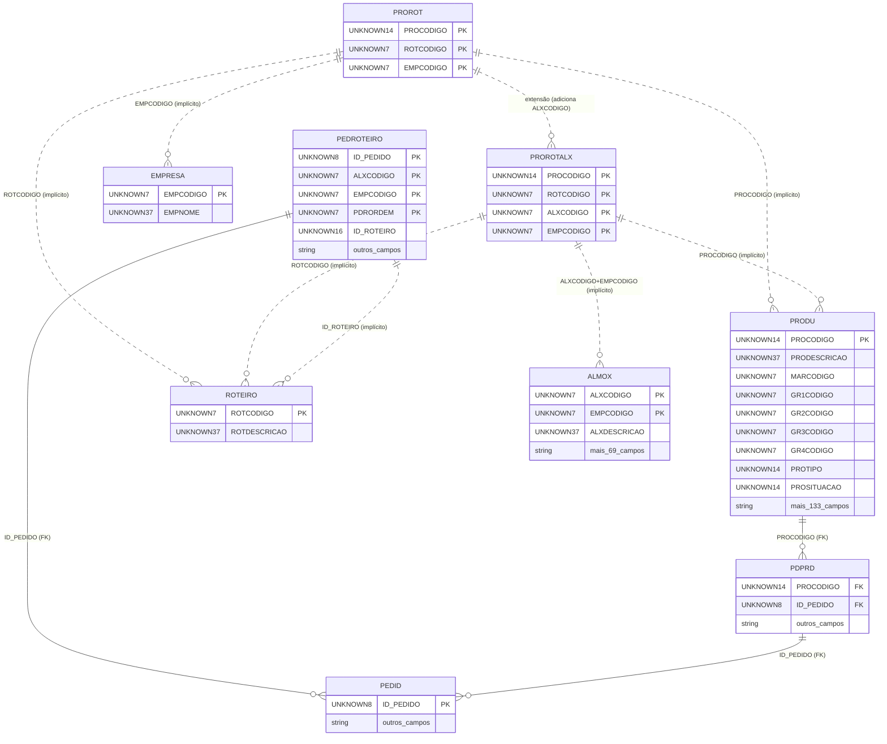

# Documentação Completa: Tabela PROROT

**Fonte:** Schema do Banco de Dados Firebird
**Tabela:** PROROT (Produtos x Roteiros)
**Versão:** 1.0
**Data:** 2025-11-09

---

## 📋 Índice

1. [Visão Geral](#visão-geral)
2. [Estrutura da Tabela](#estrutura-da-tabela)
3. [Relacionamentos Formais (Foreign Keys)](#relacionamentos-formais)
4. [Relacionamentos Implícitos](#relacionamentos-implícitos)
5. [Tabelas Relacionadas Detalhadas](#tabelas-relacionadas-detalhadas)
6. [Fluxos de Relacionamento Multi-Nível](#fluxos-multi-nível)
7. [Exemplos de Consultas](#exemplos-de-consultas)
8. [Diagrama de Relacionamentos](#diagrama-de-relacionamentos)
9. [Observações Importantes](#observações-importantes)

---

## 📊 Visão Geral

A tabela **PROROT** é uma **tabela de relacionamento N:N** (muitos-para-muitos) que associa **PRODUTOS** (PRODU) aos **ROTEIROS** de produção que podem ser utilizados para fabricá-los.

### Estatísticas

- **Total de Registros:** 1.337.661 (1,3 milhões)
- **Número de Colunas:** 3 (tabela minimalista)
- **Primary Key:** Composta (PROCODIGO, ROTCODIGO, EMPCODIGO)
- **Foreign Keys Out:** 0 (sem FK formais)
- **Foreign Keys In:** 0 (sem FK formais)
- **Índices:** Nenhum além da PK

### Conceito: Tabela de Relacionamento

PROROT implementa o padrão de **tabela associativa** para resolver o relacionamento muitos-para-muitos:

```
PRODU (1 produto)  ←→  PROROT  ←→  ROTEIRO (1 roteiro)
   (N produtos)             (N:N)        (N roteiros)
```

**Significa:**
- Um produto pode ter múltiplos roteiros de produção
- Um roteiro pode ser usado por múltiplos produtos
- PROROT armazena cada combinação produto + roteiro

---

## 🏗️ Estrutura da Tabela

### Primary Key (Composta - 3 Campos)

A chave primária é composta por **3 campos**, garantindo unicidade de cada combinação produto + roteiro + empresa:

| Campo | Tipo | Descrição |
|-------|------|-----------|
| **PROCODIGO** | UNKNOWN(14) | Código do Produto |
| **ROTCODIGO** | UNKNOWN(7) | Código do Roteiro |
| **EMPCODIGO** | UNKNOWN(7) | Código da Empresa |

### Colunas Detalhadas (3 Total)

| Nome | Tipo | Not Null | PK | Descrição |
|------|------|----------|----|-----------|
| 🔑 **PROCODIGO** | UNKNOWN(14) | ✓ | ✓ | Código do Produto (referência implícita a PRODU) |
| 🔑 **ROTCODIGO** | UNKNOWN(7) | ✓ | ✓ | Código do Roteiro (referência implícita a ROTEIRO) |
| 🔑 **EMPCODIGO** | UNKNOWN(7) | ✓ | ✓ | Código da Empresa |

**Observação:** Tabela extremamente simples, contendo **APENAS** a PK sem nenhum campo adicional.

---

## 🔗 Relacionamentos Formais (Foreign Keys)

### FK Out: Tabelas Referenciadas por PROROT

❌ **PROROT NÃO possui Foreign Keys formais** no schema.

### FK In: Tabelas que Referenciam PROROT

❌ **Nenhuma tabela** possui Foreign Key formal apontando para PROROT.

---

## 🔄 Relacionamentos Implícitos

PROROT possui relacionamentos **lógicos/implícitos** (sem constraint FK) com:

### 1. PRODU (Produtos)

**Relacionamento:** Via campo PROCODIGO

```
PROROT.PROCODIGO ··> PRODU.PROCODIGO
```

**Observações:**
- **NÃO há FK formal**, mas o relacionamento é evidente pela nomenclatura
- PRODU.PROCODIGO é a PK da tabela PRODU
- Tipos compatíveis: ambos UNKNOWN(14)

### 2. ROTEIRO (Tipos de Roteiro)

**Relacionamento:** Via campo ROTCODIGO

```
PROROT.ROTCODIGO ··> ROTEIRO.ROTCODIGO
```

**Observações:**
- **NÃO há FK formal**
- ROTEIRO é uma tabela mestre minimalista (apenas 2 registros)
- Tipos compatíveis: ambos UNKNOWN(7)

### 3. EMPRESA

**Relacionamento:** Via campo EMPCODIGO

```
PROROT.EMPCODIGO ··> EMPRESA.EMPCODIGO
```

**Observação:** Relacionamento lógico com tabela de empresas (multi-empresa).

---

## 📑 Tabelas Relacionadas Detalhadas

### 1. PRODU - Produtos (Relacionamento Implícito)

**Tipo de Relacionamento:** N:N (muitos produtos para muitos roteiros)

**Informações da Tabela:**
- **Total:** 178.184 produtos
- **PK:** PROCODIGO
- **Colunas:** 143 campos
- **FK Out:** Múltiplas (grupos, marcas, etc.)
- **FK In:** 101 tabelas diferentes

**Campos Principais (Selecionados):**

| Campo | Tipo | Descrição |
|-------|------|-----------|
| PROCODIGO | PK | Código único do produto |
| PRODESCRICAO | | Descrição do produto |
| MARCODIGO | | Marca |
| GR1CODIGO, GR2CODIGO, GR3CODIGO, GR4CODIGO | | Grupos hierárquicos |
| PROUN | | Unidade de medida |
| PROTIPO | | Tipo de produto |
| PROSITUACAO | | Situação (ativo/inativo) |
| PROCODIGOEAN | | Código de barras EAN |

**Categorias de Campos em PRODU:**
1. Identificação (código, descrição, EAN)
2. Classificação (marca, grupos, tipo)
3. Medidas físicas (peso, volume, dimensões)
4. Fiscal/Tributário (IPI, PIS, COFINS, ICMS)
5. Comercial (comissão, preço, garantia)
6. Produção (lote, serial, validade)
7. Técnicos específicos (óculos: grau, eixo, cilindro, etc.)

**Tabelas que Dependem de PRODU:** **101 tabelas**, incluindo:
- PDPRD (produtos de pedidos)
- ESTOQ (estoque)
- PRECO (preços)
- COMPO (composição de produtos)
- CLIPRO (produtos por cliente)
- E outras 96 tabelas

**Fluxo:**
```
PROROT.PROCODIGO ··> PRODU.PROCODIGO
```

### 2. ROTEIRO - Tipos de Roteiro (Relacionamento Implícito)

**Tipo de Relacionamento:** N:N (muitos produtos para muitos roteiros)

**Informações da Tabela:**
- **Total:** 2 registros (tabela mestre minimal)
- **PK:** ROTCODIGO
- **Colunas:** 2 (ROTCODIGO, ROTDESCRICAO)
- **FK Out:** 0
- **FK In:** 0

**Estrutura:**

| Campo | Tipo | Descrição |
|-------|------|-----------|
| ROTCODIGO | UNKNOWN(7) PK | Código do roteiro |
| ROTDESCRICAO | UNKNOWN(37) | Descrição do roteiro |

**Observação Crítica:**
- ROTEIRO tem apenas **2 registros**
- Tabela extremamente simples (lookup/master)
- Sem FKs formais (similar a PROROT)

**Fluxo:**
```
PROROT.ROTCODIGO ··> ROTEIRO.ROTCODIGO
```

### 3. PROROTALX - Produtos x Roteiros x Almoxarifados (Tabela Relacionada)

**Tipo de Relacionamento:** Extensão de PROROT

**Informações da Tabela:**
- **Total:** 1.336.457 registros (similar a PROROT: 1.337.661)
- **PK:** (PROCODIGO, ROTCODIGO, ALXCODIGO, EMPCODIGO)
- **Colunas:** 4
- **FK Out:** 0
- **FK In:** 0

**Estrutura:**

| Campo | Tipo | PK | Descrição |
|-------|------|----|-----------|
| PROCODIGO | UNKNOWN(14) | ✓ | Código do Produto |
| ROTCODIGO | UNKNOWN(7) | ✓ | Código do Roteiro |
| ALXCODIGO | UNKNOWN(7) | ✓ | Código do Almoxarifado/Célula |
| EMPCODIGO | UNKNOWN(7) | ✓ | Código da Empresa |

**Diferença de PROROT:**
- **PROROT:** Produto + Roteiro + Empresa (3 campos)
- **PROROTALX:** Produto + Roteiro + **Célula** + Empresa (4 campos)

**Interpretação:**
```
PROROT: "Este produto pode usar este roteiro"
PROROTALX: "Este produto pode usar este roteiro nesta célula específica"
```

**Relacionamento Implícito Adicional:**
```
PROROTALX.ALXCODIGO ··> ALMOX.ALXCODIGO
```

**Volumes Comparados:**
- PROROT: 1.337.661 registros
- PROROTALX: 1.336.457 registros
- Diferença: 1.204 registros

**Possível Explicação:**
- Maioria dos produtos tem roteiro especificado por célula (PROROTALX)
- Alguns produtos têm apenas roteiro genérico (PROROT sem célula)

### 4. ALMOX - Células/Almoxarifados (Relacionamento via PROROTALX)

**Tipo de Relacionamento:** Indireto via PROROTALX

**Informações da Tabela:**
- **Total:** 128 células/almoxarifados
- **PK:** (ALXCODIGO, EMPCODIGO)
- **Colunas:** 72 campos
- **FK In:** 15 tabelas

**Fluxo Indireto:**
```
PROROT → (conceito) → PROROTALX → ALMOX
```

Permite determinar em quais células um produto pode ser produzido usando determinado roteiro.

---

## 🌊 Fluxos de Relacionamento Multi-Nível

### Fluxo 1: Do Produto ao Roteiro (Relacionamento Principal)

```
PRODU (178k produtos)
    ↓ (PROCODIGO - implícito)
PROROT (1,3M combinações)
    ↓ (ROTCODIGO - implícito)
ROTEIRO (2 roteiros)
```

**Utilidade:**
- Determinar quais roteiros estão disponíveis para um produto
- Listar todos os produtos que usam um roteiro específico

### Fluxo 2: Do Produto às Células de Produção (via PROROTALX)

```
PRODU (178k produtos)
    ↓
PROROT (roteiro genérico)
    ↓ (conceito)
PROROTALX (roteiro + célula)
    ↓
ALMOX (128 células)
```

**Utilidade:**
- Identificar em quais células um produto pode ser fabricado
- Planejar capacidade de produção por célula

### Fluxo 3: Do Produto aos Pedidos (via PRODU)

```
PROROT
    ↓ (PROCODIGO)
PRODU (178k produtos)
    ↓ (FK via múltiplas tabelas)
PDPRD (produtos de pedidos)
    ↓
PEDID (3,1M pedidos)
    ↓
CLIEN (clientes)
```

**Via PRODU, PROROT conecta indiretamente a:**
- 101 tabelas dependentes de PRODU
- Pedidos (PDPRD → PEDID)
- Clientes (via PEDID → CLIEN)
- Estoque (ESTOQ)
- Preços (PRECO)
- Composição de produtos (COMPO)

### Fluxo 4: Integração com Sistema de Produção Real

```
PROROT (definição: produto pode usar roteiro)
    ↓
PEDROTEIRO (execução: pedido usando roteiro)
    ↓
ALMOX (célula de produção)
```

**Comparação:**
- **PROROT:** Define **possibilidades** (cadastro/configuração)
- **PEDROTEIRO:** Registra **execuções reais** (transacional)

### Fluxo 5: Hierarquia de Produtos via Grupos

```
PROROT
    ↓ (PROCODIGO)
PRODU
    ↓ (GR1CODIGO, GR2CODIGO, GR3CODIGO, GR4CODIGO)
GR1PROD, GR2PROD, GR3PROD, GR4PROD (grupos hierárquicos)
```

**Utilidade:**
- Analisar roteiros por categoria de produto
- Agrupar produtos com roteiros similares

---

## 💡 Exemplos de Consultas

### 1. Listar Todos os Roteiros de um Produto

```sql
SELECT
    PR.PROCODIGO,
    PR.ROTCODIGO,
    PR.EMPCODIGO
FROM PROROT PR
WHERE PR.PROCODIGO = 12345
ORDER BY PR.ROTCODIGO;
```

### 2. Listar Todos os Produtos que Usam um Roteiro Específico

```sql
SELECT
    PR.PROCODIGO,
    PR.ROTCODIGO,
    PR.EMPCODIGO
FROM PROROT PR
WHERE PR.ROTCODIGO = 1
ORDER BY PR.PROCODIGO;
```

### 3. Junção com PRODU para Descrição dos Produtos

```sql
SELECT
    PR.PROCODIGO,
    P.PRODESCRICAO,
    PR.ROTCODIGO,
    PR.EMPCODIGO
FROM PROROT PR
INNER JOIN PRODU P
    ON PR.PROCODIGO = P.PROCODIGO
WHERE PR.ROTCODIGO = 1
ORDER BY P.PRODESCRICAO;
```

### 4. Junção com ROTEIRO para Descrição do Roteiro

```sql
SELECT
    PR.PROCODIGO,
    P.PRODESCRICAO,
    PR.ROTCODIGO,
    R.ROTDESCRICAO
FROM PROROT PR
INNER JOIN PRODU P
    ON PR.PROCODIGO = P.PROCODIGO
INNER JOIN ROTEIRO R
    ON PR.ROTCODIGO = R.ROTCODIGO
WHERE PR.PROCODIGO = 12345
ORDER BY R.ROTDESCRICAO;
```

### 5. Contar Quantos Produtos Usam Cada Roteiro

```sql
SELECT
    PR.ROTCODIGO,
    R.ROTDESCRICAO,
    COUNT(DISTINCT PR.PROCODIGO) AS TOTAL_PRODUTOS
FROM PROROT PR
LEFT JOIN ROTEIRO R
    ON PR.ROTCODIGO = R.ROTCODIGO
GROUP BY PR.ROTCODIGO, R.ROTDESCRICAO
ORDER BY TOTAL_PRODUTOS DESC;
```

### 6. Contar Quantos Roteiros Cada Produto Possui

```sql
SELECT
    PR.PROCODIGO,
    P.PRODESCRICAO,
    COUNT(DISTINCT PR.ROTCODIGO) AS TOTAL_ROTEIROS
FROM PROROT PR
INNER JOIN PRODU P
    ON PR.PROCODIGO = P.PROCODIGO
GROUP BY PR.PROCODIGO, P.PRODESCRICAO
HAVING COUNT(DISTINCT PR.ROTCODIGO) > 1
ORDER BY TOTAL_ROTEIROS DESC;
```

### 7. Produtos Sem Roteiro Cadastrado

```sql
SELECT
    P.PROCODIGO,
    P.PRODESCRICAO,
    P.PROSITUACAO
FROM PRODU P
LEFT JOIN PROROT PR
    ON P.PROCODIGO = PR.PROCODIGO
WHERE PR.PROCODIGO IS NULL
  AND P.PROSITUACAO = 'A'  -- Apenas produtos ativos
ORDER BY P.PRODESCRICAO;
```

### 8. Relacionamento com PROROTALX - Células por Produto/Roteiro

```sql
SELECT
    PR.PROCODIGO,
    P.PRODESCRICAO,
    PR.ROTCODIGO,
    PA.ALXCODIGO,
    A.ALXDESCRICAO
FROM PROROT PR
INNER JOIN PRODU P
    ON PR.PROCODIGO = P.PROCODIGO
LEFT JOIN PROROTALX PA
    ON PR.PROCODIGO = PA.PROCODIGO
    AND PR.ROTCODIGO = PA.ROTCODIGO
    AND PR.EMPCODIGO = PA.EMPCODIGO
LEFT JOIN ALMOX A
    ON PA.ALXCODIGO = A.ALXCODIGO
    AND PA.EMPCODIGO = A.EMPCODIGO
WHERE PR.PROCODIGO = 12345
ORDER BY PA.ALXCODIGO;
```

### 9. Produtos por Grupo com Roteiros

```sql
SELECT
    P.GR1CODIGO,
    PR.ROTCODIGO,
    R.ROTDESCRICAO,
    COUNT(DISTINCT PR.PROCODIGO) AS TOTAL_PRODUTOS
FROM PROROT PR
INNER JOIN PRODU P
    ON PR.PROCODIGO = P.PROCODIGO
LEFT JOIN ROTEIRO R
    ON PR.ROTCODIGO = R.ROTCODIGO
GROUP BY P.GR1CODIGO, PR.ROTCODIGO, R.ROTDESCRICAO
ORDER BY P.GR1CODIGO, TOTAL_PRODUTOS DESC;
```

### 10. Análise de Cobertura - Produtos vs PROROTALX

```sql
SELECT
    'PROROT' AS TABELA,
    COUNT(*) AS TOTAL_REGISTROS,
    COUNT(DISTINCT PROCODIGO) AS PRODUTOS_DISTINTOS,
    COUNT(DISTINCT ROTCODIGO) AS ROTEIROS_DISTINTOS
FROM PROROT
WHERE EMPCODIGO = 1

UNION ALL

SELECT
    'PROROTALX' AS TABELA,
    COUNT(*) AS TOTAL_REGISTROS,
    COUNT(DISTINCT PROCODIGO) AS PRODUTOS_DISTINTOS,
    COUNT(DISTINCT ROTCODIGO) AS ROTEIROS_DISTINTOS
FROM PROROTALX
WHERE EMPCODIGO = 1;
```

### 11. Produtos com Roteiro mas Sem Célula Específica

```sql
-- Produtos em PROROT que NÃO estão em PROROTALX
SELECT
    PR.PROCODIGO,
    P.PRODESCRICAO,
    PR.ROTCODIGO,
    'Sem célula específica' AS STATUS
FROM PROROT PR
INNER JOIN PRODU P
    ON PR.PROCODIGO = P.PROCODIGO
LEFT JOIN PROROTALX PA
    ON PR.PROCODIGO = PA.PROCODIGO
    AND PR.ROTCODIGO = PA.ROTCODIGO
    AND PR.EMPCODIGO = PA.EMPCODIGO
WHERE PA.PROCODIGO IS NULL
ORDER BY PR.PROCODIGO;
```

### 12. Distribuição de Produtos por Empresa

```sql
SELECT
    PR.EMPCODIGO,
    COUNT(DISTINCT PR.PROCODIGO) AS PRODUTOS_COM_ROTEIRO,
    COUNT(*) AS TOTAL_COMBINACOES
FROM PROROT PR
GROUP BY PR.EMPCODIGO
ORDER BY PR.EMPCODIGO;
```

---

## 📊 Diagrama de Relacionamentos



### Legenda do Diagrama

- **Linha sólida (`||--o{`)**: Relacionamento formal com Foreign Key constraint
- **Linha pontilhada (`||..o{`)**: Relacionamento lógico/implícito sem FK constraint
- **PK**: Primary Key
- **FK**: Foreign Key

---

## ⚠️ Observações Importantes

### 1. Tabela de Relacionamento N:N Puro

PROROT é um exemplo clássico de **tabela associativa** sem atributos adicionais:

```
Estrutura Típica N:N:
- Tabela A (PK)
- Tabela B (PK)
- Tabela A_B (PKa, PKb) ← PROROT é este tipo
```

**Características:**
- Apenas campos da PK (PROCODIGO, ROTCODIGO, EMPCODIGO)
- Nenhum campo adicional (data, status, observação, etc.)
- Função única: associar produtos a roteiros

### 2. Ausência Total de Foreign Keys Formais

```
PROROT possui 0 FKs formais
```

**Observações:**
- PROCODIGO não tem FK para PRODU
- ROTCODIGO não tem FK para ROTEIRO
- EMPCODIGO não tem FK para EMPRESA

**Possíveis Razões:**
- Design legado sem constraints
- Performance (evitar overhead de validação)
- Flexibilidade para dados órfãos (discutível)

**Implicações:**
- Possível inserir PROCODIGO inexistente em PRODU
- Possível inserir ROTCODIGO inexistente em ROTEIRO
- Responsabilidade de integridade recai sobre aplicação

### 3. Volume Significativo: 1,3 Milhões de Registros

**Análise de Volume:**
- PROROT: 1.337.661 registros
- PRODU: 178.184 produtos
- ROTEIRO: 2 roteiros
- Média: **~7,5 registros por produto**

**Interpretação:**
```
1.337.661 registros / 178.184 produtos ≈ 7,5 registros/produto
```

**Isso significa:**
- Com apenas 2 roteiros possíveis, ter 7,5 registros/produto parece alto
- Provável que EMPCODIGO multiplique os registros (multi-empresa)
- Cada produto pode estar cadastrado para múltiplas empresas

**Verificação Matemática (supondo 7 empresas):**
```
178.184 produtos × 2 roteiros × 7 empresas ≈ 2.494.576
Real: 1.337.661
```

Isso sugere que nem todo produto tem todos os roteiros em todas as empresas.

### 4. Relação com PROROTALX

**Volumes Comparados:**
- PROROT: 1.337.661 (produto + roteiro)
- PROROTALX: 1.336.457 (produto + roteiro + célula)
- Diferença: **1.204 registros**

**Análise:**
- **99,9%** dos registros de PROROT têm célula específica (PROROTALX)
- **0,1%** (1.204 registros) existem apenas em PROROT

**Possível Interpretação:**
```
PROROT: "Este produto pode usar este roteiro" (genérico)
PROROTALX: "Este produto usa este roteiro nesta célula" (específico)
```

**Casos de Uso:**
- PROROT sem PROROTALX: Roteiro definido mas célula ainda não especificada
- PROROTALX: Configuração completa produto + roteiro + célula

### 5. ROTEIRO com Apenas 2 Registros

**Implicação:**

Com apenas 2 roteiros possíveis no sistema:
- Provavelmente roteiros genéricos/amplos
- Exemplos possíveis: "Produção Normal", "Produção Especial"
- Ou: "Roteiro A", "Roteiro B"

**Sem dados reais, não podemos afirmar, mas a simplicidade é notável.**

### 6. PROROT vs PEDROTEIRO

Duas tabelas relacionadas a roteiro mas com propósitos diferentes:

| Característica | PROROT | PEDROTEIRO |
|----------------|--------|------------|
| **Propósito** | Cadastro/Configuração | Execução/Transacional |
| **Conceito** | "Produto PODE usar roteiro" | "Pedido ESTÁ usando roteiro" |
| **Volume** | 1,3M registros | 11,2M registros |
| **Campos** | 3 (minimal) | 21 (completo) |
| **Campos Temporais** | ✗ Nenhum | ✓ 7 (datas, tempos, SLA) |
| **FK Formais** | ✗ Nenhuma | ✓ 1 (PEDID) |
| **ID_ROTEIRO** | ROTCODIGO | ID_ROTEIRO |
| **Tipos** | UNKNOWN(7) | UNKNOWN(16) |

**Fluxo Lógico:**
```
1. Cadastrar produto com roteiros possíveis (PROROT)
2. Cliente faz pedido do produto (PEDID)
3. Sistema cria roteiro de produção do pedido (PEDROTEIRO)
4. Pedido passa pelas células conforme roteiro (ALMOX)
```

### 7. Diferença de Tipos: ROTCODIGO vs ID_ROTEIRO

```
PROROT.ROTCODIGO: UNKNOWN(7)
PEDROTEIRO.ID_ROTEIRO: UNKNOWN(16)
ROTEIRO.ROTCODIGO: UNKNOWN(7)
```

**Análise:**
- PROROT e ROTEIRO usam ROTCODIGO (7 caracteres)
- PEDROTEIRO usa ID_ROTEIRO (16 caracteres)
- Tipos incompatíveis sugerem conceitos possivelmente diferentes

**Possível Explicação:**
- ROTCODIGO: Tipo de roteiro (lookup simples - 2 opções)
- ID_ROTEIRO: Instância/execução específica de roteiro

### 8. Ausência de Índices Adicionais

**PROROT não possui índices além da PK.**

**Implicações:**
- Consultas por PROCODIGO: eficiente (1º campo da PK)
- Consultas por ROTCODIGO: menos eficiente (2º campo da PK)
- Consultas por EMPCODIGO: menos eficiente (3º campo da PK)

**Recomendações (se performance for crítica):**
- Considerar índice em (ROTCODIGO, EMPCODIGO) para query "produtos por roteiro"
- Considerar índice em (EMPCODIGO) para query "produtos por empresa"

### 9. Produtos com Múltiplos Roteiros

Com volume de 1,3M registros e 178k produtos:

**Produtos podem ter múltiplos roteiros por:**
1. **Diferentes empresas** (EMPCODIGO diferente)
2. **Diferentes tipos de roteiro** (ROTCODIGO diferente)

**Exemplos:**
```sql
-- Produto 12345 pode ter:
(12345, 1, 1)  -- Roteiro 1, Empresa 1
(12345, 2, 1)  -- Roteiro 2, Empresa 1
(12345, 1, 2)  -- Roteiro 1, Empresa 2
```

### 10. Conexão Indireta com 101 Tabelas via PRODU

Via PRODU, PROROT tem acesso indireto a **101 tabelas** que dependem de produtos:

**Principais Categorias:**
1. **Pedidos:** PDPRD, ORCPRD (produtos em pedidos/orçamentos)
2. **Estoque:** ESTOQ, MOVESTOQ (controle de estoque)
3. **Preços:** PRECO, PRECODATA (tabelas de preços)
4. **Composição:** COMPO (produtos compostos)
5. **Cliente-Produto:** CLIPRO (produtos por cliente)
6. **Fornecedor-Produto:** FORPRO (produtos por fornecedor)
7. **Produção:** PRODUCAO, PROCES (processos produtivos)
8. **E outras 94 tabelas**

**Isso significa que PROROT, apesar de simples, é ponto central para:**
- Planejamento de produção
- Análise de capacidade
- Precificação por roteiro
- Custos de produção

---

## 📚 Referências Cruzadas

Para informações completas sobre tabelas relacionadas, consultar:

- **[ROTEIRO_RELACIONAMENTOS_COMPLETOS.md]** - Documentação da tabela ROTEIRO
- **[PEDROTEIRO_RELACIONAMENTOS_COMPLETOS.md]** - Documentação da tabela PEDROTEIRO
- **[ALMOX_RELACIONAMENTOS_COMPLETOS.md]** - Documentação da tabela ALMOX

---

## 🔍 Caso de Uso: Fluxo Completo de Produção

### 1. Cadastro (PROROT e PROROTALX)

```sql
-- Define que produto 12345 pode usar roteiro 1
INSERT INTO PROROT (PROCODIGO, ROTCODIGO, EMPCODIGO)
VALUES (12345, 1, 1);

-- Define que produto 12345 com roteiro 1 pode ser feito na célula 10
INSERT INTO PROROTALX (PROCODIGO, ROTCODIGO, ALXCODIGO, EMPCODIGO)
VALUES (12345, 1, 10, 1);
```

### 2. Pedido do Cliente

```sql
-- Cliente faz pedido do produto
INSERT INTO PEDID (...) VALUES (...);
INSERT INTO PDPRD (ID_PEDIDO, PROCODIGO, ...) VALUES (98765, 12345, ...);
```

### 3. Criação do Roteiro de Produção

```sql
-- Sistema consulta PROROT/PROROTALX para saber roteiro e célula
SELECT PR.ROTCODIGO, PA.ALXCODIGO
FROM PROROT PR
INNER JOIN PROROTALX PA
    ON PR.PROCODIGO = PA.PROCODIGO
    AND PR.ROTCODIGO = PA.ROTCODIGO
WHERE PR.PROCODIGO = 12345;

-- Sistema cria etapas de produção em PEDROTEIRO
INSERT INTO PEDROTEIRO (ID_PEDIDO, ALXCODIGO, EMPCODIGO, PDRORDEM, ...)
VALUES (98765, 10, 1, 1, ...);
```

### 4. Execução da Produção

```sql
-- Produção avança pelas células
UPDATE PEDROTEIRO
SET DTINICIO = CURRENT_TIMESTAMP
WHERE ID_PEDIDO = 98765 AND ALXCODIGO = 10;

UPDATE PEDROTEIRO
SET DTTERMINO = CURRENT_TIMESTAMP, PDRCONCLUIDO = 'S'
WHERE ID_PEDIDO = 98765 AND ALXCODIGO = 10;
```

**Papel do PROROT neste fluxo:**
- **Configuração inicial:** Define possibilidades de produção
- **Validação:** Garante que roteiro escolhido é válido para o produto
- **Planejamento:** Informa quais células podem produzir o produto

---

**Fim da Documentação**

*Esta documentação foi gerada exclusivamente a partir do schema do banco de dados Firebird, sem interpretações de código-fonte local.*
