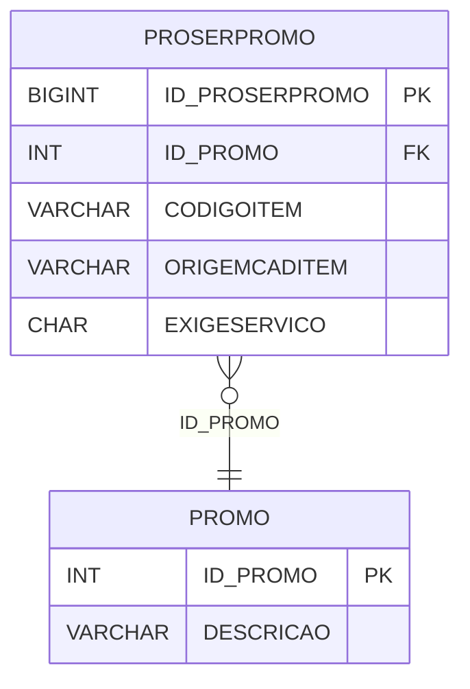

# PROSERPROMO - Documentação Completa de Relacionamentos

## 📊 Informações Gerais

- **Nome da Tabela**: PROSERPROMO (Produto Serviço Promoção)
- **Total de Registros**: 102.255
- **Total de Colunas**: 5
- **Chave Primária**: ID_PROSERPROMO
- **Chaves Estrangeiras**: 1
- **Índices**: 0
- **Tabelas Dependentes**: 0
- **Banco de Dados**: Firebird

## 📝 Descrição

**PROSERPROMO** é uma tabela de relacionamento que associa produtos e serviços com promoções. Com **102.255 registros**, esta tabela registra quais produtos e serviços estão relacionados a quais promoções, incluindo informações sobre origem e exigência de serviço.

Esta tabela é essencial para:
- **Promoções**: Gerenciar produtos e serviços em promoções
- **Rastreamento**: Rastrear produtos e serviços por promoção
- **Relatórios**: Gerar relatórios de produtos e serviços em promoções
- **Validação**: Validar produtos e serviços elegíveis para promoções

---

## 🔑 Estrutura de Colunas

| Coluna | Tipo | Descrição |
|--------|------|-----------|
| **ID_PROSERPROMO** 🔑 | BIGINT | Identificador único (PK) |
| **ID_PROMO** 🔗 | INT | Código da promoção (FK → PROMO) |
| **CODIGOITEM** | VARCHAR(37) | Código do item (produto ou serviço) |
| **ORIGEMCADITEM** | VARCHAR(37) | Origem do cadastro do item |
| **EXIGESERVICO** | CHAR(1) | Indica se exige serviço |

---

## 🔗 Relacionamentos - Nível 1 (Diretos)

### PROMO - Promoção (FK Obrigatória)
**Volume:** 156 registros

**Relacionamento:**
```
PROSERPROMO.ID_PROMO → PROMO.ID_PROMO (N:1)
Constraint: XFK_PROSERPROMO_PROMO
```

**Descrição:** Cada registro relaciona um produto ou serviço com uma promoção.

**Proporção:** ~655 produtos/serviços por promoção em média (102.255 / 156)

---

## 🗺️ Diagrama de Relacionamentos



---

## 💡 Exemplos de Uso

### Consulta Básica

```sql
SELECT ID_PROSERPROMO, ID_PROMO, CODIGOITEM, ORIGEMCADITEM, EXIGESERVICO
FROM PROSERPROMO
WHERE ID_PROMO = ?;
```

---

## ⚡ Performance e Otimização

### Índices Recomendados

#### 1. Índice na Chave Primária (Já existe implicitamente)
```sql
-- Índice primário já existe implicitamente
```

#### 2. Índice em ID_PROMO
```sql
CREATE INDEX IDX_PROSERPROMO_PROMO 
ON PROSERPROMO (ID_PROMO);
```

**Justificativa:** Facilita buscas por promoção (muito frequente).

---

## 📊 Estatísticas e Insights

- **Total de Registros**: 102.255
- **Média por Promoção**: ~655 produtos/serviços por promoção

---

**Documentação gerada em**: 2025-01-27

**Banco de dados**: Firebird

