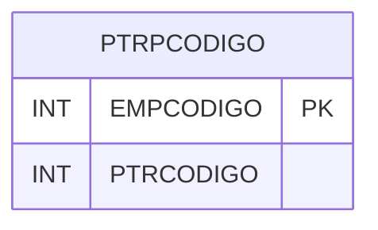

# PTRPCODIGO - Documentação Completa de Relacionamentos

## 📊 Informações Gerais

- **Nome da Tabela**: PTRPCODIGO (Pedido Tipo Rota Código)
- **Total de Registros**: 1
- **Total de Colunas**: 2
- **Chave Primária**: EMPCODIGO
- **Chaves Estrangeiras**: 0
- **Índices**: 0
- **Tabelas Dependentes**: 0
- **Banco de Dados**: Firebird

## 📝 Descrição

**PTRPCODIGO** é uma tabela de controle que armazena códigos sequenciais de pedidos tipo rota por empresa. Com apenas **1 registro**, esta tabela controla a numeração sequencial de pedidos tipo rota, garantindo unicidade por empresa.

Esta tabela é essencial para:
- **Controle de Numeração**: Controlar numeração sequencial de pedidos tipo rota
- **Unicidade**: Garantir unicidade de códigos por empresa
- **Sequenciamento**: Manter sequência de códigos

---

## 🔑 Estrutura de Colunas

| Coluna | Tipo | Descrição |
|--------|------|-----------|
| **EMPCODIGO** 🔑 | INT | Código da empresa (PK) |
| **PTRCODIGO** | INT | Código sequencial do pedido tipo rota |

---

## 🗺️ Diagrama de Relacionamentos



---

## 💡 Exemplos de Uso

### Consulta Básica

```sql
SELECT EMPCODIGO, PTRCODIGO
FROM PTRPCODIGO
WHERE EMPCODIGO = ?;
```

---

## ⚡ Performance e Otimização

### Índices Recomendados

#### 1. Índice na Chave Primária (Já existe implicitamente)
```sql
-- Índice primário já existe implicitamente
```

---

## 📊 Estatísticas e Insights

- **Total de Registros**: 1
- **Uso**: Tabela de controle com volume mínimo

---

**Documentação gerada em**: 2025-01-27

**Banco de dados**: Firebird

