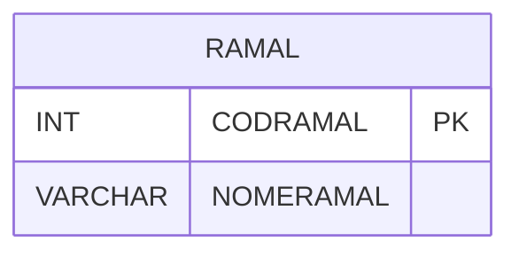

# RAMAL - Documentação Completa de Relacionamentos

## 📊 Informações Gerais

- **Nome da Tabela**: RAMAL
- **Total de Registros**: 1
- **Total de Colunas**: 2
- **Chave Primária**: CODRAMAL
- **Chaves Estrangeiras**: 0
- **Índices**: 0
- **Tabelas Dependentes**: 0
- **Banco de Dados**: Firebird

## 📝 Descrição

**RAMAL** é uma tabela mestre que armazena informações sobre ramais telefônicos. Com apenas **1 registro**, esta tabela define ramais disponíveis no sistema.

Esta tabela é essencial para:
- **Ramais**: Gerenciar ramais telefônicos
- **Configuração**: Armazenar configurações de ramais
- **Rastreamento**: Rastrear ramais disponíveis

---

## 🔑 Estrutura de Colunas

| Coluna | Tipo | Descrição |
|--------|------|-----------|
| **CODRAMAL** 🔑 | INT | Código do ramal (PK) |
| **NOMERAMAL** | VARCHAR(37) | Nome do ramal |

---

## 🗺️ Diagrama de Relacionamentos



---

## 💡 Exemplos de Uso

### Consulta Básica

```sql
SELECT CODRAMAL, NOMERAMAL
FROM RAMAL
WHERE CODRAMAL = ?;
```

---

## ⚡ Performance e Otimização

### Índices Recomendados

#### 1. Índice na Chave Primária (Já existe implicitamente)
```sql
-- Índice primário já existe implicitamente
```

---

## 📊 Estatísticas e Insights

- **Total de Registros**: 1
- **Uso**: Tabela mestre com volume mínimo

---

**Documentação gerada em**: 2025-01-27

**Banco de dados**: Firebird

