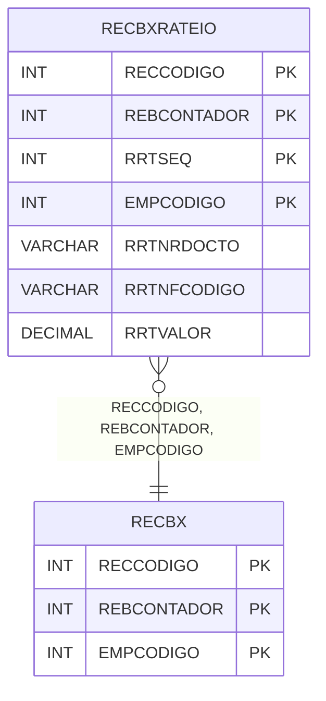

# RECBXRATEIO - Documentação Completa de Relacionamentos

## 📊 Informações Gerais

- **Nome da Tabela**: RECBXRATEIO (Recebimento Baixa Rateio)
- **Total de Registros**: 30.885
- **Total de Colunas**: 12
- **Chave Primária**: RECCODIGO, REBCONTADOR, RRTSEQ, EMPCODIGO (composite)
- **Chaves Estrangeiras**: 3
- **Índices**: 0
- **Tabelas Dependentes**: 0
- **Banco de Dados**: Firebird

## 📝 Descrição

**RECBXRATEIO** é uma tabela intermediária de grande volume que armazena informações sobre rateio de baixas de recebimento. Com **30.885 registros**, esta tabela registra rateios de baixas de contas a receber, incluindo empresa, conta a receber, contador da baixa, sequencial do rateio, número do documento, código da NF, data, valor, valor de juros, valor de descontos, saldo da NF e data de liquidação.

Esta tabela é essencial para:
- **Financeiro**: Gerenciar rateio de baixas de recebimento
- **Controle**: Controlar rateio de pagamentos
- **Rastreamento**: Rastrear rateios por baixa
- **Relatórios**: Gerar relatórios de rateio

---

## 🔑 Estrutura de Colunas

| Coluna | Tipo | Descrição |
|--------|------|-----------|
| **RECCODIGO** 🔑 🔗 | INT | Código da conta a receber (PK, FK → RECBX) |
| **REBCONTADOR** 🔑 🔗 | INT | Contador da baixa (PK, FK → RECBX) |
| **RRTSEQ** 🔑 | INT | Sequencial do rateio (PK) |
| **EMPCODIGO** 🔑 🔗 | INT | Código da empresa (PK, FK → RECBX) |
| **RRTNRDOCTO** | VARCHAR(14) | Número do documento |
| **RRTNFCODIGO** | VARCHAR(14) | Código da NF |
| **RRTDATA** | TIMESTAMP | Data do rateio |
| **RRTVALOR** | DECIMAL(18,2) | Valor do rateio |
| **RRTVALORJUROS** | DECIMAL(18,2) | Valor de juros |
| **RRTVALORDESCONTOS** | DECIMAL(18,2) | Valor de descontos |
| **RRTSALDONF** | DECIMAL(18,2) | Saldo da NF |
| **RRTDATALIQ** | TIMESTAMP | Data de liquidação |

---

## 🔗 Relacionamentos - Nível 1 (Diretos)

### RECBX - Recebimento Baixa (FK Obrigatória)
**Volume:** 216.135 registros

**Relacionamento:**
```
RECBXRATEIO.RECCODIGO → RECBX.RECCODIGO (N:1)
RECBXRATEIO.REBCONTADOR → RECBX.REBCONTADOR (N:1)
RECBXRATEIO.EMPCODIGO → RECBX.EMPCODIGO (N:1)
Constraint: FK_RECBXRATEIO_RECBX
```

**Proporção:** ~0.14 rateios por baixa em média (30.885 / 216.135)

---

## 🗺️ Diagrama de Relacionamentos



---

## 💡 Exemplos de Uso

### Consulta Básica

```sql
SELECT RECCODIGO, REBCONTADOR, RRTSEQ, EMPCODIGO, RRTNRDOCTO, RRTNFCODIGO, RRTVALOR
FROM RECBXRATEIO
WHERE RECCODIGO = ? AND REBCONTADOR = ? AND EMPCODIGO = ?;
```

---

## ⚡ Performance e Otimização

### Índices Recomendados

#### 1. Índice Composto na Chave Primária (Já existe implicitamente)
```sql
-- Índice primário já existe implicitamente
```

---

## 📊 Estatísticas e Insights

- **Total de Registros**: 30.885
- **Rateios**: 30.885 rateios de baixas de recebimento

---

**Documentação gerada em**: 2025-01-27

**Banco de dados**: Firebird
