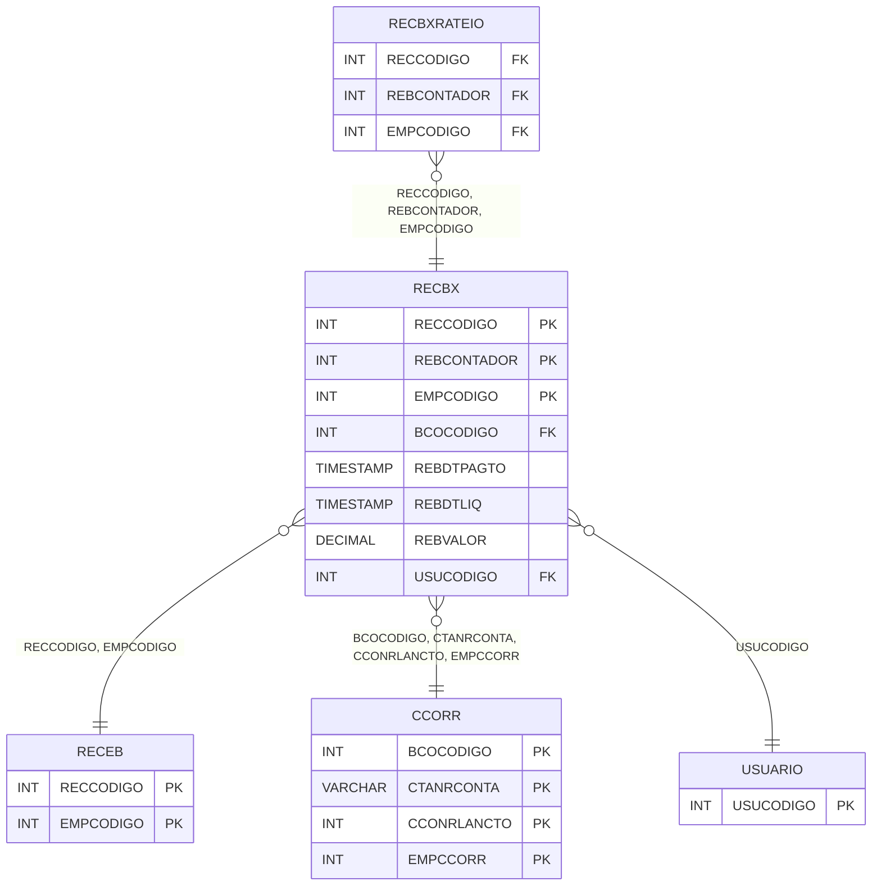

# RECBX - Documentação Completa de Relacionamentos

## 📊 Informações Gerais

- **Nome da Tabela**: RECBX (Recebimento Baixa)
- **Total de Registros**: 216.135
- **Total de Colunas**: 21
- **Chave Primária**: RECCODIGO, REBCONTADOR, EMPCODIGO (composite)
- **Chaves Estrangeiras**: 7
- **Índices**: 4
- **Tabelas Dependentes**: 9
- **Banco de Dados**: Firebird

## 📝 Descrição

**RECBX** é uma tabela intermediária de grande volume que armazena informações sobre baixas de recebimento. Com **216.135 registros**, esta tabela registra baixas de contas a receber, incluindo empresa, conta a receber, contador, banco, data de pagamento, data de liquidação, valor, valor de desconto, valor de juros, devolução, observações, tipo de documento de baixa, conta corrente, lançamento contábil, origem, lote de cheque, valor de abatimento, usuário, ID de cobrança e número de autorização.

Esta tabela é essencial para:
- **Financeiro**: Gerenciar baixas de recebimento
- **Controle**: Controlar pagamentos recebidos
- **Rastreamento**: Rastrear baixas por conta a receber
- **Relatórios**: Gerar relatórios de baixas

---

## 🔑 Estrutura de Colunas (Principais)

| Coluna | Tipo | Descrição |
|--------|------|-----------|
| **RECCODIGO** 🔑 🔗 | INT | Código da conta a receber (PK, FK → RECEB) |
| **REBCONTADOR** 🔑 | INT | Contador da baixa (PK) |
| **EMPCODIGO** 🔑 🔗 | INT | Código da empresa (PK, FK → RECEB) |
| **BCOCODIGO** 🔗 | INT | Código do banco (FK → CCORR) |
| **REBDTPAGTO** | TIMESTAMP | Data de pagamento |
| **REBDTLIQ** | TIMESTAMP | Data de liquidação |
| **REBVALOR** | DECIMAL(18,2) | Valor da baixa |
| **REBVRDESC** | DECIMAL(18,2) | Valor de desconto |
| **REBVRJUROS** | DECIMAL(18,2) | Valor de juros |
| **REBDEVOLUCAO** | VARCHAR(14) | Devolução |
| **REBOBSER** | VARCHAR(37) | Observações |
| **REBDOCTOBX** | VARCHAR(14) | Tipo de documento de baixa |
| **CTANRCONTA** 🔗 | VARCHAR(37) | Número da conta (FK → CCORR) |
| **CCONRLANCTO** 🔗 | INT | Lançamento contábil (FK → CCORR) |
| **EMPCCORR** 🔗 | INT | Empresa conta corrente (FK → CCORR) |
| **REBORIGEM** | VARCHAR(14) | Origem da baixa |
| **ID_LOTECH** | INT | ID do lote de cheque |
| **REBVRABAT** | DECIMAL(18,2) | Valor de abatimento |
| **USUCODIGO** 🔗 | INT | Código do usuário (FK → USUARIO) |
| **ID_COBRANCA** | VARCHAR(37) | ID da cobrança |
| **CRENRAUTORIZACAO** | VARCHAR(14) | Número de autorização |

---

## 🔗 Relacionamentos - Nível 1 (Diretos)

### RECEB - Contas a Receber (FK Obrigatória)
**Volume:** 200.335 registros

**Relacionamento:**
```
RECBX.RECCODIGO → RECEB.RECCODIGO (N:1)
RECBX.EMPCODIGO → RECEB.EMPCODIGO (N:1)
Constraint: RECEB_RECBX
```

### CCORR - Conta Corrente (FK Opcional)
**Volume:** Variável

**Relacionamento:**
```
RECBX.BCOCODIGO → CCORR.BCOCODIGO (N:1)
RECBX.CTANRCONTA → CCORR.CTANRCONTA (N:1)
RECBX.CCONRLANCTO → CCORR.CCONRLANCTO (N:1)
RECBX.EMPCCORR → CCORR.EMPCCORR (N:1)
Constraint: CCORR_RECBX
```

### USUARIO - Usuário (FK Opcional)
**Volume:** 297 registros

**Relacionamento:**
```
RECBX.USUCODIGO → USUARIO.USUCODIGO (N:1)
Constraint: USUARIO_RECBX
```

---

## 📊 Tabelas que Referenciam Esta

Esta tabela é referenciada por 9 tabelas:

### RECBXRATEIO - Recebimento Baixa Rateio
**Volume:** 30.885 registros

**Relacionamento:**
```
RECBXRATEIO.RECCODIGO → RECBX.RECCODIGO (N:1)
RECBXRATEIO.REBCONTADOR → RECBX.REBCONTADOR (N:1)
RECBXRATEIO.EMPCODIGO → RECBX.EMPCODIGO (N:1)
Constraint: FK_RECBXRATEIO_RECBX
```

---

## 📇 Índices

| Nome do Índice | Colunas | Único |
|----------------|---------|-------|
| INDREBDTLIQ | REBDTLIQ | Não |
| INDREBDTPAGTO | REBDTPAGTO | Não |
| IND_ID_LOTECH | ID_LOTECH | Não |
| RECBX_CCORR | CCONRLANCTO | Não |

---

## 🗺️ Diagrama de Relacionamentos



---

## 💡 Exemplos de Uso

### Consulta Básica

```sql
SELECT RECCODIGO, REBCONTADOR, EMPCODIGO, REBDTPAGTO, REBDTLIQ, REBVALOR, REBVRDESC, REBVRJUROS
FROM RECBX
WHERE RECCODIGO = ? AND EMPCODIGO = ?;
```

---

## ⚡ Performance e Otimização

### Índices Recomendados

#### 1. Índice Composto na Chave Primária (Já existe implicitamente)
```sql
-- Índice primário já existe implicitamente
```

#### 2. Índices Existentes
Os índices em REBDTLIQ, REBDTPAGTO, ID_LOTECH e CCONRLANCTO já estão criados e são adequados.

---

## 📊 Estatísticas e Insights

- **Total de Registros**: 216.135
- **Baixas**: 216.135 baixas de recebimento cadastradas
- **Média por Conta**: ~1.08 baixas por conta a receber (216.135 / 200.335)

---

**Documentação gerada em**: 2025-01-27

**Banco de dados**: Firebird
