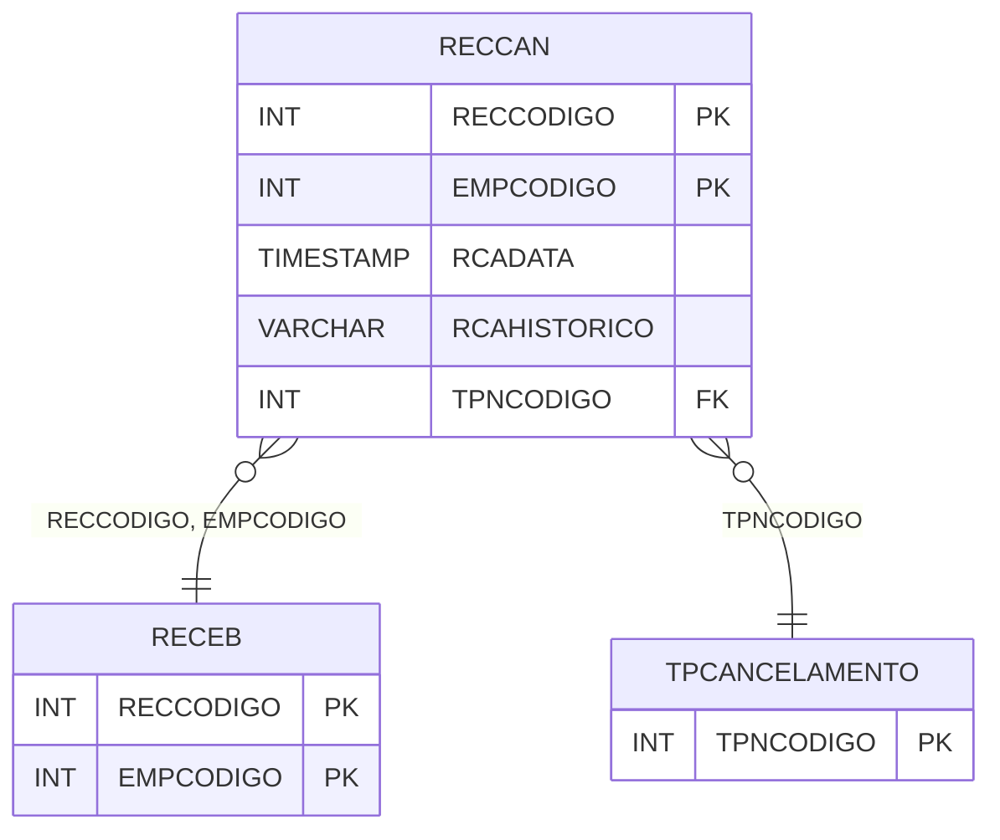

# RECCAN - Documentação Completa de Relacionamentos

## 📊 Informações Gerais

- **Nome da Tabela**: RECCAN (Recebimento Cancelamento)
- **Total de Registros**: 745
- **Total de Colunas**: 5
- **Chave Primária**: RECCODIGO, EMPCODIGO (composite)
- **Chaves Estrangeiras**: 3
- **Índices**: 0
- **Tabelas Dependentes**: 0
- **Banco de Dados**: Firebird

## 📝 Descrição

**RECCAN** é uma tabela intermediária que armazena informações sobre cancelamentos de contas a receber. Com **745 registros**, esta tabela registra cancelamentos de contas a receber, incluindo data do cancelamento, histórico, empresa, conta a receber e tipo de cancelamento.

Esta tabela é essencial para:
- **Financeiro**: Gerenciar cancelamentos de contas a receber
- **Auditoria**: Rastrear cancelamentos
- **Rastreamento**: Rastrear cancelamentos por conta
- **Relatórios**: Gerar relatórios de cancelamentos

---

## 🔑 Estrutura de Colunas

| Coluna | Tipo | Descrição |
|--------|------|-----------|
| **RCADATA** | TIMESTAMP | Data do cancelamento |
| **RCAHISTORICO** | VARCHAR(37) | Histórico do cancelamento |
| **RECCODIGO** 🔑 🔗 | INT | Código da conta a receber (PK, FK → RECEB) |
| **EMPCODIGO** 🔑 🔗 | INT | Código da empresa (PK, FK → RECEB) |
| **TPNCODIGO** 🔗 | INT | Código do tipo de cancelamento (FK → TPCANCELAMENTO) |

---

## 🔗 Relacionamentos - Nível 1 (Diretos)

### RECEB - Contas a Receber (FK Obrigatória)
**Volume:** 200.335 registros

**Relacionamento:**
```
RECCAN.RECCODIGO → RECEB.RECCODIGO (N:1)
RECCAN.EMPCODIGO → RECEB.EMPCODIGO (N:1)
Constraint: RECEB_RECCAN
```

### TPCANCELAMENTO - Tipo Cancelamento (FK Opcional)
**Volume:** Variável

**Relacionamento:**
```
RECCAN.TPNCODIGO → TPCANCELAMENTO.TPNCODIGO (N:1)
Constraint: TPCANCELAMENTO_RECCAN
```

---

## 🗺️ Diagrama de Relacionamentos



---

## 💡 Exemplos de Uso

### Consulta Básica

```sql
SELECT RCADATA, RCAHISTORICO, RECCODIGO, EMPCODIGO, TPNCODIGO
FROM RECCAN
WHERE RECCODIGO = ? AND EMPCODIGO = ?;
```

---

## ⚡ Performance e Otimização

### Índices Recomendados

#### 1. Índice Composto na Chave Primária (Já existe implicitamente)
```sql
-- Índice primário já existe implicitamente
```

---

## 📊 Estatísticas e Insights

- **Total de Registros**: 745
- **Cancelamentos**: 745 cancelamentos de contas a receber

---

**Documentação gerada em**: 2025-01-27

**Banco de dados**: Firebird
