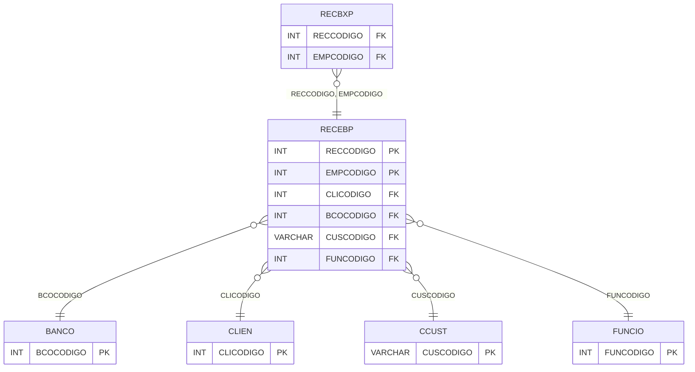

# RECEBP - Documentação Completa de Relacionamentos

## 📊 Informações Gerais

- **Nome da Tabela**: RECEBP (Contas a Receber Provisório)
- **Total de Registros**: 3
- **Total de Colunas**: 72
- **Chave Primária**: RECCODIGO, EMPCODIGO (composite)
- **Chaves Estrangeiras**: 7
- **Índices**: 6
- **Tabelas Dependentes**: 16
- **Banco de Dados**: Firebird

## 📝 Descrição

**RECEBP** é uma tabela mestre que armazena informações sobre contas a receber provisórias. Com apenas **3 registros**, esta tabela tem a mesma estrutura da tabela RECEB e é utilizada para armazenar contas a receber temporárias antes da confirmação definitiva.

Esta tabela é essencial para:
- **Financeiro**: Gerenciar contas a receber provisórias
- **Controle**: Controlar contas temporárias
- **Rastreamento**: Rastrear contas provisórias
- **Relatórios**: Gerar relatórios de contas provisórias

---

## 🔑 Estrutura de Colunas

A estrutura é idêntica à tabela RECEB, com 72 colunas incluindo todas as informações de contas a receber.

---

## 🔗 Relacionamentos - Nível 1 (Diretos)

### BANCO - Banco (FK Obrigatória)
**Volume:** Variável

**Relacionamento:**
```
RECEBP.BCOCODIGO → BANCO.BCOCODIGO (N:1)
Constraint: BANCO_RECEBP
```

### CCUST - Centro de Custo (FK Obrigatória)
**Volume:** Variável

**Relacionamento:**
```
RECEBP.CUSCODIGO → CCUST.CUSCODIGO (N:1)
Constraint: CCUST_RECEBP
```

### CLIEN - Cliente (FK Obrigatória)
**Volume:** Variável

**Relacionamento:**
```
RECEBP.CLICODIGO → CLIEN.CLICODIGO (N:1)
RECEBP.CLICODIGOCTC → CLIEN.CLICODIGO (N:1)
Constraint: CLIEN_RECEBP, CLIENCTC_RECEBP
```

### CTRCLI - Contrato Cliente (FK Opcional)
**Volume:** Variável

**Relacionamento:**
```
RECEBP.CTCNUMERO → CTRCLI.CTCNUMERO (N:1)
RECEBP.EMPCODIGO → CTRCLI.EMPCODIGO (N:1)
Constraint: CTRCLI_RECEBP
```

### FUNCIO - Funcionário (FK Obrigatória)
**Volume:** Variável

**Relacionamento:**
```
RECEBP.FUNCODIGO → FUNCIO.FUNCODIGO (N:1)
Constraint: FUNCIO_RECEBP
```

---

## 📊 Tabelas que Referenciam Esta

Esta tabela é referenciada por 16 tabelas, incluindo:

### RECBXP - Recebimento Baixa Provisório
**Volume:** Variável

**Relacionamento:**
```
RECBXP.RECCODIGO → RECEBP.RECCODIGO (N:1)
RECBXP.EMPCODIGO → RECEBP.EMPCODIGO (N:1)
Constraint: RECEBP_RECBXP
```

---

## 📇 Índices

| Nome do Índice | Colunas | Único |
|----------------|---------|-------|
| INDRECDTEMISSAOP | RECDTEMISSAO | Não |
| INDRECDTPREVISP | RECDTPREVIS | Não |
| INDRECDTVENCTOP | RECDTVENCTO | Não |
| INDRECEBPNSNUM | RECNSNUMERO | Não |
| INDRECNRDOCP | RECNRDOC | Não |
| INDRECPSEQNSNUMERO | RECSEQNSNUMERO | Não |

---

## 🗺️ Diagrama de Relacionamentos



---

## 💡 Exemplos de Uso

### Consulta Básica

```sql
SELECT RECCODIGO, EMPCODIGO, CLICODIGO, RECDTVENCTO, RECVALOR, RECVALORABERTO
FROM RECEBP
WHERE RECCODIGO = ? AND EMPCODIGO = ?;
```

---

## ⚡ Performance e Otimização

### Índices Recomendados

#### 1. Índice Composto na Chave Primária (Já existe implicitamente)
```sql
-- Índice primário já existe implicitamente
```

#### 2. Índices Existentes
Os índices em datas e números de documento já estão criados e são adequados.

---

## 📊 Estatísticas e Insights

- **Total de Registros**: 3
- **Contas Provisórias**: 3 contas a receber provisórias cadastradas

---

**Documentação gerada em**: 2025-01-27

**Banco de dados**: Firebird
