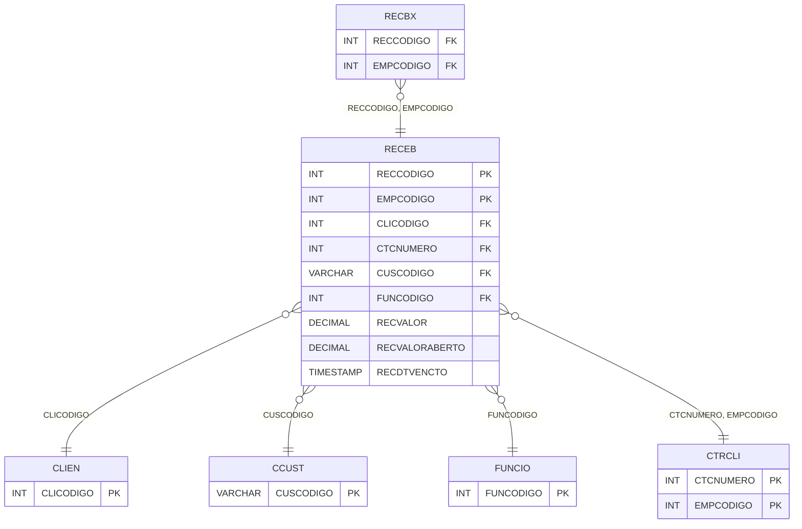

# RECEB - Documentação Completa de Relacionamentos

## 📊 Informações Gerais

- **Nome da Tabela**: RECEB (Contas a Receber)
- **Total de Registros**: 200.335
- **Total de Colunas**: 72
- **Chave Primária**: RECCODIGO, EMPCODIGO (composite)
- **Chaves Estrangeiras**: 5
- **Índices**: 9
- **Tabelas Dependentes**: 20
- **Banco de Dados**: Firebird

## 📝 Descrição

**RECEB** é uma tabela mestre de grande volume que armazena informações sobre contas a receber. Com **200.335 registros**, esta tabela registra todas as contas a receber do sistema, incluindo dados completos de documentos, valores, datas, cliente, funcionário, centro de custo, banco, cobrança, instruções, situação e muitas outras informações operacionais e fiscais.

Esta tabela é essencial para:
- **Financeiro**: Gerenciar contas a receber
- **Cobrança**: Controlar cobrança de clientes
- **Rastreamento**: Rastrear recebimentos por cliente e período
- **Relatórios**: Gerar relatórios financeiros de contas a receber

**Contexto de Negócio:**
Esta é uma das tabelas mais importantes do sistema financeiro, sendo referenciada por 20 outras tabelas. É fundamental para gestão financeira, controle de cobrança e análise de recebimentos.

---

## 🔑 Estrutura de Colunas (Principais)

| Coluna | Tipo | Descrição |
|--------|------|-----------|
| **RECCODIGO** 🔑 | INT | Código da conta a receber (PK) |
| **EMPCODIGO** 🔑 🔗 | INT | Código da empresa (PK, FK → CTRCLI) |
| **CLICODIGO** 🔗 | INT | Código do cliente (FK → CLIEN) |
| **CTCNUMERO** 🔗 | INT | Número do contrato (FK → CTRCLI) |
| **BCOCODIGO** | INT | Código do banco |
| **COBCODIGO** | VARCHAR(14) | Código da cobrança |
| **ENDFAT** | INT | Código do endereço de faturamento |
| **ENDCOB** | INT | Código do endereço de cobrança |
| **RECNRDOC** | VARCHAR(14) | Número do documento |
| **RECDTDOC** | TIMESTAMP | Data do documento |
| **RECPARCELA** | VARCHAR(14) | Parcela |
| **CUSCODIGO** 🔗 | VARCHAR(14) | Código do centro de custo (FK → CCUST) |
| **FUNCODIGO** 🔗 | INT | Código do funcionário (FK → FUNCIO) |
| **RECPCCOMISSAO** | DECIMAL(18,2) | Percentual de comissão |
| **RECDTEMISSAO** | TIMESTAMP | Data de emissão |
| **RECDTVENCTO** | TIMESTAMP | Data de vencimento |
| **RECDTPREVIS** | TIMESTAMP | Data prevista |
| **RECVALOR** | DECIMAL(18,2) | Valor da conta |
| **RECVALORABERTO** | DECIMAL(18,2) | Valor em aberto |
| **RECDTREMESSA** | TIMESTAMP | Data de remessa |
| **RECDTRETORNO** | TIMESTAMP | Data de retorno |
| **RECHISTORICO** | VARCHAR(37) | Histórico |
| **RECCOMANDO** | VARCHAR(14) | Comando |
| **RECPRZPROT** | INT | Prazo de protesto |
| **RECSITUACAO** | VARCHAR(14) | Situação |
| **RECORIGEM** | VARCHAR(14) | Origem |
| **RECNSNUMERO** | VARCHAR(37) | Número NS |
| **RECTIPODOCTO** | VARCHAR(14) | Tipo de documento |
| **RECDTIMPBOLETO** | TIMESTAMP | Data de impressão do boleto |
| **RECPCDESCTO** | DECIMAL(18,2) | Percentual de desconto |
| **RECVRDESCTO** | DECIMAL(18,2) | Valor de desconto |
| **RECDTCARTORIO** | TIMESTAMP | Data de cartório |
| **CLICODIGOCTC** | INT | Código do cliente CTC |
| **RECNRCAIXA** | INT | Número da caixa |
| **RECOUTDESP** | DECIMAL(18,2) | Outras despesas |
| **RECVRMULTA** | DECIMAL(18,2) | Valor de multa |
| **RECPCJUROS** | DECIMAL(18,2) | Percentual de juros |
| **RECVRJUROS** | DECIMAL(18,2) | Valor de juros |
| **RECVRDESCESP** | DECIMAL(18,2) | Valor de desconto especial |
| **STCODIGO** | VARCHAR(14) | Código da situação |
| **RECVRDESCONTO** | DECIMAL(18,2) | Valor de desconto |
| **RECSEQNSNUMERO** | INT | Sequencial NS número |
| **RECNUMCTR** | INT | Número do contrato |
| **AGCODIGO** | INT | Código da agência |
| **RECVRAGE** | DECIMAL(18,2) | Valor da agência |
| **PERAG** | DECIMAL(18,2) | Percentual da agência |
| **SUCODIGO** | INT | Código do supervisor |
| **RECVRSU** | DECIMAL(18,2) | Valor do supervisor |
| **PERSU** | DECIMAL(18,2) | Percentual do supervisor |
| **RECINSTRUCAO1** | VARCHAR(37) | Instrução 1 |
| **RECINSTRUCAO2** | VARCHAR(37) | Instrução 2 |
| **RECINSTRUCAO3** | VARCHAR(37) | Instrução 3 |
| **RECINSTRUCAO4** | VARCHAR(37) | Instrução 4 |
| **SERCODIGO** | INT | Código do serviço |
| **FUNCODIGO2** | INT | Código do funcionário 2 |
| **PERFUN2** | DECIMAL(18,2) | Percentual do funcionário 2 |
| **RECTIPODOCTOANT** | VARCHAR(14) | Tipo de documento anterior |
| **RECOBSERVACAO** | VARCHAR(37) | Observação |
| **RECEMINF** | VARCHAR(14) | Emitir NF |
| **RECCARTEIRA** | VARCHAR(37) | Carteira |
| **RECDTRECIBO** | TIMESTAMP | Data de recibo |
| **RECDTENVFAT** | DATE | Data de envio de fatura |
| **RECNRAUTO** | VARCHAR(37) | Número de autorização |
| **RECLOCALPAGTO** | VARCHAR(37) | Local de pagamento |
| **RECOBS1** | VARCHAR(37) | Observação 1 |
| **RECOBS2** | VARCHAR(37) | Observação 2 |
| **RECOBS3** | VARCHAR(37) | Observação 3 |
| **CONFRECBL_ID** | INT | ID da configuração de recebimento |
| **RECLINHADIGITAVEL** | VARCHAR(37) | Linha digitável |
| **RECQRCODEPIX** | VARCHAR(37) | QR Code PIX |
| **RECDIASRECEBIMENTO** | INT | Dias de recebimento |

---

## 🔗 Relacionamentos - Nível 1 (Diretos)

### CLIEN - Cliente (FK Opcional)
**Volume:** Variável

**Relacionamento:**
```
RECEB.CLICODIGO → CLIEN.CLICODIGO (N:1)
Constraint: CLIEN_RECEB
```

### CCUST - Centro de Custo (FK Obrigatória)
**Volume:** Variável

**Relacionamento:**
```
RECEB.CUSCODIGO → CCUST.CUSCODIGO (N:1)
Constraint: CCUST_RECEB
```

### FUNCIO - Funcionário (FK Obrigatória)
**Volume:** Variável

**Relacionamento:**
```
RECEB.FUNCODIGO → FUNCIO.FUNCODIGO (N:1)
Constraint: FUNCIO_RECEB
```

### CTRCLI - Contrato Cliente (FK Opcional)
**Volume:** Variável

**Relacionamento:**
```
RECEB.CTCNUMERO → CTRCLI.CTCNUMERO (N:1)
RECEB.EMPCODIGO → CTRCLI.EMPCODIGO (N:1)
Constraint: CTRCLI_RECEB
```

---

## 📊 Tabelas que Referenciam Esta

Esta tabela é referenciada por 20 tabelas, incluindo:

### RECBX - Recebimento Baixa
**Volume:** Variável

**Relacionamento:**
```
RECBX.RECCODIGO → RECEB.RECCODIGO (N:1)
RECBX.EMPCODIGO → RECEB.EMPCODIGO (N:1)
Constraint: RECEB_RECBX
```

### REPARCRECEB - Reparcelação Receber
**Volume:** 724 registros

**Relacionamento:**
```
REPARCRECEB.RECCODIGO → RECEB.RECCODIGO (N:1)
REPARCRECEB.EMPCODIGO → RECEB.EMPCODIGO (N:1)
Constraint: RECEB_REPARCRECEB
```

---

## 📇 Índices

| Nome do Índice | Colunas | Único |
|----------------|---------|-------|
| INDRECDTEMISSAO | RECDTEMISSAO | Não |
| INDRECDTIMPBOLETO | RECDTIMPBOLETO | Não |
| INDRECDTPREVIS | RECDTPREVIS | Não |
| INDRECDTREMESSA | RECDTREMESSA | Não |
| INDRECDTRETORNO | RECDTRETORNO | Não |
| INDRECDTVENCTO | RECDTVENCTO | Não |
| INDRECEBNSNUM | RECNSNUMERO | Não |
| INDRECNRDOC | RECNRDOC | Não |
| INDRECSEQNSNUMERO | RECSEQNSNUMERO | Não |

---

## 🗺️ Diagrama de Relacionamentos



---

## 💡 Exemplos de Uso

### Consulta Básica

```sql
SELECT RECCODIGO, EMPCODIGO, CLICODIGO, RECDTVENCTO, RECVALOR, RECVALORABERTO, RECSITUACAO
FROM RECEB
WHERE RECCODIGO = ? AND EMPCODIGO = ?;
```

### Consulta com Cliente

```sql
SELECT 
    r.*,
    c.CLINOME
FROM RECEB r
LEFT JOIN CLIEN c
    ON r.CLICODIGO = c.CLICODIGO
WHERE r.RECCODIGO = ? AND r.EMPCODIGO = ?;
```

---

## ⚡ Performance e Otimização

### Índices Recomendados

#### 1. Índice Composto na Chave Primária (Já existe implicitamente)
```sql
-- Índice primário já existe implicitamente
```

#### 2. Índices Existentes
Os índices em datas e números de documento já estão criados e são adequados.

#### 3. Índice em CLICODIGO
```sql
CREATE INDEX IDX_RECEB_CLICODIGO 
ON RECEB (CLICODIGO);
```

**Justificativa:** Facilita buscas por cliente.

---

## 📊 Estatísticas e Insights

- **Total de Registros**: 200.335
- **Contas a Receber**: 200.335 contas a receber cadastradas

---

**Documentação gerada em**: 2025-01-27

**Banco de dados**: Firebird
