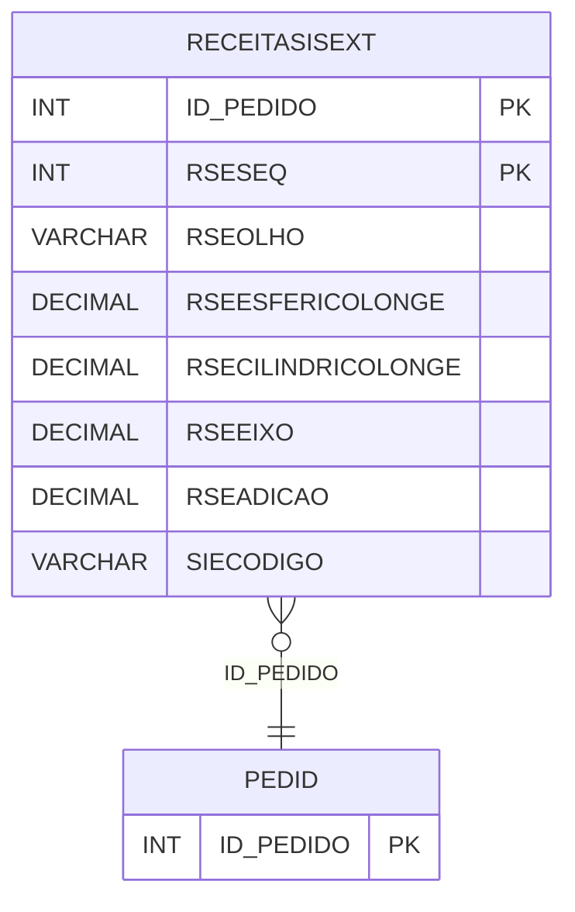

# RECEITASISEXT - Documentação Completa de Relacionamentos

## 📊 Informações Gerais

- **Nome da Tabela**: RECEITASISEXT (Receitas Sistema Externo)
- **Total de Registros**: 2.847.353
- **Total de Colunas**: 33
- **Chave Primária**: ID_PEDIDO, RSESEQ (composite)
- **Chaves Estrangeiras**: 1
- **Índices**: 2
- **Tabelas Dependentes**: 0
- **Banco de Dados**: Firebird

## 📝 Descrição

**RECEITASISEXT** é uma tabela intermediária de grande volume que armazena informações sobre receitas ópticas de sistemas externos. Com **2.847.353 registros**, esta tabela registra receitas importadas de sistemas externos, incluindo pedido, sequencial, olho, esférico longe, cilíndrico longe, eixo, adição, código do sistema externo, número de referência, coeficientes, distância de progressão, iniciais do paciente, visão de perto, distância do vértice, ângulos, CRO, descrição da etiqueta, número OptClick, distância de leitura, olho dominante, VMAP, NVB e outras informações específicas de receitas ópticas.

Esta tabela é essencial para:
- **Integração**: Gerenciar integração de receitas de sistemas externos
- **Receitas**: Armazenar receitas importadas
- **Rastreamento**: Rastrear receitas por pedido e sistema externo
- **Relatórios**: Gerar relatórios de receitas importadas

---

## 🔑 Estrutura de Colunas (Principais)

| Coluna | Tipo | Descrição |
|--------|------|-----------|
| **ID_PEDIDO** 🔑 🔗 | INT | ID do pedido (PK, FK → PEDID) |
| **RSESEQ** 🔑 | INT | Sequencial da receita (PK) |
| **RSEOLHO** | VARCHAR(14) | Olho (OD/OE) |
| **RSEESFERICOLONGE** | DECIMAL(18,2) | Esférico longe |
| **RSECILINDRICOLONGE** | DECIMAL(18,2) | Cilíndrico longe |
| **RSEEIXO** | DECIMAL(18,2) | Eixo |
| **RSEADICAO** | DECIMAL(18,2) | Adição |
| **SIECODIGO** | VARCHAR(14) | Código do sistema externo |
| **RSEREFNUMERO** | VARCHAR(37) | Número de referência |
| **RSCOEFICIENTE_HE** | VARCHAR(37) | Coeficiente HE |
| **RSCOEFICIENTE_ST** | VARCHAR(37) | Coeficiente ST |
| **RSDISTANCIA_PROGRESSAO** | VARCHAR(37) | Distância de progressão |
| **RSINICIAIS_PACIENTE** | VARCHAR(37) | Iniciais do paciente |
| **DNP_PERTO_OD** | DECIMAL(18,2) | DNP perto OD |
| **DNP_PERTO_OE** | DECIMAL(18,2) | DNP perto OE |
| **DIST_VERTICE_OD** | DECIMAL(18,2) | Distância do vértice OD |
| **DIST_VERTICE_OE** | DECIMAL(18,2) | Distância do vértice OE |
| **ANG_PANTO** | DECIMAL(18,2) | Ângulo panto |
| **ANG_CURV** | DECIMAL(18,2) | Ângulo curvatura |
| **CRO_OD** | DECIMAL(18,2) | CRO OD |
| **CRO_OE** | DECIMAL(18,2) | CRO OE |
| **DESCRICAO_ETIQUETA** | VARCHAR(37) | Descrição da etiqueta |
| **INTOPNROPTICLICK** | INT | Número OptClick |
| **DIST_LEITURA** | DECIMAL(18,2) | Distância de leitura |
| **OLHO_DOMINANTE** | VARCHAR(37) | Olho dominante |
| **VMAP** | VARCHAR(37) | VMAP |
| **NVB** | VARCHAR(37) | NVB |
| **NVBSTATUS** | VARCHAR(14) | Status NVB |
| **RSEORIGEM** | VARCHAR(14) | Origem da receita |
| **CORREDOR_OD** | INT | Corredor OD |
| **CORREDOR_OE** | INT | Corredor OE |
| **PEDOPTICLICK** | INT | Pedido OptClick |

---

## 🔗 Relacionamentos - Nível 1 (Diretos)

### PEDID - Pedido (FK Obrigatória)
**Volume:** 3.099.176 registros

**Relacionamento:**
```
RECEITASISEXT.ID_PEDIDO → PEDID.ID_PEDIDO (N:1)
Constraint: PEDID_RECEITASISEXT
```

**Proporção:** ~0.92 receitas por pedido em média (2.847.353 / 3.099.176)

---

## 📇 Índices

| Nome do Índice | Colunas | Único |
|----------------|---------|-------|
| IDXPEDOPTICLICK | PEDOPTICLICK | Não |
| IDXRSEREFNUMERO | RSEREFNUMERO | Não |

---

## 🗺️ Diagrama de Relacionamentos



---

## 💡 Exemplos de Uso

### Consulta Básica

```sql
SELECT ID_PEDIDO, RSESEQ, RSEOLHO, RSEESFERICOLONGE, RSECILINDRICOLONGE, RSEEIXO, RSEADICAO
FROM RECEITASISEXT
WHERE ID_PEDIDO = ?;
```

---

## ⚡ Performance e Otimização

### Índices Recomendados

#### 1. Índice Composto na Chave Primária (Já existe implicitamente)
```sql
-- Índice primário já existe implicitamente
```

#### 2. Índices Existentes
Os índices em PEDOPTICLICK e RSEREFNUMERO já estão criados e são adequados.

---

## 📊 Estatísticas e Insights

- **Total de Registros**: 2.847.353
- **Receitas**: 2.847.353 receitas de sistemas externos cadastradas

---

**Documentação gerada em**: 2025-01-27

**Banco de dados**: Firebird

