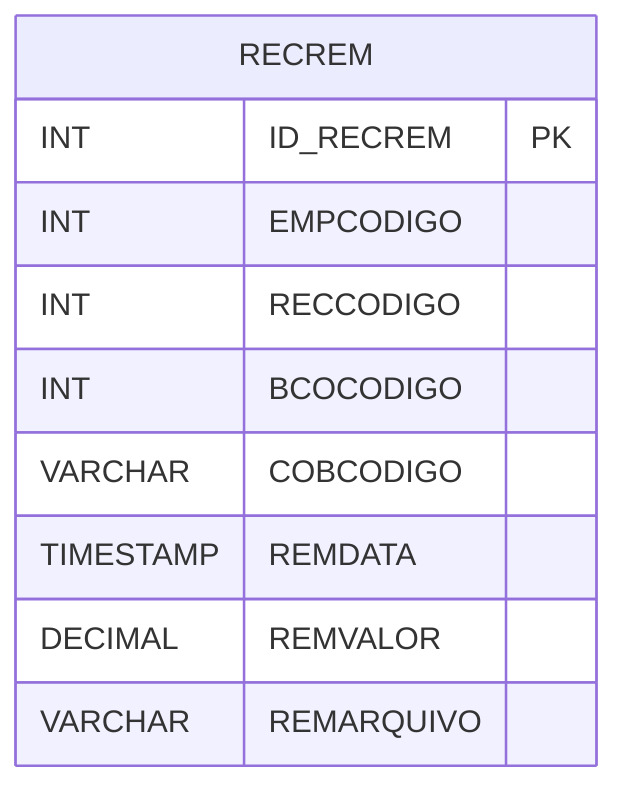

# RECREM - Documentação Completa de Relacionamentos

## 📊 Informações Gerais

- **Nome da Tabela**: RECREM (Recebimento Remessa)
- **Total de Registros**: 188.473
- **Total de Colunas**: 10
- **Chave Primária**: ID_RECREM
- **Chaves Estrangeiras**: 0
- **Índices**: 1
- **Tabelas Dependentes**: 0
- **Banco de Dados**: Firebird

## 📝 Descrição

**RECREM** é uma tabela intermediária de grande volume que armazena informações sobre remessas de recebimento. Com **188.473 registros**, esta tabela registra remessas de contas a receber para bancos, incluindo empresa, conta a receber, banco, código de cobrança, data, valor, arquivo, comando e usuário.

Esta tabela é essencial para:
- **Cobrança**: Gerenciar remessas de recebimento
- **Bancos**: Controlar remessas para bancos
- **Rastreamento**: Rastrear remessas por conta a receber
- **Relatórios**: Gerar relatórios de remessas

---

## 🔑 Estrutura de Colunas

| Coluna | Tipo | Descrição |
|--------|------|-----------|
| **ID_RECREM** 🔑 | INT | ID da remessa (PK) |
| **EMPCODIGO** | INT | Código da empresa |
| **RECCODIGO** | INT | Código da conta a receber |
| **BCOCODIGO** | INT | Código do banco |
| **COBCODIGO** | VARCHAR(14) | Código da cobrança |
| **REMDATA** | TIMESTAMP | Data da remessa |
| **REMVALOR** | DECIMAL(18,2) | Valor da remessa |
| **REMARQUIVO** | VARCHAR(37) | Nome do arquivo |
| **REMCOMANDO** | VARCHAR(14) | Comando |
| **USUCODIGO** | INT | Código do usuário |

---

## 📇 Índices

| Nome do Índice | Colunas | Único |
|----------------|---------|-------|
| INDRECREMRECCODIGO | RECCODIGO | Não |

---

## 🗺️ Diagrama de Relacionamentos



---

## 💡 Exemplos de Uso

### Consulta Básica

```sql
SELECT ID_RECREM, EMPCODIGO, RECCODIGO, BCOCODIGO, COBCODIGO, REMDATA, REMVALOR
FROM RECREM
WHERE ID_RECREM = ?;
```

---

## ⚡ Performance e Otimização

### Índices Recomendados

#### 1. Índice na Chave Primária (Já existe implicitamente)
```sql
-- Índice primário já existe implicitamente
```

#### 2. Índice Existente
O índice em RECCODIGO já está criado e é adequado.

#### 3. Índice em EMPCODIGO e REMDATA
```sql
CREATE INDEX IDX_RECREM_EMP_DATA 
ON RECREM (EMPCODIGO, REMDATA);
```

**Justificativa:** Facilita buscas por empresa e período.

---

## 📊 Estatísticas e Insights

- **Total de Registros**: 188.473
- **Remessas**: 188.473 remessas de recebimento cadastradas

---

**Documentação gerada em**: 2025-01-27

**Banco de dados**: Firebird

