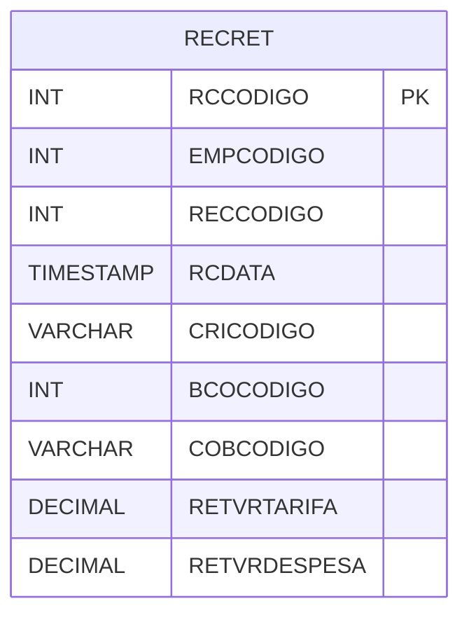

# RECRET - Documentação Completa de Relacionamentos

## 📊 Informações Gerais

- **Nome da Tabela**: RECRET (Recebimento Retorno)
- **Total de Registros**: 436.291
- **Total de Colunas**: 13
- **Chave Primária**: RCCODIGO
- **Chaves Estrangeiras**: 0
- **Índices**: 1
- **Tabelas Dependentes**: 0
- **Banco de Dados**: Firebird

## 📝 Descrição

**RECRET** é uma tabela intermediária de grande volume que armazena informações sobre retornos de recebimento. Com **436.291 registros**, esta tabela registra retornos de contas a receber dos bancos, incluindo empresa, conta a receber, data, código de ocorrência, banco, código de cobrança, arquivo, valor de tarifa, valor de despesa, valor de outros recebimentos, status e ocorrência.

Esta tabela é essencial para:
- **Cobrança**: Gerenciar retornos de recebimento
- **Bancos**: Controlar retornos dos bancos
- **Rastreamento**: Rastrear retornos por conta a receber
- **Relatórios**: Gerar relatórios de retornos

---

## 🔑 Estrutura de Colunas

| Coluna | Tipo | Descrição |
|--------|------|-----------|
| **RCCODIGO** 🔑 | INT | Código do retorno (PK) |
| **EMPCODIGO** | INT | Código da empresa |
| **RECCODIGO** | INT | Código da conta a receber |
| **RCDATA** | TIMESTAMP | Data do retorno |
| **CRICODIGO** | VARCHAR(14) | Código da ocorrência |
| **BCOCODIGO** | INT | Código do banco |
| **COBCODIGO** | VARCHAR(14) | Código da cobrança |
| **RETARQUIVO** | VARCHAR(37) | Nome do arquivo |
| **RETVRTARIFA** | DECIMAL(18,2) | Valor da tarifa |
| **RETVRDESPESA** | DECIMAL(18,2) | Valor da despesa |
| **RETVROUTROSREC** | DECIMAL(18,2) | Valor de outros recebimentos |
| **RETSTATUS** | VARCHAR(37) | Status do retorno |
| **RETOCORRENCIA** | VARCHAR(37) | Ocorrência |

---

## 📇 Índices

| Nome do Índice | Colunas | Único |
|----------------|---------|-------|
| RECRET_RECEB | RECCODIGO | Não |

---

## 🗺️ Diagrama de Relacionamentos



---

## 💡 Exemplos de Uso

### Consulta Básica

```sql
SELECT RCCODIGO, EMPCODIGO, RECCODIGO, RCDATA, CRICODIGO, BCOCODIGO, RETSTATUS
FROM RECRET
WHERE RCCODIGO = ?;
```

---

## ⚡ Performance e Otimização

### Índices Recomendados

#### 1. Índice na Chave Primária (Já existe implicitamente)
```sql
-- Índice primário já existe implicitamente
```

#### 2. Índice Existente
O índice em RECCODIGO já está criado e é adequado.

#### 3. Índice em EMPCODIGO e RCDATA
```sql
CREATE INDEX IDX_RECRET_EMP_DATA 
ON RECRET (EMPCODIGO, RCDATA);
```

**Justificativa:** Facilita buscas por empresa e período.

---

## 📊 Estatísticas e Insights

- **Total de Registros**: 436.291
- **Retornos**: 436.291 retornos de recebimento cadastrados

---

**Documentação gerada em**: 2025-01-27

**Banco de dados**: Firebird

