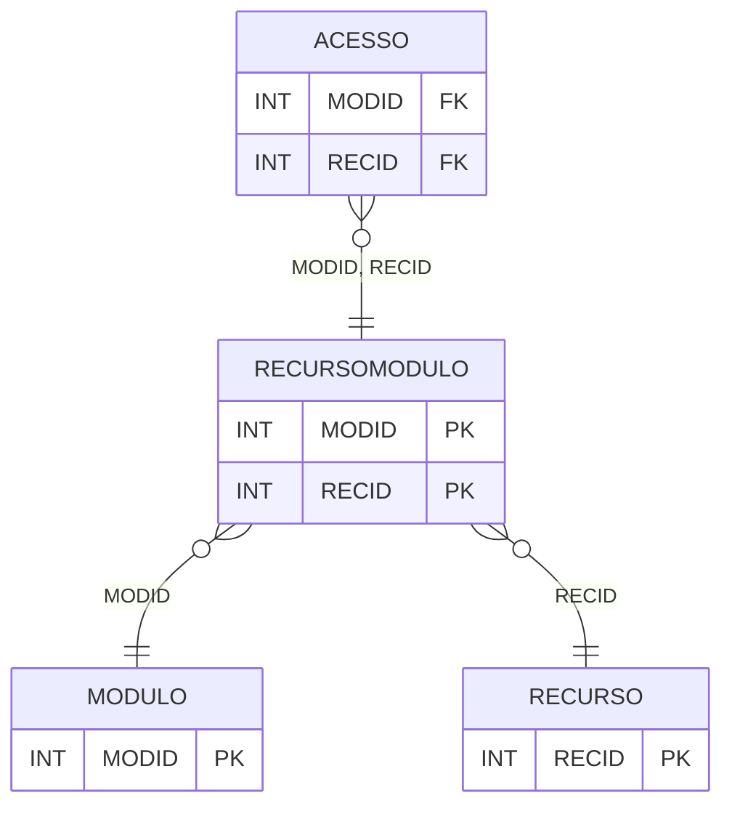

# RECURSOMODULO - Documentação Completa de Relacionamentos

## 📊 Informações Gerais

- **Nome da Tabela**: RECURSOMODULO (Recurso Módulo)
- **Total de Registros**: 14
- **Total de Colunas**: 2
- **Chave Primária**: MODID, RECID (composite)
- **Chaves Estrangeiras**: 2
- **Índices**: 0
- **Tabelas Dependentes**: 2
- **Banco de Dados**: Firebird

## 📝 Descrição

**RECURSOMODULO** é uma tabela intermediária que associa recursos a módulos do sistema. Com apenas **14 registros**, esta tabela registra quais recursos estão disponíveis em quais módulos, permitindo organização e controle de acesso por módulo.

Esta tabela é essencial para:
- **Recursos**: Gerenciar recursos por módulo
- **Módulos**: Organizar recursos em módulos
- **Rastreamento**: Rastrear recursos por módulo
- **Relatórios**: Gerar relatórios de recursos por módulo

---

## 🔑 Estrutura de Colunas

| Coluna | Tipo | Descrição |
|--------|------|-----------|
| **MODID** 🔑 🔗 | INT | ID do módulo (PK, FK → MODULO) |
| **RECID** 🔑 🔗 | INT | ID do recurso (PK, FK → RECURSO) |

---

## 🔗 Relacionamentos - Nível 1 (Diretos)

### MODULO - Módulo (FK Obrigatória)
**Volume:** Variável

**Relacionamento:**
```
RECURSOMODULO.MODID → MODULO.MODID (N:1)
Constraint: MODULO_RECURSOMODULO
```

### RECURSO - Recurso (FK Obrigatória)
**Volume:** 13 registros

**Relacionamento:**
```
RECURSOMODULO.RECID → RECURSO.RECID (N:1)
Constraint: RECURSO_RECURSOMODULO
```

---

## 📊 Tabelas que Referenciam Esta

Esta tabela é referenciada por 2 tabelas:

### ACESSO - Acesso
**Volume:** Variável

**Relacionamento:**
```
ACESSO.MODID → RECURSOMODULO.MODID (N:1)
ACESSO.RECID → RECURSOMODULO.RECID (N:1)
Constraint: RECURSOMODULO_ACESSO
```

---

## 🗺️ Diagrama de Relacionamentos



---

## 💡 Exemplos de Uso

### Consulta Básica

```sql
SELECT MODID, RECID
FROM RECURSOMODULO
WHERE MODID = ? AND RECID = ?;
```

---

## ⚡ Performance e Otimização

### Índices Recomendados

#### 1. Índice Composto na Chave Primária (Já existe implicitamente)
```sql
-- Índice primário já existe implicitamente
```

---

## 📊 Estatísticas e Insights

- **Total de Registros**: 14
- **Associações**: 14 associações de recursos a módulos

---

**Documentação gerada em**: 2025-01-27

**Banco de dados**: Firebird
