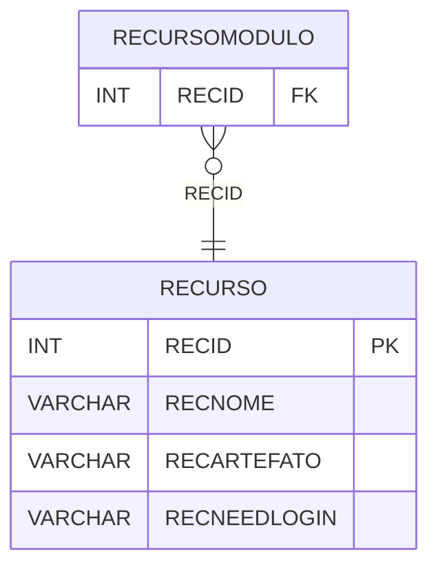

# RECURSO - Documentação Completa de Relacionamentos

## 📊 Informações Gerais

- **Nome da Tabela**: RECURSO
- **Total de Registros**: 13
- **Total de Colunas**: 4
- **Chave Primária**: RECID
- **Chaves Estrangeiras**: 0
- **Índices**: 0
- **Tabelas Dependentes**: 1
- **Banco de Dados**: Firebird

## 📝 Descrição

**RECURSO** é uma tabela mestre que armazena informações sobre recursos do sistema. Com apenas **13 registros**, esta tabela define recursos disponíveis no sistema, incluindo nome, artefato e flag de necessidade de login.

Esta tabela é essencial para:
- **Recursos**: Gerenciar recursos do sistema
- **Configuração**: Armazenar configurações de recursos
- **Rastreamento**: Rastrear recursos disponíveis
- **Relatórios**: Gerar relatórios de recursos

---

## 🔑 Estrutura de Colunas

| Coluna | Tipo | Descrição |
|--------|------|-----------|
| **RECID** 🔑 | INT | ID do recurso (PK) |
| **RECNOME** | VARCHAR(37) | Nome do recurso |
| **RECARTEFATO** | VARCHAR(37) | Artefato do recurso |
| **RECNEEDLOGIN** | VARCHAR(14) | Necessita login |

---

## 📊 Tabelas que Referenciam Esta

Esta tabela é referenciada por 1 tabela:

### RECURSOMODULO - Recurso Módulo
**Volume:** Variável

**Relacionamento:**
```
RECURSOMODULO.RECID → RECURSO.RECID (N:1)
Constraint: RECURSO_RECURSOMODULO
```

---

## 🗺️ Diagrama de Relacionamentos



---

## 💡 Exemplos de Uso

### Consulta Básica

```sql
SELECT RECID, RECNOME, RECARTEFATO, RECNEEDLOGIN
FROM RECURSO
WHERE RECID = ?;
```

---

## ⚡ Performance e Otimização

### Índices Recomendados

#### 1. Índice na Chave Primária (Já existe implicitamente)
```sql
-- Índice primário já existe implicitamente
```

---

## 📊 Estatísticas e Insights

- **Total de Registros**: 13
- **Recursos**: 13 recursos cadastrados no sistema

---

**Documentação gerada em**: 2025-01-27

**Banco de dados**: Firebird
