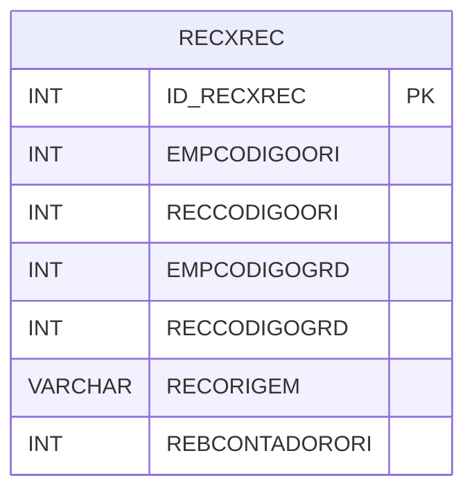

# RECXREC - Documentação Completa de Relacionamentos

## 📊 Informações Gerais

- **Nome da Tabela**: RECXREC (Receber x Receber)
- **Total de Registros**: 62
- **Total de Colunas**: 7
- **Chave Primária**: ID_RECXREC
- **Chaves Estrangeiras**: 0
- **Índices**: 0
- **Tabelas Dependentes**: 0
- **Banco de Dados**: Firebird

## 📝 Descrição

**RECXREC** é uma tabela intermediária que armazena informações sobre relacionamentos entre contas a receber. Com apenas **62 registros**, esta tabela registra relacionamentos entre contas a receber de diferentes empresas, incluindo empresa e conta origem, empresa e conta gerada, origem e contador origem.

Esta tabela é essencial para:
- **Relacionamentos**: Gerenciar relacionamentos entre contas a receber
- **Rastreamento**: Rastrear contas geradas a partir de outras
- **Relatórios**: Gerar relatórios de relacionamentos

---

## 🔑 Estrutura de Colunas

| Coluna | Tipo | Descrição |
|--------|------|-----------|
| **ID_RECXREC** 🔑 | INT | ID do relacionamento (PK) |
| **EMPCODIGOORI** | INT | Código da empresa origem |
| **RECCODIGOORI** | INT | Código da conta origem |
| **EMPCODIGOGRD** | INT | Código da empresa gerada |
| **RECCODIGOGRD** | INT | Código da conta gerada |
| **RECORIGEM** | VARCHAR(14) | Origem do relacionamento |
| **REBCONTADORORI** | INT | Contador origem |

---

## 🗺️ Diagrama de Relacionamentos



---

## 💡 Exemplos de Uso

### Consulta Básica

```sql
SELECT ID_RECXREC, EMPCODIGOORI, RECCODIGOORI, EMPCODIGOGRD, RECCODIGOGRD, RECORIGEM
FROM RECXREC
WHERE ID_RECXREC = ?;
```

---

## ⚡ Performance e Otimização

### Índices Recomendados

#### 1. Índice na Chave Primária (Já existe implicitamente)
```sql
-- Índice primário já existe implicitamente
```

#### 2. Índice em EMPCODIGOORI e RECCODIGOORI
```sql
CREATE INDEX IDX_RECXREC_ORIGEM 
ON RECXREC (EMPCODIGOORI, RECCODIGOORI);
```

**Justificativa:** Facilita buscas por conta origem.

---

## 📊 Estatísticas e Insights

- **Total de Registros**: 62
- **Relacionamentos**: 62 relacionamentos entre contas a receber

---

**Documentação gerada em**: 2025-01-27

**Banco de dados**: Firebird
