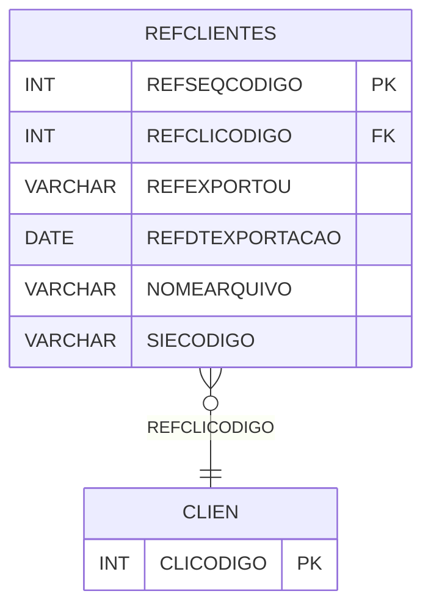

# REFCLIENTES - Documentação Completa de Relacionamentos

## 📊 Informações Gerais

- **Nome da Tabela**: REFCLIENTES (Referência Clientes)
- **Total de Registros**: 134.118
- **Total de Colunas**: 6
- **Chave Primária**: REFSEQCODIGO
- **Chaves Estrangeiras**: 1
- **Índices**: 0
- **Tabelas Dependentes**: 0
- **Banco de Dados**: Firebird

## 📝 Descrição

**REFCLIENTES** é uma tabela intermediária de grande volume que armazena informações sobre referências de clientes para sistemas externos. Com **134.118 registros**, esta tabela registra mapeamentos de clientes para sistemas externos, incluindo código do cliente, flag de exportação, data de exportação, nome do arquivo e código do sistema externo.

Esta tabela é essencial para:
- **Integração**: Gerenciar integração de clientes com sistemas externos
- **Exportação**: Controlar exportação de clientes
- **Rastreamento**: Rastrear exportações por cliente
- **Relatórios**: Gerar relatórios de integração

---

## 🔑 Estrutura de Colunas

| Coluna | Tipo | Descrição |
|--------|------|-----------|
| **REFSEQCODIGO** 🔑 | INT | Código sequencial (PK) |
| **REFCLICODIGO** 🔗 | INT | Código do cliente (FK → CLIEN) |
| **REFEXPORTOU** | VARCHAR(14) | Exportou |
| **REFDTEXPORTACAO** | DATE | Data de exportação |
| **NOMEARQUIVO** | VARCHAR(37) | Nome do arquivo |
| **SIECODIGO** | VARCHAR(14) | Código do sistema externo |

---

## 🔗 Relacionamentos - Nível 1 (Diretos)

### CLIEN - Cliente (FK Obrigatória)
**Volume:** Variável

**Relacionamento:**
```
REFCLIENTES.REFCLICODIGO → CLIEN.CLICODIGO (N:1)
Constraint: CLIEN_CLICODIGO
```

---

## 🗺️ Diagrama de Relacionamentos



---

## 💡 Exemplos de Uso

### Consulta Básica

```sql
SELECT REFSEQCODIGO, REFCLICODIGO, REFEXPORTOU, REFDTEXPORTACAO, NOMEARQUIVO, SIECODIGO
FROM REFCLIENTES
WHERE REFSEQCODIGO = ?;
```

---

## ⚡ Performance e Otimização

### Índices Recomendados

#### 1. Índice na Chave Primária (Já existe implicitamente)
```sql
-- Índice primário já existe implicitamente
```

#### 2. Índice em REFCLICODIGO e SIECODIGO
```sql
CREATE INDEX IDX_REFCLIENTES_CLI_SIE 
ON REFCLIENTES (REFCLICODIGO, SIECODIGO);
```

**Justificativa:** Facilita buscas por cliente e sistema externo.

---

## 📊 Estatísticas e Insights

- **Total de Registros**: 134.118
- **Referências**: 134.118 referências de clientes para sistemas externos

---

**Documentação gerada em**: 2025-01-27

**Banco de dados**: Firebird
