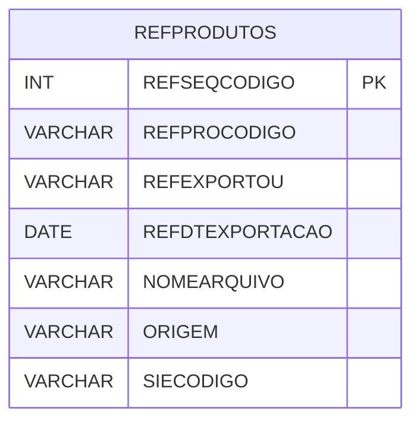

# REFPRODUTOS - Documentação Completa de Relacionamentos

## 📊 Informações Gerais

- **Nome da Tabela**: REFPRODUTOS (Referência Produtos)
- **Total de Registros**: 78.909
- **Total de Colunas**: 7
- **Chave Primária**: REFSEQCODIGO
- **Chaves Estrangeiras**: 0
- **Índices**: 2
- **Tabelas Dependentes**: 0
- **Banco de Dados**: Firebird

## 📝 Descrição

**REFPRODUTOS** é uma tabela intermediária de grande volume que armazena informações sobre referências de produtos para sistemas externos. Com **78.909 registros**, esta tabela registra mapeamentos de produtos para sistemas externos, incluindo código do produto, flag de exportação, data de exportação, nome do arquivo, origem e código do sistema externo.

Esta tabela é essencial para:
- **Integração**: Gerenciar integração de produtos com sistemas externos
- **Exportação**: Controlar exportação de produtos
- **Rastreamento**: Rastrear exportações por produto
- **Relatórios**: Gerar relatórios de integração

---

## 🔑 Estrutura de Colunas

| Coluna | Tipo | Descrição |
|--------|------|-----------|
| **REFSEQCODIGO** 🔑 | INT | Código sequencial (PK) |
| **REFPROCODIGO** | VARCHAR(14) | Código do produto |
| **REFEXPORTOU** | VARCHAR(14) | Exportou |
| **REFDTEXPORTACAO** | DATE | Data de exportação |
| **NOMEARQUIVO** | VARCHAR(37) | Nome do arquivo |
| **ORIGEM** | VARCHAR(14) | Origem |
| **SIECODIGO** | VARCHAR(14) | Código do sistema externo |

---

## 📇 Índices

| Nome do Índice | Colunas | Único |
|----------------|---------|-------|
| REFPRODUTOS_IDX1 | REFPROCODIGO, ORIGEM | Não |
| REFPRODUTOS_IDX2 | REFEXPORTOU | Não |

---

## 🗺️ Diagrama de Relacionamentos



---

## 💡 Exemplos de Uso

### Consulta Básica

```sql
SELECT REFSEQCODIGO, REFPROCODIGO, REFEXPORTOU, REFDTEXPORTACAO, NOMEARQUIVO, ORIGEM, SIECODIGO
FROM REFPRODUTOS
WHERE REFSEQCODIGO = ?;
```

---

## ⚡ Performance e Otimização

### Índices Recomendados

#### 1. Índice na Chave Primária (Já existe implicitamente)
```sql
-- Índice primário já existe implicitamente
```

#### 2. Índices Existentes
Os índices em REFPROCODIGO/ORIGEM e REFEXPORTOU já estão criados e são adequados.

---

## 📊 Estatísticas e Insights

- **Total de Registros**: 78.909
- **Referências**: 78.909 referências de produtos para sistemas externos

---

**Documentação gerada em**: 2025-01-27

**Banco de dados**: Firebird
