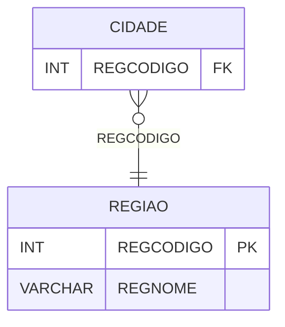

# REGIAO - Documentação Completa de Relacionamentos

## 📊 Informações Gerais

- **Nome da Tabela**: REGIAO
- **Total de Registros**: 6
- **Total de Colunas**: 2
- **Chave Primária**: REGCODIGO
- **Chaves Estrangeiras**: 0
- **Índices**: 0
- **Tabelas Dependentes**: 1
- **Banco de Dados**: Firebird

## 📝 Descrição

**REGIAO** é uma tabela mestre que armazena informações sobre regiões geográficas. Com apenas **6 registros**, esta tabela define regiões disponíveis no sistema, incluindo nome.

Esta tabela é essencial para:
- **Geografia**: Gerenciar regiões geográficas
- **Cidades**: Classificar cidades por região
- **Rastreamento**: Rastrear regiões disponíveis
- **Relatórios**: Gerar relatórios por região

---

## 🔑 Estrutura de Colunas

| Coluna | Tipo | Descrição |
|--------|------|-----------|
| **REGCODIGO** 🔑 | INT | Código da região (PK) |
| **REGNOME** | VARCHAR(37) | Nome da região |

---

## 📊 Tabelas que Referenciam Esta

Esta tabela é referenciada por 1 tabela:

### CIDADE - Cidade
**Volume:** Variável

**Relacionamento:**
```
CIDADE.REGCODIGO → REGIAO.REGCODIGO (N:1)
Constraint: REGIAO_CIDADE
```

---

## 🗺️ Diagrama de Relacionamentos



---

## 💡 Exemplos de Uso

### Consulta Básica

```sql
SELECT REGCODIGO, REGNOME
FROM REGIAO
WHERE REGCODIGO = ?;
```

---

## ⚡ Performance e Otimização

### Índices Recomendados

#### 1. Índice na Chave Primária (Já existe implicitamente)
```sql
-- Índice primário já existe implicitamente
```

---

## 📊 Estatísticas e Insights

- **Total de Registros**: 6
- **Regiões**: 6 regiões geográficas cadastradas

---

**Documentação gerada em**: 2025-01-27

**Banco de dados**: Firebird
