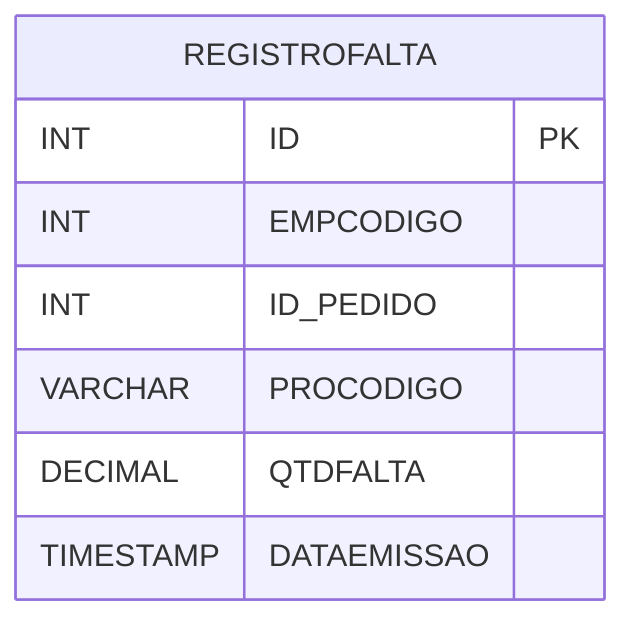

# REGISTROFALTA - Documentação Completa de Relacionamentos

## 📊 Informações Gerais

- **Nome da Tabela**: REGISTROFALTA (Registro de Falta)
- **Total de Registros**: 218.146
- **Total de Colunas**: 6
- **Chave Primária**: ID
- **Chaves Estrangeiras**: 0
- **Índices**: 3
- **Tabelas Dependentes**: 0
- **Banco de Dados**: Firebird

## 📝 Descrição

**REGISTROFALTA** é uma tabela intermediária de grande volume que armazena informações sobre registros de falta de produtos. Com **218.146 registros**, esta tabela registra faltas de produtos em pedidos, incluindo empresa, pedido, produto, quantidade faltante e data de emissão.

Esta tabela é essencial para:
- **Estoque**: Gerenciar registros de falta de produtos
- **Pedidos**: Controlar faltas em pedidos
- **Rastreamento**: Rastrear faltas por produto e pedido
- **Relatórios**: Gerar relatórios de faltas

---

## 🔑 Estrutura de Colunas

| Coluna | Tipo | Descrição |
|--------|------|-----------|
| **ID** 🔑 | INT | ID do registro (PK) |
| **EMPCODIGO** | INT | Código da empresa |
| **ID_PEDIDO** | INT | ID do pedido |
| **PROCODIGO** | VARCHAR(14) | Código do produto |
| **QTDFALTA** | DECIMAL(18,2) | Quantidade faltante |
| **DATAEMISSAO** | TIMESTAMP | Data de emissão |

---

## 📇 Índices

| Nome do Índice | Colunas | Único |
|----------------|---------|-------|
| IND_DATAEMI_REGFALTA | DATAEMISSAO | Não |
| IND_IDPEDIDO_REGFALTA | ID_PEDIDO | Não |
| IND_PROCODIGO_REGFALTA | PROCODIGO | Não |

---

## 🗺️ Diagrama de Relacionamentos



---

## 💡 Exemplos de Uso

### Consulta Básica

```sql
SELECT ID, EMPCODIGO, ID_PEDIDO, PROCODIGO, QTDFALTA, DATAEMISSAO
FROM REGISTROFALTA
WHERE ID = ?;
```

---

## ⚡ Performance e Otimização

### Índices Recomendados

#### 1. Índice na Chave Primária (Já existe implicitamente)
```sql
-- Índice primário já existe implicitamente
```

#### 2. Índices Existentes
Os índices em DATAEMISSAO, ID_PEDIDO e PROCODIGO já estão criados e são adequados.

---

## 📊 Estatísticas e Insights

- **Total de Registros**: 218.146
- **Registros de Falta**: 218.146 registros de falta de produtos

---

**Documentação gerada em**: 2025-01-27

**Banco de dados**: Firebird
