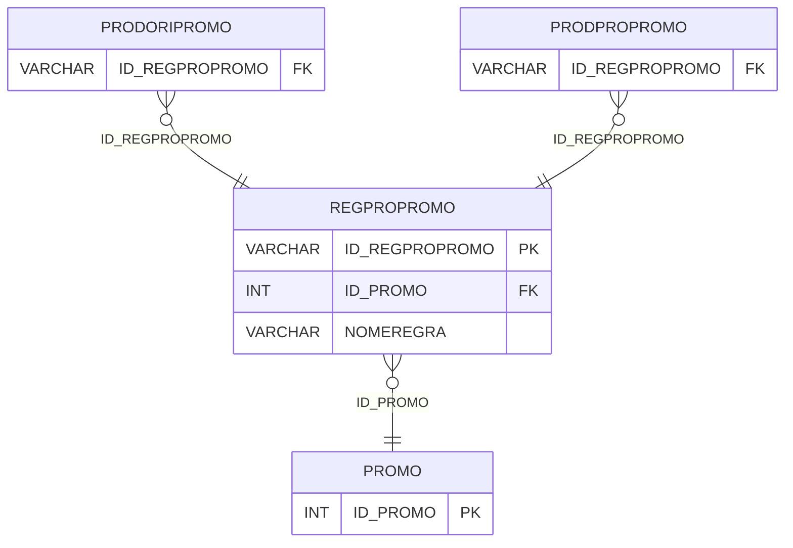

# REGPROPROMO - Documentação Completa de Relacionamentos

## 📊 Informações Gerais

- **Nome da Tabela**: REGPROPROMO (Regra Produto Promoção)
- **Total de Registros**: 2.251
- **Total de Colunas**: 3
- **Chave Primária**: ID_REGPROPROMO
- **Chaves Estrangeiras**: 1
- **Índices**: 0
- **Tabelas Dependentes**: 2
- **Banco de Dados**: Firebird

## 📝 Descrição

**REGPROPROMO** é uma tabela intermediária que armazena informações sobre regras de produtos em promoções. Com **2.251 registros**, esta tabela registra regras específicas de produtos para promoções, incluindo código da promoção e nome da regra.

Esta tabela é essencial para:
- **Promoções**: Gerenciar regras de produtos em promoções
- **Rastreamento**: Rastrear regras por promoção
- **Relatórios**: Gerar relatórios de regras de promoção

---

## 🔑 Estrutura de Colunas

| Coluna | Tipo | Descrição |
|--------|------|-----------|
| **ID_REGPROPROMO** 🔑 | VARCHAR(16) | ID da regra produto promoção (PK) |
| **ID_PROMO** 🔗 | INT | ID da promoção (FK → PROMO) |
| **NOMEREGRA** | VARCHAR(37) | Nome da regra |

---

## 🔗 Relacionamentos - Nível 1 (Diretos)

### PROMO - Promoção (FK Obrigatória)
**Volume:** Variável

**Relacionamento:**
```
REGPROPROMO.ID_PROMO → PROMO.ID_PROMO (N:1)
Constraint: XFK_REGPROPROMO_PROMO
```

---

## 📊 Tabelas que Referenciam Esta

Esta tabela é referenciada por 2 tabelas:

### PRODORIPROMO - Produto Origem Promoção
**Volume:** Variável

**Relacionamento:**
```
PRODORIPROMO.ID_REGPROPROMO → REGPROPROMO.ID_REGPROPROMO (N:1)
Constraint: XFK_PRODORIPROMO_REGPROPROMO
```

### PRODPROPROMO - Produto Produto Promoção
**Volume:** Variável

**Relacionamento:**
```
PRODPROPROMO.ID_REGPROPROMO → REGPROPROMO.ID_REGPROPROMO (N:1)
Constraint: XFK_PRODPROPROMO_REGPROPROMO
```

---

## 🗺️ Diagrama de Relacionamentos



---

## 💡 Exemplos de Uso

### Consulta Básica

```sql
SELECT ID_REGPROPROMO, ID_PROMO, NOMEREGRA
FROM REGPROPROMO
WHERE ID_REGPROPROMO = ?;
```

---

## ⚡ Performance e Otimização

### Índices Recomendados

#### 1. Índice na Chave Primária (Já existe implicitamente)
```sql
-- Índice primário já existe implicitamente
```

---

## 📊 Estatísticas e Insights

- **Total de Registros**: 2.251
- **Regras**: 2.251 regras de produtos em promoções

---

**Documentação gerada em**: 2025-01-27

**Banco de dados**: Firebird
