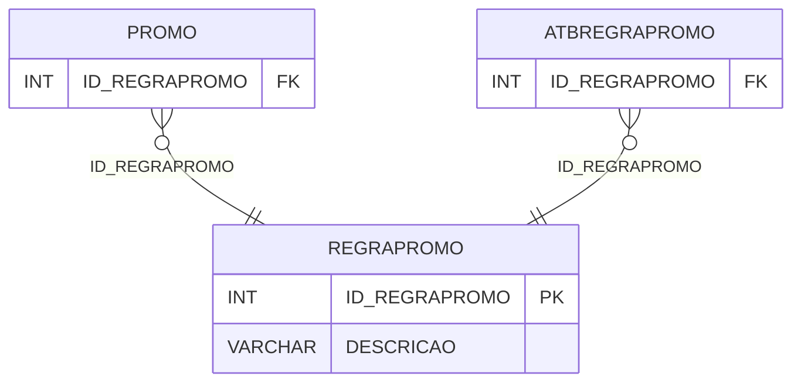

# REGRAPROMO - Documentação Completa de Relacionamentos

## 📊 Informações Gerais

- **Nome da Tabela**: REGRAPROMO (Regra Promoção)
- **Total de Registros**: 3
- **Total de Colunas**: 2
- **Chave Primária**: ID_REGRAPROMO
- **Chaves Estrangeiras**: 0
- **Índices**: 0
- **Tabelas Dependentes**: 2
- **Banco de Dados**: Firebird

## 📝 Descrição

**REGRAPROMO** é uma tabela mestre que armazena informações sobre tipos de regras de promoção. Com apenas **3 registros**, esta tabela define tipos de regras disponíveis para promoções, incluindo descrição.

Esta tabela é essencial para:
- **Promoções**: Gerenciar tipos de regras de promoção
- **Rastreamento**: Rastrear tipos de regras disponíveis
- **Relatórios**: Gerar relatórios de tipos de regras

---

## 🔑 Estrutura de Colunas

| Coluna | Tipo | Descrição |
|--------|------|-----------|
| **ID_REGRAPROMO** 🔑 | INT | ID da regra promoção (PK) |
| **DESCRICAO** | VARCHAR(37) | Descrição da regra |

---

## 📊 Tabelas que Referenciam Esta

Esta tabela é referenciada por 2 tabelas:

### PROMO - Promoção
**Volume:** Variável

**Relacionamento:**
```
PROMO.ID_REGRAPROMO → REGRAPROMO.ID_REGRAPROMO (N:1)
Constraint: XFKPROMO_REGRAPROMO
```

### ATBREGRAPROMO - Atributo Regra Promoção
**Volume:** Variável

**Relacionamento:**
```
ATBREGRAPROMO.ID_REGRAPROMO → REGRAPROMO.ID_REGRAPROMO (N:1)
Constraint: XFKATBRPROMO_RPROMO
```

---

## 🗺️ Diagrama de Relacionamentos



---

## 💡 Exemplos de Uso

### Consulta Básica

```sql
SELECT ID_REGRAPROMO, DESCRICAO
FROM REGRAPROMO
WHERE ID_REGRAPROMO = ?;
```

---

## ⚡ Performance e Otimização

### Índices Recomendados

#### 1. Índice na Chave Primária (Já existe implicitamente)
```sql
-- Índice primário já existe implicitamente
```

---

## 📊 Estatísticas e Insights

- **Total de Registros**: 3
- **Tipos de Regras**: 3 tipos de regras de promoção cadastrados

---

**Documentação gerada em**: 2025-01-27

**Banco de dados**: Firebird
