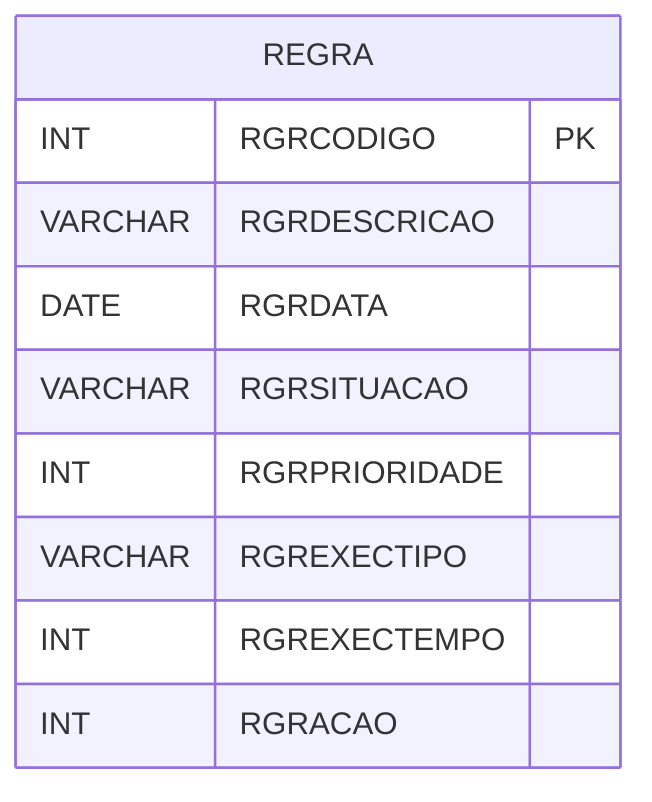

# REGRA - Documentação Completa de Relacionamentos

## 📊 Informações Gerais

- **Nome da Tabela**: REGRA
- **Total de Registros**: 1
- **Total de Colunas**: 8
- **Chave Primária**: RGRCODIGO
- **Chaves Estrangeiras**: 0
- **Índices**: 0
- **Tabelas Dependentes**: 0
- **Banco de Dados**: Firebird

## 📝 Descrição

**REGRA** é uma tabela de configuração que armazena informações sobre regras do sistema. Com apenas **1 registro**, esta tabela define configurações de regras, incluindo descrição, data, situação, prioridade, tipo de execução, tempo de execução e ação.

Esta tabela é essencial para:
- **Configuração**: Armazenar configurações de regras
- **Rastreamento**: Rastrear configurações de regras
- **Relatórios**: Gerar relatórios de configurações

---

## 🔑 Estrutura de Colunas

| Coluna | Tipo | Descrição |
|--------|------|-----------|
| **RGRCODIGO** 🔑 | INT | Código da regra (PK) |
| **RGRDESCRICAO** | VARCHAR(37) | Descrição da regra |
| **RGRDATA** | DATE | Data da regra |
| **RGRSITUACAO** | VARCHAR(14) | Situação da regra |
| **RGRPRIORIDADE** | INT | Prioridade da regra |
| **RGREXECTIPO** | VARCHAR(14) | Tipo de execução |
| **RGREXECTEMPO** | INT | Tempo de execução |
| **RGRACAO** | INT | Ação da regra |

---

## 🗺️ Diagrama de Relacionamentos



---

## 💡 Exemplos de Uso

### Consulta Básica

```sql
SELECT RGRCODIGO, RGRDESCRICAO, RGRDATA, RGRSITUACAO, RGRPRIORIDADE, RGREXECTIPO, RGREXECTEMPO, RGRACAO
FROM REGRA
WHERE RGRCODIGO = ?;
```

---

## ⚡ Performance e Otimização

### Índices Recomendados

#### 1. Índice na Chave Primária (Já existe implicitamente)
```sql
-- Índice primário já existe implicitamente
```

---

## 📊 Estatísticas e Insights

- **Total de Registros**: 1
- **Uso**: Tabela de configuração com volume mínimo

---

**Documentação gerada em**: 2025-01-27

**Banco de dados**: Firebird
