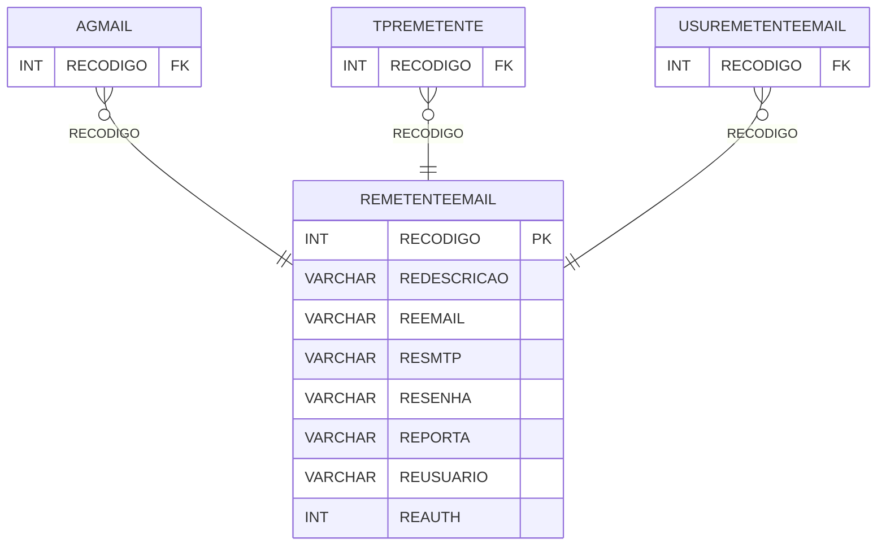

# REMETENTEEMAIL - Documentação Completa de Relacionamentos

## 📊 Informações Gerais

- **Nome da Tabela**: REMETENTEEMAIL (Remetente E-mail)
- **Total de Registros**: 9
- **Total de Colunas**: 8
- **Chave Primária**: RECODIGO
- **Chaves Estrangeiras**: 0
- **Índices**: 0
- **Tabelas Dependentes**: 3
- **Banco de Dados**: Firebird

## 📝 Descrição

**REMETENTEEMAIL** é uma tabela mestre que armazena configurações de remetentes de e-mail. Com apenas **9 registros**, esta tabela define remetentes disponíveis no sistema, incluindo descrição, e-mail, servidor SMTP, porta, senha, usuário e autenticação.

Esta tabela é essencial para:
- **E-mail**: Gerenciar remetentes de e-mail
- **Configuração**: Armazenar configurações SMTP
- **Rastreamento**: Rastrear remetentes disponíveis
- **Relatórios**: Gerar relatórios de envio de e-mail

---

## 🔑 Estrutura de Colunas

| Coluna | Tipo | Descrição |
|--------|------|-----------|
| **RECODIGO** 🔑 | INT | Código do remetente (PK) |
| **REDESCRICAO** | VARCHAR(37) | Descrição do remetente |
| **REEMAIL** | VARCHAR(37) | E-mail do remetente |
| **RESMTP** | VARCHAR(37) | Servidor SMTP |
| **RESENHA** | VARCHAR(37) | Senha do servidor |
| **REPORTA** | VARCHAR(14) | Porta do servidor |
| **REUSUARIO** | VARCHAR(37) | Usuário do servidor |
| **REAUTH** | INT | Tipo de autenticação |

---

## 📊 Tabelas que Referenciam Esta

Esta tabela é referenciada por 3 tabelas:

### AGMAIL - Agendamento E-mail
**Volume:** Variável

**Relacionamento:**
```
AGMAIL.RECODIGO → REMETENTEEMAIL.RECODIGO (N:1)
Constraint: REMETENTEEMAIL_AGMAIL
```

### TPREMETENTE - Tipo Remetente
**Volume:** Variável

**Relacionamento:**
```
TPREMETENTE.RECODIGO → REMETENTEEMAIL.RECODIGO (N:1)
Constraint: FK_TPREMETENTE_1
```

### USUREMETENTEEMAIL - Usuário Remetente E-mail
**Volume:** Variável

**Relacionamento:**
```
USUREMETENTEEMAIL.RECODIGO → REMETENTEEMAIL.RECODIGO (N:1)
Constraint: USURE_REMETENTEEMAIL
```

---

## 🗺️ Diagrama de Relacionamentos



---

## 💡 Exemplos de Uso

### Consulta Básica

```sql
SELECT RECODIGO, REDESCRICAO, REEMAIL, RESMTP, REPORTA, REUSUARIO, REAUTH
FROM REMETENTEEMAIL
WHERE RECODIGO = ?;
```

---

## ⚡ Performance e Otimização

### Índices Recomendados

#### 1. Índice na Chave Primária (Já existe implicitamente)
```sql
-- Índice primário já existe implicitamente
```

---

## 📊 Estatísticas e Insights

- **Total de Registros**: 9
- **Remetentes**: 9 remetentes de e-mail cadastrados

---

**Documentação gerada em**: 2025-01-27

**Banco de dados**: Firebird

