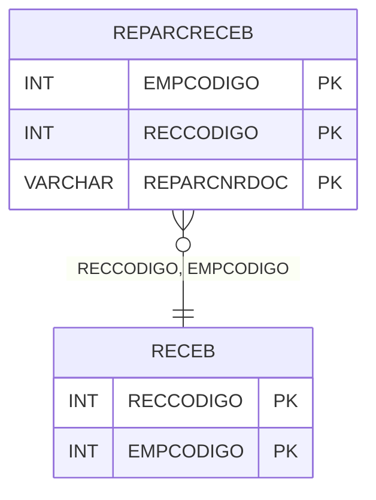

# REPARCRECEB - Documentação Completa de Relacionamentos

## 📊 Informações Gerais

- **Nome da Tabela**: REPARCRECEB (Reparcelação Receber)
- **Total de Registros**: 724
- **Total de Colunas**: 3
- **Chave Primária**: EMPCODIGO, RECCODIGO, REPARCNRDOC (composite)
- **Chaves Estrangeiras**: 2
- **Índices**: 0
- **Tabelas Dependentes**: 0
- **Banco de Dados**: Firebird

## 📝 Descrição

**REPARCRECEB** é uma tabela intermediária que armazena informações sobre reparcelação de contas a receber. Com **724 registros**, esta tabela registra documentos de reparcelação associados a contas a receber, permitindo rastreamento de parcelas geradas a partir de contas originais.

Esta tabela é essencial para:
- **Reparcelação**: Gerenciar reparcelação de contas a receber
- **Rastreamento**: Rastrear documentos de reparcelação
- **Relatórios**: Gerar relatórios de reparcelação

---

## 🔑 Estrutura de Colunas

| Coluna | Tipo | Descrição |
|--------|------|-----------|
| **EMPCODIGO** 🔑 🔗 | INT | Código da empresa (PK, FK → RECEB) |
| **RECCODIGO** 🔑 🔗 | INT | Código da conta a receber (PK, FK → RECEB) |
| **REPARCNRDOC** 🔑 | VARCHAR(14) | Número do documento de reparcelação (PK) |

---

## 🔗 Relacionamentos - Nível 1 (Diretos)

### RECEB - Contas a Receber (FK Obrigatória)
**Volume:** Variável

**Relacionamento:**
```
REPARCRECEB.RECCODIGO → RECEB.RECCODIGO (N:1)
REPARCRECEB.EMPCODIGO → RECEB.EMPCODIGO (N:1)
Constraint: RECEB_REPARCRECEB
```

---

## 🗺️ Diagrama de Relacionamentos



---

## 💡 Exemplos de Uso

### Consulta Básica

```sql
SELECT EMPCODIGO, RECCODIGO, REPARCNRDOC
FROM REPARCRECEB
WHERE EMPCODIGO = ? AND RECCODIGO = ?;
```

---

## ⚡ Performance e Otimização

### Índices Recomendados

#### 1. Índice Composto na Chave Primária (Já existe implicitamente)
```sql
-- Índice primário já existe implicitamente
```

---

## 📊 Estatísticas e Insights

- **Total de Registros**: 724
- **Reparcelações**: 724 reparcelações de contas a receber

---

**Documentação gerada em**: 2025-01-27

**Banco de dados**: Firebird

