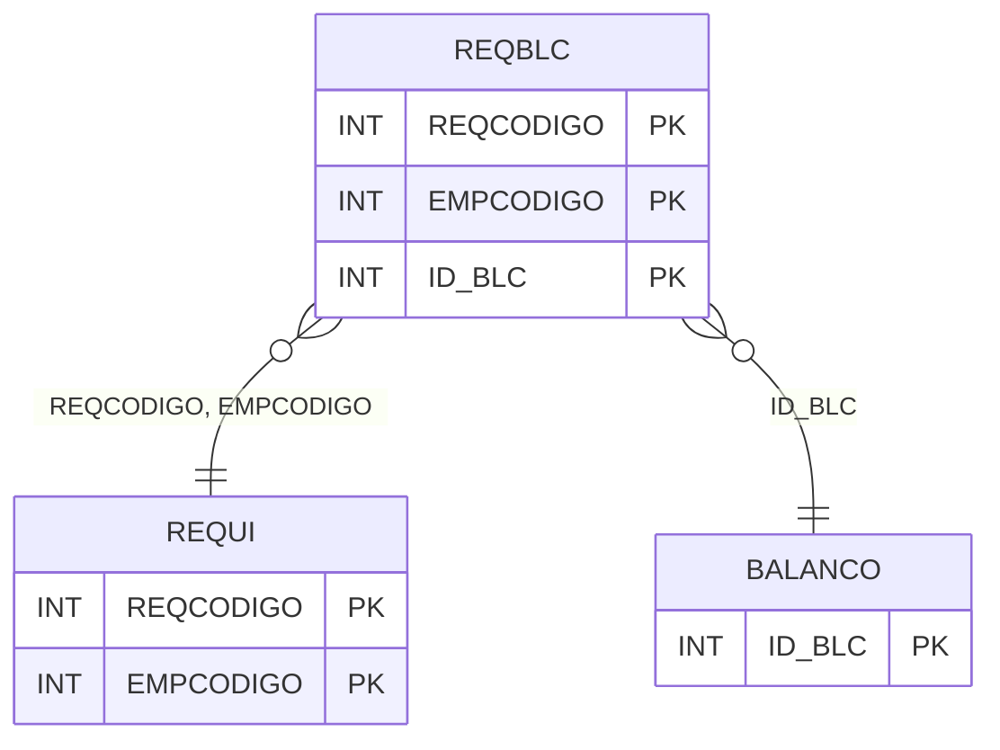

# REQBLC - Documentação Completa de Relacionamentos

## 📊 Informações Gerais

- **Nome da Tabela**: REQBLC (Requisição Balanço)
- **Total de Registros**: 1.919
- **Total de Colunas**: 3
- **Chave Primária**: REQCODIGO, EMPCODIGO, ID_BLC (composite)
- **Chaves Estrangeiras**: 3
- **Índices**: 0
- **Tabelas Dependentes**: 0
- **Banco de Dados**: Firebird

## 📝 Descrição

**REQBLC** é uma tabela intermediária que associa requisições a balanços de estoque. Com **1.919 registros**, esta tabela registra quais balanços estão associados a cada requisição, permitindo rastreamento de requisições relacionadas a inventários.

Esta tabela é essencial para:
- **Requisições**: Gerenciar requisições relacionadas a balanços
- **Inventário**: Rastrear requisições por balanço
- **Relatórios**: Gerar relatórios de requisições por balanço

---

## 🔑 Estrutura de Colunas

| Coluna | Tipo | Descrição |
|--------|------|-----------|
| **REQCODIGO** 🔑 🔗 | INT | Código da requisição (PK, FK → REQUI) |
| **EMPCODIGO** 🔑 🔗 | INT | Código da empresa (PK, FK → REQUI) |
| **ID_BLC** 🔑 🔗 | INT | ID do balanço (PK, FK → BALANCO) |

---

## 🔗 Relacionamentos - Nível 1 (Diretos)

### REQUI - Requisição (FK Obrigatória)
**Volume:** 1.365.818 registros

**Relacionamento:**
```
REQBLC.REQCODIGO → REQUI.REQCODIGO (N:1)
REQBLC.EMPCODIGO → REQUI.EMPCODIGO (N:1)
Constraint: REQBLC_REQUI
```

### BALANCO - Balanço (FK Obrigatória)
**Volume:** Variável

**Relacionamento:**
```
REQBLC.ID_BLC → BALANCO.ID_BLC (N:1)
Constraint: REQBLC_BALANCO
```

---

## 🗺️ Diagrama de Relacionamentos



---

## 💡 Exemplos de Uso

### Consulta Básica

```sql
SELECT REQCODIGO, EMPCODIGO, ID_BLC
FROM REQBLC
WHERE REQCODIGO = ? AND EMPCODIGO = ?;
```

---

## ⚡ Performance e Otimização

### Índices Recomendados

#### 1. Índice Composto na Chave Primária (Já existe implicitamente)
```sql
-- Índice primário já existe implicitamente
```

---

## 📊 Estatísticas e Insights

- **Total de Registros**: 1.919
- **Associações**: 1.919 associações de requisições a balanços

---

**Documentação gerada em**: 2025-01-27

**Banco de dados**: Firebird

