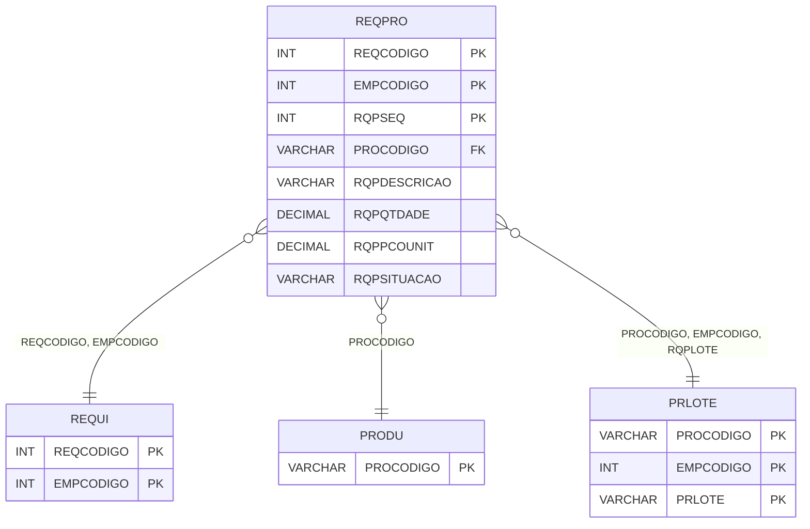

# REQPRO - Documentação Completa de Relacionamentos

## 📊 Informações Gerais

- **Nome da Tabela**: REQPRO (Requisição Produto)
- **Total de Registros**: 4.631.501
- **Total de Colunas**: 25
- **Chave Primária**: REQCODIGO, EMPCODIGO, RQPSEQ (composite)
- **Chaves Estrangeiras**: 6
- **Índices**: 2
- **Tabelas Dependentes**: 3
- **Banco de Dados**: Firebird

## 📝 Descrição

**REQPRO** é uma tabela intermediária de grande volume que armazena itens de produtos em requisições. Com **4.631.501 registros**, esta tabela registra produtos solicitados em requisições, incluindo quantidade, preço unitário, tipo de preço, desconto, data de aprovação, situação, prazo de entrega, lote, custo real, data de separação, quantidade faltante e outras informações operacionais.

Esta tabela é essencial para:
- **Requisições**: Gerenciar produtos em requisições
- **Estoque**: Controlar movimentação de estoque via requisições
- **Rastreamento**: Rastrear produtos por requisição
- **Relatórios**: Gerar relatórios de requisições por produto

---

## 🔑 Estrutura de Colunas (Principais)

| Coluna | Tipo | Descrição |
|--------|------|-----------|
| **REQCODIGO** 🔑 🔗 | INT | Código da requisição (PK, FK → REQUI) |
| **EMPCODIGO** 🔑 🔗 | INT | Código da empresa (PK, FK → REQUI) |
| **RQPSEQ** 🔑 | INT | Sequencial do item (PK) |
| **PROCODIGO** 🔗 | VARCHAR(14) | Código do produto (FK → PRODU) |
| **RQPDESCRICAO** | VARCHAR(37) | Descrição do produto |
| **RQPQTDADE** | DECIMAL(18,2) | Quantidade solicitada |
| **RQPPCOUNIT** | DECIMAL(18,2) | Preço unitário |
| **RQPTPPRECO** | VARCHAR(14) | Tipo de preço |
| **RQPPCDESCTO** | DECIMAL(18,2) | Percentual de desconto |
| **RQPDTAPROV** | TIMESTAMP | Data de aprovação |
| **RQPSITUACAO** | VARCHAR(14) | Situação do item |
| **RQPPZENTRE** | TIMESTAMP | Prazo de entrega |
| **RQPDTCANC** | TIMESTAMP | Data de cancelamento |
| **RQPDTENTRE** | TIMESTAMP | Data de entrega |
| **RQPLOTE** 🔗 | VARCHAR(14) | Lote do produto (FK → PRLOTE) |
| **RQPCUSTOREAL** | DECIMAL(18,2) | Custo real |
| **RQPDTSEPARACAO** | DATE | Data de separação |
| **RQPQTDFALTA** | DECIMAL(18,2) | Quantidade faltante |
| **RQPCUSTODIGITADO** | DECIMAL(18,2) | Custo digitado |
| **COMPOCOD** | INT | Código da composição |

---

## 🔗 Relacionamentos - Nível 1 (Diretos)

### REQUI - Requisição (FK Obrigatória)
**Volume:** 1.365.818 registros

**Relacionamento:**
```
REQPRO.REQCODIGO → REQUI.REQCODIGO (N:1)
REQPRO.EMPCODIGO → REQUI.EMPCODIGO (N:1)
Constraint: REQUI_REQPRO
```

### PRODU - Produto (FK Obrigatória)
**Volume:** Variável

**Relacionamento:**
```
REQPRO.PROCODIGO → PRODU.PROCODIGO (N:1)
Constraint: PRODU_REQPRO
```

### PRLOTE - Produto Lote (FK Opcional)
**Volume:** Variável

**Relacionamento:**
```
REQPRO.PROCODIGO → PRLOTE.PROCODIGO (N:1)
REQPRO.EMPCODIGO → PRLOTE.EMPCODIGO (N:1)
REQPRO.RQPLOTE → PRLOTE.PRLOTE (N:1)
Constraint: PRLOTE_REQPRO
```

---

## 📊 Tabelas que Referenciam Esta

Esta tabela é referenciada por 3 tabelas:

### RQPLOTE - Requisição Produto Lote
**Volume:** Variável

**Relacionamento:**
```
RQPLOTE.REQCODIGO → REQPRO.REQCODIGO (N:1)
RQPLOTE.EMPCODIGO → REQPRO.EMPCODIGO (N:1)
RQPLOTE.RQPSEQ → REQPRO.RQPSEQ (N:1)
Constraint: REQPRO_RQPLOTE
```

---

## 📇 Índices

| Nome do Índice | Colunas | Único |
|----------------|---------|-------|
| IND_REQPRO_DATAAPV | RQPDTAPROV | Não |
| IND_REQPRO_DATAENTREGA | RQPDTENTRE | Não |

---

## 🗺️ Diagrama de Relacionamentos



---

## 💡 Exemplos de Uso

### Consulta Básica

```sql
SELECT REQCODIGO, EMPCODIGO, RQPSEQ, PROCODIGO, RQPDESCRICAO, RQPQTDADE, RQPSITUACAO
FROM REQPRO
WHERE REQCODIGO = ? AND EMPCODIGO = ?;
```

---

## ⚡ Performance e Otimização

### Índices Recomendados

#### 1. Índice Composto na Chave Primária (Já existe implicitamente)
```sql
-- Índice primário já existe implicitamente
```

#### 2. Índices Existentes
Os índices em RQPDTAPROV e RQPDTENTRE já estão criados e são adequados.

---

## 📊 Estatísticas e Insights

- **Total de Registros**: 4.631.501
- **Média por Requisição**: ~3.4 produtos por requisição (4.631.501 / 1.365.818)

---

**Documentação gerada em**: 2025-01-27

**Banco de dados**: Firebird

