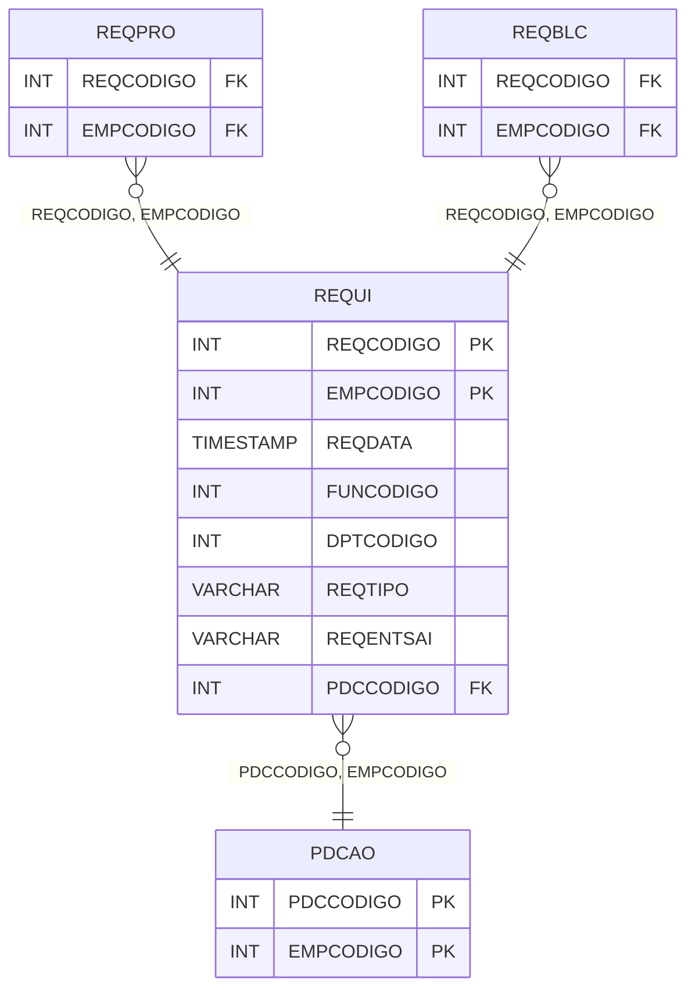

# REQUI - Documentação Completa de Relacionamentos

## 📊 Informações Gerais

- **Nome da Tabela**: REQUI (Requisição)
- **Total de Registros**: 1.365.818
- **Total de Colunas**: 16
- **Chave Primária**: REQCODIGO, EMPCODIGO (composite)
- **Chaves Estrangeiras**: 2
- **Índices**: 1
- **Tabelas Dependentes**: 10
- **Banco de Dados**: Firebird

## 📝 Descrição

**REQUI** é uma tabela mestre de grande volume que armazena informações sobre requisições de estoque. Com **1.365.818 registros**, esta tabela registra requisições de entrada e saída de estoque, incluindo data, funcionário, departamento, tipo, origem, observações, valor total, ordem de produção associada e outras informações operacionais.

Esta tabela é essencial para:
- **Estoque**: Gerenciar movimentação de estoque via requisições
- **Produção**: Controlar requisições relacionadas a ordens de produção
- **Rastreamento**: Rastrear requisições por funcionário e departamento
- **Relatórios**: Gerar relatórios de requisições

---

## 🔑 Estrutura de Colunas (Principais)

| Coluna | Tipo | Descrição |
|--------|------|-----------|
| **REQCODIGO** 🔑 | INT | Código da requisição (PK) |
| **REQDATA** | TIMESTAMP | Data da requisição |
| **FUNCODIGO** | INT | Código do funcionário |
| **DPTCODIGO** | INT | Código do departamento |
| **REQTIPO** | VARCHAR(14) | Tipo da requisição |
| **REQENTSAI** | VARCHAR(14) | Entrada/Saída |
| **REQOBS** | VARCHAR(261) | Observações |
| **REQVRTOTAL** | DECIMAL(18,2) | Valor total |
| **EMPCODIGO** 🔑 🔗 | INT | Código da empresa (PK, FK → PDCAO) |
| **PDCCODIGO** 🔗 | INT | Código da ordem de produção (FK → PDCAO) |
| **REQORIGEM** | VARCHAR(14) | Origem da requisição |
| **REQCHECKSUM** | VARCHAR(37) | Checksum para validação |
| **REQHORA** | TIMESTAMP | Hora da requisição |
| **REQTIPOESTOQUE** | VARCHAR(14) | Tipo de estoque |
| **CLIFORNCODIGO** | INT | Código do cliente/fornecedor |
| **REQDTFRESTADO** | VARCHAR(14) | Data de restado |

---

## 🔗 Relacionamentos - Nível 1 (Diretos)

### PDCAO - Ordem de Produção (FK Opcional)
**Volume:** Variável

**Relacionamento:**
```
REQUI.PDCCODIGO → PDCAO.PDCCODIGO (N:1)
REQUI.EMPCODIGO → PDCAO.EMPCODIGO (N:1)
Constraint: PDCAO_REQUI
```

---

## 📊 Tabelas que Referenciam Esta

Esta tabela é referenciada por 10 tabelas:

### REQPRO - Requisição Produto
**Volume:** 4.631.501 registros

**Relacionamento:**
```
REQPRO.REQCODIGO → REQUI.REQCODIGO (N:1)
REQPRO.EMPCODIGO → REQUI.EMPCODIGO (N:1)
Constraint: REQUI_REQPRO
```

### REQBLC - Requisição Balanço
**Volume:** 1.919 registros

**Relacionamento:**
```
REQBLC.REQCODIGO → REQUI.REQCODIGO (N:1)
REQBLC.EMPCODIGO → REQUI.EMPCODIGO (N:1)
Constraint: REQBLC_REQUI
```

---

## 📇 Índices

| Nome do Índice | Colunas | Único |
|----------------|---------|-------|
| IND_REQDATA | REQDATA | Não |

---

## 🗺️ Diagrama de Relacionamentos



---

## 💡 Exemplos de Uso

### Consulta Básica

```sql
SELECT REQCODIGO, EMPCODIGO, REQDATA, FUNCODIGO, DPTCODIGO, REQTIPO, REQENTSAI
FROM REQUI
WHERE REQCODIGO = ? AND EMPCODIGO = ?;
```

---

## ⚡ Performance e Otimização

### Índices Recomendados

#### 1. Índice Composto na Chave Primária (Já existe implicitamente)
```sql
-- Índice primário já existe implicitamente
```

#### 2. Índice Existente
O índice em REQDATA já está criado e é adequado para consultas por período.

---

## 📊 Estatísticas e Insights

- **Total de Registros**: 1.365.818
- **Requisições**: 1.365.818 requisições de estoque cadastradas

---

**Documentação gerada em**: 2025-01-27

**Banco de dados**: Firebird

