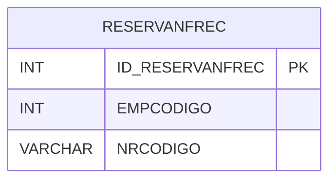

# RESERVANFREC - Documentação Completa de Relacionamentos

## 📊 Informações Gerais

- **Nome da Tabela**: RESERVANFREC (Reserva NF Receber)
- **Total de Registros**: 7.504
- **Total de Colunas**: 3
- **Chave Primária**: ID_RESERVANFREC
- **Chaves Estrangeiras**: 0
- **Índices**: 0
- **Tabelas Dependentes**: 0
- **Banco de Dados**: Firebird

## 📝 Descrição

**RESERVANFREC** é uma tabela intermediária que armazena informações sobre reservas de números de notas fiscais para contas a receber. Com **7.504 registros**, esta tabela registra números de notas fiscais reservados por empresa, permitindo controle de numeração fiscal.

Esta tabela é essencial para:
- **Fiscal**: Gerenciar reservas de números de notas fiscais
- **Controle**: Controlar numeração fiscal por empresa
- **Rastreamento**: Rastrear números reservados
- **Relatórios**: Gerar relatórios de reservas fiscais

---

## 🔑 Estrutura de Colunas

| Coluna | Tipo | Descrição |
|--------|------|-----------|
| **ID_RESERVANFREC** 🔑 | INT | ID da reserva (PK) |
| **EMPCODIGO** | INT | Código da empresa |
| **NRCODIGO** | VARCHAR(14) | Código do número de nota fiscal |

---

## 🗺️ Diagrama de Relacionamentos



---

## 💡 Exemplos de Uso

### Consulta Básica

```sql
SELECT ID_RESERVANFREC, EMPCODIGO, NRCODIGO
FROM RESERVANFREC
WHERE ID_RESERVANFREC = ?;
```

---

## ⚡ Performance e Otimização

### Índices Recomendados

#### 1. Índice na Chave Primária (Já existe implicitamente)
```sql
-- Índice primário já existe implicitamente
```

#### 2. Índice em EMPCODIGO e NRCODIGO
```sql
CREATE INDEX IDX_RESERVANFREC_EMP_NR 
ON RESERVANFREC (EMPCODIGO, NRCODIGO);
```

**Justificativa:** Facilita buscas por empresa e número de nota fiscal.

---

## 📊 Estatísticas e Insights

- **Total de Registros**: 7.504
- **Reservas**: 7.504 reservas de números de notas fiscais

---

**Documentação gerada em**: 2025-01-27

**Banco de dados**: Firebird

