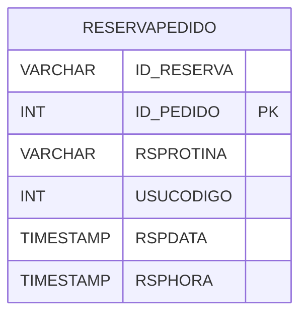

# RESERVAPEDIDO - Documentação Completa de Relacionamentos

## 📊 Informações Gerais

- **Nome da Tabela**: RESERVAPEDIDO (Reserva Pedido)
- **Total de Registros**: 7
- **Total de Colunas**: 6
- **Chave Primária**: ID_PEDIDO
- **Chaves Estrangeiras**: 0
- **Índices**: 0
- **Tabelas Dependentes**: 0
- **Banco de Dados**: Firebird

## 📝 Descrição

**RESERVAPEDIDO** é uma tabela intermediária que armazena informações sobre reservas de pedidos. Com apenas **7 registros**, esta tabela registra pedidos reservados, incluindo ID da reserva, rotina, usuário, data e hora da reserva.

Esta tabela é essencial para:
- **Reservas**: Gerenciar reservas de pedidos
- **Controle**: Controlar pedidos reservados
- **Rastreamento**: Rastrear reservas por usuário
- **Relatórios**: Gerar relatórios de reservas

---

## 🔑 Estrutura de Colunas

| Coluna | Tipo | Descrição |
|--------|------|-----------|
| **ID_RESERVA** | VARCHAR(37) | ID da reserva |
| **ID_PEDIDO** 🔑 | INT | ID do pedido (PK) |
| **RSPROTINA** | VARCHAR(37) | Rotina que fez a reserva |
| **USUCODIGO** | INT | Código do usuário |
| **RSPDATA** | TIMESTAMP | Data da reserva |
| **RSPHORA** | TIMESTAMP | Hora da reserva |

---

## 🗺️ Diagrama de Relacionamentos



---

## 💡 Exemplos de Uso

### Consulta Básica

```sql
SELECT ID_RESERVA, ID_PEDIDO, RSPROTINA, USUCODIGO, RSPDATA, RSPHORA
FROM RESERVAPEDIDO
WHERE ID_PEDIDO = ?;
```

---

## ⚡ Performance e Otimização

### Índices Recomendados

#### 1. Índice na Chave Primária (Já existe implicitamente)
```sql
-- Índice primário já existe implicitamente
```

---

## 📊 Estatísticas e Insights

- **Total de Registros**: 7
- **Reservas**: 7 reservas de pedidos cadastradas

---

**Documentação gerada em**: 2025-01-27

**Banco de dados**: Firebird

