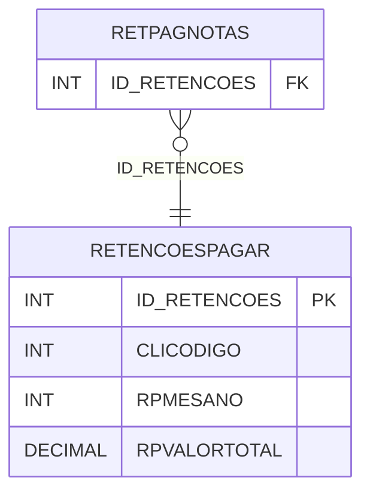

# RETENCOESPAGAR - Documentação Completa de Relacionamentos

## 📊 Informações Gerais

- **Nome da Tabela**: RETENCOESPAGAR (Retenções Pagar)
- **Total de Registros**: 766
- **Total de Colunas**: 4
- **Chave Primária**: ID_RETENCOES
- **Chaves Estrangeiras**: 0
- **Índices**: 0
- **Tabelas Dependentes**: 1
- **Banco de Dados**: Firebird

## 📝 Descrição

**RETENCOESPAGAR** é uma tabela mestre que armazena informações sobre retenções de impostos em contas a pagar. Com **766 registros**, esta tabela registra retenções por cliente, mês/ano e valor total, permitindo controle de retenções fiscais.

Esta tabela é essencial para:
- **Fiscal**: Gerenciar retenções de impostos em contas a pagar
- **Tributação**: Controlar retenções por período
- **Rastreamento**: Rastrear retenções por cliente
- **Relatórios**: Gerar relatórios de retenções

---

## 🔑 Estrutura de Colunas

| Coluna | Tipo | Descrição |
|--------|------|-----------|
| **ID_RETENCOES** 🔑 | INT | ID das retenções (PK) |
| **CLICODIGO** | INT | Código do cliente/fornecedor |
| **RPMESANO** | INT | Mês/ano da retenção |
| **RPVALORTOTAL** | DECIMAL(18,2) | Valor total das retenções |

---

## 📊 Tabelas que Referenciam Esta

Esta tabela é referenciada por 1 tabela:

### RETPAGNOTAS - Retenções Pagar Notas
**Volume:** 813 registros

**Relacionamento:**
```
RETPAGNOTAS.ID_RETENCOES → RETENCOESPAGAR.ID_RETENCOES (N:1)
Constraint: FK_RETPAGNOTAS_1
```

---

## 🗺️ Diagrama de Relacionamentos



---

## 💡 Exemplos de Uso

### Consulta Básica

```sql
SELECT ID_RETENCOES, CLICODIGO, RPMESANO, RPVALORTOTAL
FROM RETENCOESPAGAR
WHERE ID_RETENCOES = ?;
```

---

## ⚡ Performance e Otimização

### Índices Recomendados

#### 1. Índice na Chave Primária (Já existe implicitamente)
```sql
-- Índice primário já existe implicitamente
```

#### 2. Índice em CLICODIGO e RPMESANO
```sql
CREATE INDEX IDX_RETENCOESPAGAR_CLI_MES 
ON RETENCOESPAGAR (CLICODIGO, RPMESANO);
```

**Justificativa:** Facilita buscas por cliente e período.

---

## 📊 Estatísticas e Insights

- **Total de Registros**: 766
- **Retenções**: 766 registros de retenções de impostos

---

**Documentação gerada em**: 2025-01-27

**Banco de dados**: Firebird

