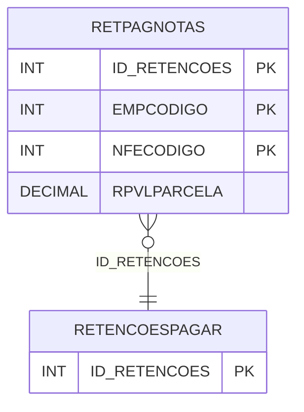

# RETPAGNOTAS - Documentação Completa de Relacionamentos

## 📊 Informações Gerais

- **Nome da Tabela**: RETPAGNOTAS (Retenções Pagar Notas)
- **Total de Registros**: 813
- **Total de Colunas**: 4
- **Chave Primária**: ID_RETENCOES, EMPCODIGO, NFECODIGO (composite)
- **Chaves Estrangeiras**: 1
- **Índices**: 0
- **Tabelas Dependentes**: 0
- **Banco de Dados**: Firebird

## 📝 Descrição

**RETPAGNOTAS** é uma tabela intermediária que associa retenções de impostos a notas fiscais eletrônicas. Com **813 registros**, esta tabela registra quais notas fiscais estão associadas a cada retenção, incluindo valor da parcela.

Esta tabela é essencial para:
- **Fiscal**: Gerenciar retenções por nota fiscal
- **Tributação**: Controlar retenções por NF-e
- **Rastreamento**: Rastrear retenções por nota fiscal
- **Relatórios**: Gerar relatórios de retenções por NF-e

---

## 🔑 Estrutura de Colunas

| Coluna | Tipo | Descrição |
|--------|------|-----------|
| **ID_RETENCOES** 🔑 🔗 | INT | ID das retenções (PK, FK → RETENCOESPAGAR) |
| **EMPCODIGO** 🔑 | INT | Código da empresa (PK) |
| **NFECODIGO** 🔑 | INT | Código da NF-e (PK) |
| **RPVLPARCELA** | DECIMAL(18,2) | Valor da parcela |

---

## 🔗 Relacionamentos - Nível 1 (Diretos)

### RETENCOESPAGAR - Retenções Pagar (FK Obrigatória)
**Volume:** 766 registros

**Relacionamento:**
```
RETPAGNOTAS.ID_RETENCOES → RETENCOESPAGAR.ID_RETENCOES (N:1)
Constraint: FK_RETPAGNOTAS_1
```

---

## 🗺️ Diagrama de Relacionamentos



---

## 💡 Exemplos de Uso

### Consulta Básica

```sql
SELECT ID_RETENCOES, EMPCODIGO, NFECODIGO, RPVLPARCELA
FROM RETPAGNOTAS
WHERE ID_RETENCOES = ? AND EMPCODIGO = ?;
```

---

## ⚡ Performance e Otimização

### Índices Recomendados

#### 1. Índice Composto na Chave Primária (Já existe implicitamente)
```sql
-- Índice primário já existe implicitamente
```

---

## 📊 Estatísticas e Insights

- **Total de Registros**: 813
- **Associações**: 813 associações de retenções a notas fiscais

---

**Documentação gerada em**: 2025-01-27

**Banco de dados**: Firebird

