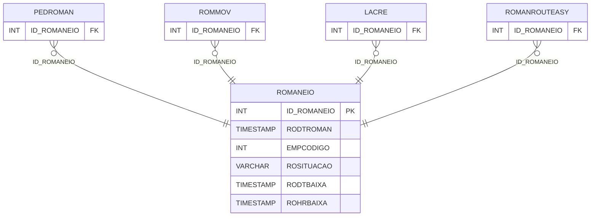

# ROMANEIO - Documentação Completa de Relacionamentos

## 📊 Informações Gerais

- **Nome da Tabela**: ROMANEIO
- **Total de Registros**: 359.245
- **Total de Colunas**: 10
- **Chave Primária**: ID_ROMANEIO
- **Chaves Estrangeiras**: 0
- **Índices**: 2
- **Tabelas Dependentes**: 4
- **Banco de Dados**: Firebird

## 📝 Descrição

**ROMANEIO** é uma tabela mestre de grande volume que armazena informações sobre romaneios de entrega. Com **359.245 registros**, esta tabela registra romaneios criados no sistema, incluindo data do romaneio, empresa, situação, data e hora de baixa, número de romaneio temporário, ID do lote de impressão, número de etiqueta ECT e hora do romaneio.

Esta tabela é essencial para:
- **Logística**: Gerenciar romaneios de entrega
- **Rastreamento**: Rastrear romaneios por situação
- **Expedição**: Controlar expedição de pedidos
- **Relatórios**: Gerar relatórios de romaneios

---

## 🔑 Estrutura de Colunas (Principais)

| Coluna | Tipo | Descrição |
|--------|------|-----------|
| **ID_ROMANEIO** 🔑 | INT | ID do romaneio (PK) |
| **RODTROMAN** | TIMESTAMP | Data do romaneio |
| **EMPCODIGO** | INT | Código da empresa |
| **ROSITUACAO** | VARCHAR(14) | Situação do romaneio |
| **RODTBAIXA** | TIMESTAMP | Data de baixa |
| **ROHRBAIXA** | TIMESTAMP | Hora de baixa |
| **TMP_RONRROMAN** | INT | Número do romaneio temporário |
| **ID_LOTEIMP** | INT | ID do lote de impressão |
| **RONRETIQUETAECT** | VARCHAR(37) | Número de etiqueta ECT |
| **ROHRROMAN** | TIMESTAMP | Hora do romaneio |

---

## 📊 Tabelas que Referenciam Esta

Esta tabela é referenciada por 4 tabelas:

### PEDROMAN - Pedido Romaneio
**Volume:** Variável

**Relacionamento:**
```
PEDROMAN.ID_ROMANEIO → ROMANEIO.ID_ROMANEIO (N:1)
Constraint: ROMANEIO_PEDROMAN
```

### ROMMOV - Romaneio Movimentação
**Volume:** Variável

**Relacionamento:**
```
ROMMOV.ID_ROMANEIO → ROMANEIO.ID_ROMANEIO (N:1)
Constraint: ROMANEIO_ROMMOV
```

### LACRE - Lacre
**Volume:** Variável

**Relacionamento:**
```
LACRE.ID_ROMANEIO → ROMANEIO.ID_ROMANEIO (N:1)
Constraint: LACRE_ROMANEIO
```

### ROMANROUTEASY - Romaneio Routeasy
**Volume:** Variável

**Relacionamento:**
```
ROMANROUTEASY.ID_ROMANEIO → ROMANEIO.ID_ROMANEIO (N:1)
Constraint: XFKROMANROUTEASY
```

---

## 📇 Índices

| Nome do Índice | Colunas | Único |
|----------------|---------|-------|
| INDRODTBAIXA | RODTBAIXA | Não |
| INDRODTROMAN | RODTROMAN | Não |

---

## 🗺️ Diagrama de Relacionamentos



---

## 💡 Exemplos de Uso

### Consulta Básica

```sql
SELECT ID_ROMANEIO, RODTROMAN, EMPCODIGO, ROSITUACAO, RODTBAIXA, ROHRBAIXA
FROM ROMANEIO
WHERE ID_ROMANEIO = ?;
```

---

## ⚡ Performance e Otimização

### Índices Recomendados

#### 1. Índice na Chave Primária (Já existe implicitamente)
```sql
-- Índice primário já existe implicitamente
```

#### 2. Índices Existentes
Os índices em RODTBAIXA e RODTROMAN já estão criados e são adequados para consultas por período.

---

## 📊 Estatísticas e Insights

- **Total de Registros**: 359.245
- **Romaneios**: 359.245 romaneios de entrega cadastrados

---

**Documentação gerada em**: 2025-01-27

**Banco de dados**: Firebird

