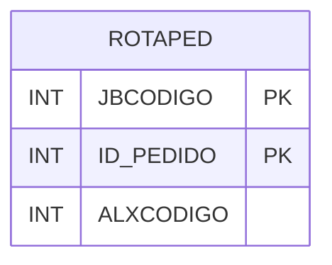

# ROTAPED - Documentação Completa de Relacionamentos

## 📊 Informações Gerais

- **Nome da Tabela**: ROTAPED (Rota Pedido)
- **Total de Registros**: 6.943
- **Total de Colunas**: 3
- **Chave Primária**: JBCODIGO, ID_PEDIDO (composite)
- **Chaves Estrangeiras**: 0
- **Índices**: 0
- **Tabelas Dependentes**: 0
- **Banco de Dados**: Firebird

## 📝 Descrição

**ROTAPED** é uma tabela intermediária que associa pedidos a rotas/logística. Com **6.943 registros**, esta tabela registra quais pedidos estão associados a cada rota, incluindo código da JitBox e código do almoxarifado.

Esta tabela é essencial para:
- **Logística**: Gerenciar rotas de pedidos
- **Rastreamento**: Rastrear pedidos por rota
- **Expedição**: Controlar expedição de pedidos por rota
- **Relatórios**: Gerar relatórios de rotas

---

## 🔑 Estrutura de Colunas

| Coluna | Tipo | Descrição |
|--------|------|-----------|
| **JBCODIGO** 🔑 | INT | Código da JitBox/rota (PK) |
| **ID_PEDIDO** 🔑 | INT | ID do pedido (PK) |
| **ALXCODIGO** | INT | Código do almoxarifado |

---

## 🗺️ Diagrama de Relacionamentos



---

## 💡 Exemplos de Uso

### Consulta Básica

```sql
SELECT JBCODIGO, ID_PEDIDO, ALXCODIGO
FROM ROTAPED
WHERE JBCODIGO = ? AND ID_PEDIDO = ?;
```

---

## ⚡ Performance e Otimização

### Índices Recomendados

#### 1. Índice Composto na Chave Primária (Já existe implicitamente)
```sql
-- Índice primário já existe implicitamente
```

---

## 📊 Estatísticas e Insights

- **Total de Registros**: 6.943
- **Rotas**: 6.943 associações de pedidos a rotas

---

**Documentação gerada em**: 2025-01-27

**Banco de dados**: Firebird

