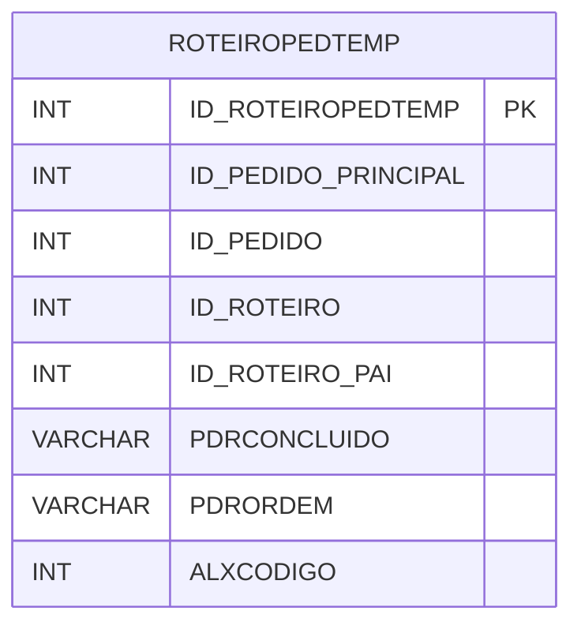

# ROTEIROPEDTEMP - Documentação Completa de Relacionamentos

## 📊 Informações Gerais

- **Nome da Tabela**: ROTEIROPEDTEMP (Roteiro Pedido Temporário)
- **Total de Registros**: 3
- **Total de Colunas**: 14
- **Chave Primária**: ID_ROTEIROPEDTEMP
- **Chaves Estrangeiras**: 0
- **Índices**: 0
- **Tabelas Dependentes**: 0
- **Banco de Dados**: Firebird

## 📝 Descrição

**ROTEIROPEDTEMP** é uma tabela temporária que armazena informações sobre roteiros de pedidos temporários. Com apenas **3 registros**, esta tabela registra roteiros temporários de pedidos, incluindo pedido principal, pedido, roteiro, roteiro pai, ordem, almoxarifado, início, término, obrigatoriedade e outras informações de controle.

Esta tabela é essencial para:
- **Roteiros**: Gerenciar roteiros temporários de pedidos
- **Controle**: Controlar roteiros em processamento
- **Rastreamento**: Rastrear roteiros temporários
- **Relatórios**: Gerar relatórios de roteiros temporários

---

## 🔑 Estrutura de Colunas (Principais)

| Coluna | Tipo | Descrição |
|--------|------|-----------|
| **ID_ROTEIROPEDTEMP** 🔑 | INT | ID do roteiro temporário (PK) |
| **ID_PEDIDO_PRINCIPAL** | INT | ID do pedido principal |
| **ID_PEDIDO** | INT | ID do pedido |
| **ID_ROTEIRO** | INT | ID do roteiro |
| **ID_ROTEIRO_PAI** | INT | ID do roteiro pai |
| **PDRCONCLUIDO** | VARCHAR(14) | Roteiro concluído |
| **PDRORDEM** | VARCHAR(37) | Ordem do roteiro |
| **ALXCODIGO** | INT | Código do almoxarifado |
| **ALXDESCRICAO** | VARCHAR(37) | Descrição do almoxarifado |
| **INICIO** | VARCHAR(14) | Início do roteiro |
| **TERMINO** | VARCHAR(14) | Término do roteiro |
| **TEMOBRIGATORIO** | VARCHAR(14) | Tempo obrigatório |
| **FALTAOBRIGATORIO** | VARCHAR(14) | Falta obrigatória |
| **FALTAOBRIGATORIOEVENTO** | VARCHAR(14) | Falta obrigatória evento |

---

## 🗺️ Diagrama de Relacionamentos



---

## 💡 Exemplos de Uso

### Consulta Básica

```sql
SELECT ID_ROTEIROPEDTEMP, ID_PEDIDO_PRINCIPAL, ID_PEDIDO, ID_ROTEIRO, ID_ROTEIRO_PAI, PDRCONCLUIDO
FROM ROTEIROPEDTEMP
WHERE ID_ROTEIROPEDTEMP = ?;
```

---

## ⚡ Performance e Otimização

### Índices Recomendados

#### 1. Índice na Chave Primária (Já existe implicitamente)
```sql
-- Índice primário já existe implicitamente
```

---

## 📊 Estatísticas e Insights

- **Total de Registros**: 3
- **Roteiros Temporários**: 3 roteiros temporários cadastrados

---

**Documentação gerada em**: 2025-01-27

**Banco de dados**: Firebird

