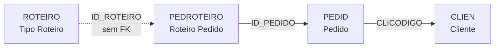
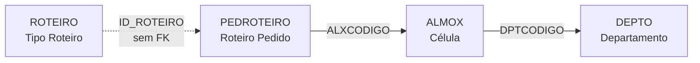
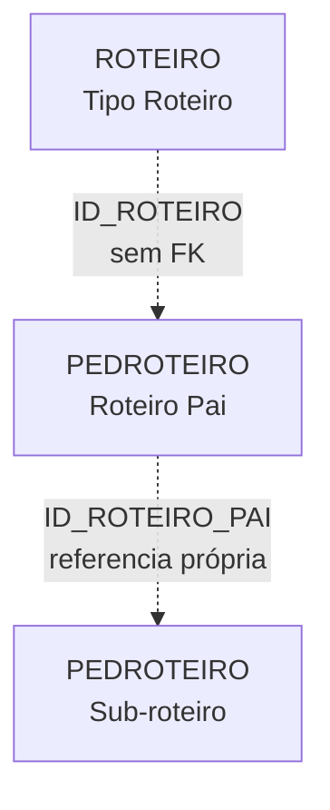
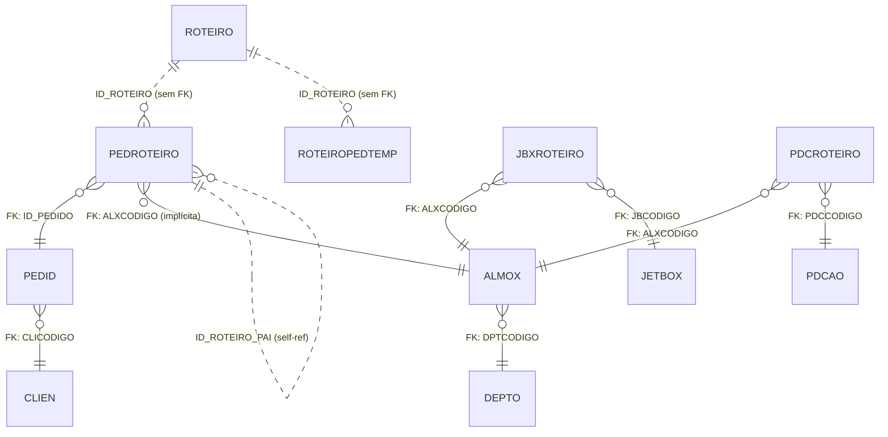

# ROTEIRO - Documentação Completa de Relacionamentos (Firebird)

## 📊 Informações Gerais (Metadados do Banco)

- **Nome da Tabela**: ROTEIRO
- **Total de Registros**: 2
- **Total de Colunas**: 2
- **Chave Primária**: 1 (ROTCODIGO)
- **Chaves Estrangeiras**: 0
- **Índices**: 0
- **Tabelas Relacionadas**: 4 tabelas contêm campos relacionados (sem FK formal)
- **Banco de Dados**: Firebird

## 📝 Descrição

**ROTEIRO** é uma tabela **mestre/catálogo** do banco de dados Firebird que armazena tipos de roteiros. Com apenas **2 registros**, esta é uma tabela de configuração minimalista que define categorias amplas de roteiros de produção.

**Características Importantes:**
- **Tabela extremamente pequena** - apenas 2 registros
- **Sem Foreign Keys** - não há FKs formais entrando ou saindo
- **Relacionamento implícito** - outras tabelas usam campo `ID_ROTEIRO` sem constraint FK
- **Lookup table** - serve como catálogo/dicionário de roteiros

**Nota Importante**: Esta documentação baseia-se **exclusivamente nos metadados do banco de dados Firebird** extraídos via análise de schema. Interpretações sobre regras de negócio ou uso no código não estão incluídas aqui.

---

## 🔑 Estrutura de Colunas (Schema Firebird)

### Todas as Colunas

| Coluna | Tipo | Not Null | Default | Descrição |
|--------|------|----------|---------|-----------|
| 🔑 **ROTCODIGO** | UNKNOWN(7) | ✓ | - | Código único do roteiro (PK) |
| **ROTDESCRICAO** | UNKNOWN(37) | - | - | Descrição do roteiro |

**Primary Key:** ROTCODIGO

---

## 🔗 Relacionamentos - Nível 1 (Schema)

### ROTEIRO Referencia:
**Nenhuma** - Esta tabela não possui Foreign Keys saindo dela.

---

### ROTEIRO é Referenciada Por:
**Nenhuma FK formal no schema** - Apesar de não haver constraints de FK no banco de dados apontando para ROTEIRO, existem tabelas que possuem campos relacionados.

---

## 📋 Tabelas com Campos Relacionados (Sem FK Formal)

Embora não existam Foreign Keys formais, as seguintes tabelas possuem campos que **implicitamente** se relacionam com ROTEIRO:

### 1. PEDROTEIRO - Roteiro de Pedidos ⭐ **PRINCIPAL**
**Volume:** 11.211.249 registros

**Campos Relacionados:**
```
PEDROTEIRO.ID_ROTEIRO (UNKNOWN(16))
PEDROTEIRO.ID_ROTEIRO_PAI (UNKNOWN(16))
```

**Estrutura Completa:**
| Coluna | Tipo | Not Null | Default |
|--------|------|----------|---------|
| 🔑 **ID_PEDIDO** | UNKNOWN(8) | ✓ | - |
| 🔑 **ALXCODIGO** | UNKNOWN(7) | ✓ | - |
| 🔑 **EMPCODIGO** | UNKNOWN(7) | ✓ | - |
| **PDRCONCLUIDO** | UNKNOWN(14) | ✓ | - |
| 🔑 **PDRORDEM** | UNKNOWN(7) | ✓ | - |
| **TEMPOMAXIMO** | UNKNOWN(8) | - | - |
| **DTINICIO** | UNKNOWN(35) | - | - |
| **DTTERMINO** | UNKNOWN(35) | - | - |
| **TEMPOESPERA** | UNKNOWN(8) | - | - |
| **TEMPOGASTO** | UNKNOWN(8) | - | - |
| **DTDISPONIVEL** | UNKNOWN(35) | - | - |
| **ID_ROTEIRO** | UNKNOWN(16) | ✓ | - |
| **ID_ROTEIRO_PAI** | UNKNOWN(16) | - | - |
| **ALXCODIGOGERADO** | UNKNOWN(7) | - | - |
| **EMPCODIGOGERADO** | UNKNOWN(7) | - | - |
| **TEMPOREALGASTO** | UNKNOWN(8) | - | - |
| **TURHRENTRADA** | UNKNOWN(8) | - | - |
| **TURHRSAIDA** | UNKNOWN(8) | - | - |
| **TURHRSAIDAALMOCO** | UNKNOWN(8) | - | - |
| **TURHRENTRADAALMOCO** | UNKNOWN(8) | - | - |
| **TURDIASUTEIS** | UNKNOWN(14) | - | - |

**Primary Key:** (ALXCODIGO, EMPCODIGO, ID_PEDIDO, PDRORDEM)

**Foreign Keys (do schema):**
```
PEDROTEIRO.ID_PEDIDO → PEDID.ID_PEDIDO (N:1)
Constraint: PEDID_PEDROTEIRO
```

**Índices Importantes:**
- `IND_PEDROTEIRO_ID` - em ID_ROTEIRO
- `IND_PEDROTEIRO_IDPAI` - em ID_ROTEIRO_PAI
- `IND_PEDROTEIRO_DTINICIO` - em DTINICIO
- `IND_PEDROTEIRO_DTTERMINO` - em DTTERMINO
- `IND_PEDROTEIRO_DTDISPONIVEL` - em DTDISPONIVEL

**Observações:**
- **Maior tabela relacionada** - 11.2 milhões de registros
- ID_ROTEIRO é **NOT NULL** - sempre deve ter valor
- Possui hierarquia via ID_ROTEIRO_PAI (relacionamento pai-filho)
- Índices em ID_ROTEIRO indicam uso frequente em queries

---

### 2. ROTEIROPEDTEMP - Roteiro Temporário de Pedidos
**Volume:** 3 registros

**Campos Relacionados:**
```
ROTEIROPEDTEMP.ID_ROTEIRO (UNKNOWN(8))
ROTEIROPEDTEMP.ID_ROTEIRO_PAI (UNKNOWN(8))
```

**Estrutura Completa:**
| Coluna | Tipo | Not Null | Default |
|--------|------|----------|---------|
| 🔑 **ID_ROTEIROPEDTEMP** | UNKNOWN(8) | ✓ | - |
| **ID_PEDIDO_PRINCIPAL** | UNKNOWN(8) | - | - |
| **ID_PEDIDO** | UNKNOWN(8) | - | - |
| **ID_ROTEIRO** | UNKNOWN(8) | - | - |
| **ID_ROTEIRO_PAI** | UNKNOWN(8) | - | - |
| **PDRCONCLUIDO** | UNKNOWN(14) | - | - |
| **PDRORDEM** | UNKNOWN(37) | - | - |
| **ALXCODIGO** | UNKNOWN(8) | - | - |
| **ALXDESCRICAO** | UNKNOWN(37) | - | - |
| **INICIO** | UNKNOWN(14) | - | - |
| **TERMINO** | UNKNOWN(14) | - | - |
| **TEMOBRIGATORIO** | UNKNOWN(14) | - | - |
| **FALTAOBRIGATORIO** | UNKNOWN(14) | - | - |
| **FALTAOBRIGATORIOEVENTO** | UNKNOWN(14) | - | - |

**Primary Key:** ID_ROTEIROPEDTEMP

**Foreign Keys (do schema):** Nenhuma

**Observações:**
- Tabela temporária com pouquíssimos registros (3)
- Estrutura similar a PEDROTEIRO
- Sem FKs formais
- Campos ID_ROTEIRO e ID_ROTEIRO_PAI não são obrigatórios

---

### 3. JBXROTEIRO - Roteiro de JitBox
**Volume:** 5.707 registros

**Observação:** Esta tabela **NÃO possui campo direto** para ROTEIRO. O nome sugere relacionamento, mas no schema não há campo ID_ROTEIRO ou ROTCODIGO.

**Estrutura:**
| Coluna | Tipo | Not Null | Default |
|--------|------|----------|---------|
| 🔑 **JBCODIGO** | UNKNOWN(8) | ✓ | - |
| 🔑 **EMPCODIGO** | UNKNOWN(7) | ✓ | - |
| 🔑 **ALXCODIGO** | UNKNOWN(7) | ✓ | - |
| 🔑 **ID_PEDIDO** | UNKNOWN(8) | ✓ | - |
| **JBRCONCLUIDO** | UNKNOWN(14) | ✓ | - |
| 🔑 **JBRORDEM** | UNKNOWN(7) | ✓ | - |

**Primary Key:** (JBCODIGO, EMPCODIGO, ALXCODIGO, ID_PEDIDO, JBRORDEM)

**Foreign Keys (do schema):**
```
JBXROTEIRO.ALXCODIGO → ALMOX.ALXCODIGO (N:1)
JBXROTEIRO.EMPCODIGO → ALMOX.EMPCODIGO (N:1)
JBXROTEIRO.JBCODIGO → JETBOX.JBCODIGO (N:1)
JBXROTEIRO.EMPCODIGO → JETBOX.EMPCODIGO (N:1)
```

**Observações:**
- Apesar do nome "ROTEIRO", não há campo direto para tabela ROTEIRO
- Relaciona JitBox (caixas) com células (ALMOX) e pedidos
- Campo JBRORDEM indica ordem de roteiro/sequência

---

### 4. PDCROTEIRO - Roteiro de Produtos
**Volume:** 0 registros (vazia)

**Observação:** Esta tabela também **NÃO possui campo direto** para ROTEIRO. O nome sugere relacionamento, mas no schema não há campo ID_ROTEIRO ou ROTCODIGO.

**Estrutura:**
| Coluna | Tipo | Not Null | Default |
|--------|------|----------|---------|
| 🔑 **PDCCODIGO** | UNKNOWN(8) | ✓ | - |
| 🔑 **ALXCODIGO** | UNKNOWN(7) | ✓ | - |
| 🔑 **EMPCODIGO** | UNKNOWN(7) | ✓ | - |
| **PDRCONCLUIDO** | UNKNOWN(14) | ✓ | - |
| 🔑 **PDRORDEM** | UNKNOWN(7) | ✓ | - |

**Primary Key:** (ALXCODIGO, EMPCODIGO, PDCCODIGO, PDRORDEM)

**Foreign Keys (do schema):**
```
PDCROTEIRO.ALXCODIGO → ALMOX.ALXCODIGO (N:1)
PDCROTEIRO.EMPCODIGO → ALMOX.EMPCODIGO (N:1)
PDCROTEIRO.PDCCODIGO → PDCAO.PDCCODIGO (N:1)
PDCROTEIRO.EMPCODIGO → PDCAO.EMPCODIGO (N:1)
```

**Observações:**
- Tabela vazia no momento da análise
- Define roteiro de produtos (PDCAO) passando por células (ALMOX)
- Campo PDRORDEM indica ordem de roteiro/sequência
- Sem campo direto para ROTEIRO

---

## 🔗 Relacionamentos - Nível 2 (Indiretos)

### Fluxo: ROTEIRO → PEDROTEIRO → PEDID → CLIEN



**Descrição:** Embora não haja FK formal, PEDROTEIRO usa ID_ROTEIRO para classificar o tipo de roteiro. De PEDROTEIRO pode-se chegar ao pedido e ao cliente.

---

### Fluxo: ROTEIRO → PEDROTEIRO → ALMOX → DEPTO



**Descrição:** PEDROTEIRO registra a célula (ALMOX) onde cada etapa do roteiro acontece.

---

### Hierarquia: PEDROTEIRO com ID_ROTEIRO_PAI



**Descrição:** PEDROTEIRO possui hierarquia através de ID_ROTEIRO_PAI, permitindo sub-roteiros.

---

## 📊 Casos de Uso de Queries (Exemplos Baseados em Schema)

### 1. Listar Todos os Tipos de Roteiro

```sql
SELECT
    ROTCODIGO,
    ROTDESCRICAO
FROM ROTEIRO
ORDER BY ROTCODIGO
```

**Resultado esperado:** 2 registros

---

### 2. Consultar Roteiros de um Pedido Específico

```sql
SELECT
    pr.ID_PEDIDO,
    pr.ID_ROTEIRO,
    pr.ID_ROTEIRO_PAI,
    pr.ALXCODIGO,
    pr.PDRORDEM,
    pr.PDRCONCLUIDO,
    pr.DTINICIO,
    pr.DTTERMINO,
    pr.TEMPOMAXIMO,
    pr.TEMPOGASTO
FROM PEDROTEIRO pr
WHERE pr.ID_PEDIDO = ?
ORDER BY pr.PDRORDEM
```

---

### 3. Buscar Roteiro com Informações da Célula

```sql
SELECT
    pr.ID_PEDIDO,
    pr.ID_ROTEIRO,
    pr.PDRORDEM,
    pr.PDRCONCLUIDO,
    a.ALXCODIGO,
    a.ALXDESCRICAO AS CELULA,
    a.TEMPOMAXIMO AS TEMPO_MAX_CELULA,
    pr.TEMPOMAXIMO AS TEMPO_MAX_ROTEIRO,
    pr.DTINICIO,
    pr.DTTERMINO
FROM PEDROTEIRO pr
INNER JOIN ALMOX a ON a.ALXCODIGO = pr.ALXCODIGO
                   AND a.EMPCODIGO = pr.EMPCODIGO
WHERE pr.ID_PEDIDO = ?
  AND pr.EMPCODIGO = 1
ORDER BY pr.PDRORDEM
```

---

### 4. Verificar Sub-roteiros (Hierarquia)

```sql
SELECT
    pr_pai.ID_ROTEIRO AS ROTEIRO_PAI,
    pr_pai.PDRORDEM AS ORDEM_PAI,
    pr_filho.ID_ROTEIRO AS ROTEIRO_FILHO,
    pr_filho.ID_ROTEIRO_PAI,
    pr_filho.PDRORDEM AS ORDEM_FILHO,
    pr_filho.ALXCODIGO
FROM PEDROTEIRO pr_pai
LEFT JOIN PEDROTEIRO pr_filho ON pr_filho.ID_ROTEIRO_PAI = pr_pai.ID_ROTEIRO
                               AND pr_filho.ID_PEDIDO = pr_pai.ID_PEDIDO
WHERE pr_pai.ID_PEDIDO = ?
  AND pr_pai.EMPCODIGO = 1
ORDER BY pr_pai.PDRORDEM, pr_filho.PDRORDEM
```

---

### 5. Analisar Roteiros Concluídos vs Pendentes

```sql
SELECT
    pr.ID_ROTEIRO,
    pr.PDRCONCLUIDO,
    COUNT(*) AS TOTAL_ETAPAS,
    COUNT(CASE WHEN pr.PDRCONCLUIDO = 'S' THEN 1 END) AS ETAPAS_CONCLUIDAS,
    COUNT(CASE WHEN pr.PDRCONCLUIDO = 'N' THEN 1 END) AS ETAPAS_PENDENTES
FROM PEDROTEIRO pr
WHERE pr.ID_PEDIDO = ?
  AND pr.EMPCODIGO = 1
GROUP BY pr.ID_ROTEIRO, pr.PDRCONCLUIDO
ORDER BY pr.ID_ROTEIRO
```

---

### 6. Calcular Tempo Total Gasto por Roteiro

```sql
SELECT
    pr.ID_ROTEIRO,
    COUNT(*) AS TOTAL_ETAPAS,
    SUM(pr.TEMPOGASTO) AS TEMPO_TOTAL_GASTO,
    SUM(pr.TEMPOMAXIMO) AS TEMPO_TOTAL_MAXIMO,
    SUM(pr.TEMPOREALGASTO) AS TEMPO_REAL_TOTAL,
    AVG(pr.TEMPOGASTO) AS TEMPO_MEDIO_GASTO,
    MIN(pr.DTINICIO) AS INICIO_PRIMEIRO,
    MAX(pr.DTTERMINO) AS TERMINO_ULTIMO
FROM PEDROTEIRO pr
WHERE pr.ID_PEDIDO = ?
  AND pr.EMPCODIGO = 1
GROUP BY pr.ID_ROTEIRO
ORDER BY pr.ID_ROTEIRO
```

---

### 7. Listar Células por Ordem de Roteiro

```sql
SELECT
    pr.PDRORDEM AS ORDEM,
    a.ALXCODIGO,
    a.ALXDESCRICAO AS CELULA,
    pr.PDRCONCLUIDO AS CONCLUIDO,
    pr.DTINICIO,
    pr.DTTERMINO,
    pr.TEMPOMAXIMO
FROM PEDROTEIRO pr
INNER JOIN ALMOX a ON a.ALXCODIGO = pr.ALXCODIGO
                   AND a.EMPCODIGO = pr.EMPCODIGO
WHERE pr.ID_PEDIDO = ?
  AND pr.EMPCODIGO = 1
ORDER BY pr.PDRORDEM
```

---

### 8. Verificar Roteiros com Atrasos

```sql
SELECT
    pr.ID_PEDIDO,
    p.PEDCODIGO,
    pr.ID_ROTEIRO,
    pr.PDRORDEM,
    a.ALXDESCRICAO AS CELULA,
    pr.TEMPOMAXIMO,
    pr.TEMPOGASTO,
    pr.TEMPOREALGASTO,
    CASE
        WHEN pr.TEMPOGASTO > pr.TEMPOMAXIMO THEN 'ATRASADO'
        WHEN pr.TEMPOREALGASTO > pr.TEMPOMAXIMO THEN 'ATRASADO (REAL)'
        ELSE 'NO PRAZO'
    END AS STATUS
FROM PEDROTEIRO pr
INNER JOIN PEDID p ON p.ID_PEDIDO = pr.ID_PEDIDO
INNER JOIN ALMOX a ON a.ALXCODIGO = pr.ALXCODIGO
                   AND a.EMPCODIGO = pr.EMPCODIGO
WHERE pr.EMPCODIGO = 1
  AND (
      pr.TEMPOGASTO > pr.TEMPOMAXIMO
      OR pr.TEMPOREALGASTO > pr.TEMPOMAXIMO
  )
ORDER BY (pr.TEMPOGASTO - pr.TEMPOMAXIMO) DESC
```

---

### 9. Análise de Utilização de Roteiros

```sql
SELECT
    pr.ID_ROTEIRO,
    COUNT(DISTINCT pr.ID_PEDIDO) AS TOTAL_PEDIDOS,
    COUNT(*) AS TOTAL_ETAPAS,
    COUNT(DISTINCT pr.ALXCODIGO) AS CELULAS_UTILIZADAS,
    COUNT(CASE WHEN pr.PDRCONCLUIDO = 'S' THEN 1 END) AS ETAPAS_CONCLUIDAS,
    ROUND(
        COUNT(CASE WHEN pr.PDRCONCLUIDO = 'S' THEN 1 END) * 100.0 / COUNT(*),
        2
    ) AS PERCENTUAL_CONCLUSAO
FROM PEDROTEIRO pr
WHERE pr.EMPCODIGO = 1
  AND pr.DTINICIO >= CURRENT_DATE - 30
GROUP BY pr.ID_ROTEIRO
ORDER BY TOTAL_PEDIDOS DESC
```

---

### 10. Verificar Disponibilidade de Etapas

```sql
SELECT
    pr.ID_PEDIDO,
    p.PEDCODIGO,
    pr.PDRORDEM,
    a.ALXDESCRICAO AS CELULA,
    pr.DTINICIO,
    pr.DTTERMINO,
    pr.DTDISPONIVEL,
    CASE
        WHEN pr.DTDISPONIVEL IS NOT NULL AND pr.DTINICIO IS NULL
            THEN 'DISPONÍVEL PARA INÍCIO'
        WHEN pr.DTINICIO IS NOT NULL AND pr.DTTERMINO IS NULL
            THEN 'EM PROCESSAMENTO'
        WHEN pr.DTTERMINO IS NOT NULL
            THEN 'CONCLUÍDO'
        ELSE 'AGUARDANDO'
    END AS STATUS_ETAPA
FROM PEDROTEIRO pr
INNER JOIN PEDID p ON p.ID_PEDIDO = pr.ID_PEDIDO
LEFT JOIN ALMOX a ON a.ALXCODIGO = pr.ALXCODIGO
                  AND a.EMPCODIGO = pr.EMPCODIGO
WHERE pr.EMPCODIGO = 1
ORDER BY pr.ID_PEDIDO, pr.PDRORDEM
```

---

## 📈 Estatísticas do Schema

| Informação | Valor |
|------------|-------|
| **Total de Registros** | 2 |
| **Total de Colunas** | 2 |
| **Chave Primária** | 1 (ROTCODIGO) |
| **Foreign Keys (saída)** | 0 |
| **Foreign Keys (entrada)** | 0 (nenhuma FK formal) |
| **Índices** | 0 (apenas PK) |
| **Colunas NOT NULL** | 1 (ROTCODIGO) |
| **Colunas com DEFAULT** | 0 |

---

## 📊 Distribuição de Registros nas Tabelas Relacionadas

| Tabela | Registros | Relação com ROTEIRO | Observação |
|--------|-----------|---------------------|------------|
| **ROTEIRO** | **2** | **Tabela mestre** | Apenas 2 tipos de roteiro |
| PEDROTEIRO | 11.211.249 | Campo ID_ROTEIRO (sem FK) | **Tabela volumosa** - 11.2M registros |
| JBXROTEIRO | 5.707 | Nome sugere, mas sem campo | Roteiro de JitBox, sem campo direto |
| ROTEIROPEDTEMP | 3 | Campo ID_ROTEIRO (sem FK) | Tabela temporária |
| PDCROTEIRO | 0 | Nome sugere, mas sem campo | Vazia, sem campo direto |

---

## 🔍 Observações Importantes sobre o Schema

### ⚠️ Tabela Minimalista
- **Apenas 2 registros** - A menor tabela mestre documentada
- **Apenas 2 colunas** - Estrutura extremamente simples
- Provavelmente categoriza roteiros em 2 tipos amplos

### ⚠️ Sem Foreign Keys Formais
- **Nenhuma constraint FK** aponta para ROTEIRO no schema
- PEDROTEIRO usa `ID_ROTEIRO` mas **sem FK formal**
- ROTEIROPEDTEMP usa `ID_ROTEIRO` mas **sem FK formal**
- Relacionamento é **implícito/lógico**, não enforçado pelo banco

### ⚠️ Inconsistência de Nomenclatura
Tabelas com "ROTEIRO" no nome mas **sem campo direto** para ROTEIRO:
- `JBXROTEIRO` - Roteiro de JitBox (sem campo ID_ROTEIRO)
- `PDCROTEIRO` - Roteiro de Produtos (sem campo ID_ROTEIRO)

Essas tabelas usam "roteiro" no sentido de **sequência/ordem** (campo PDRORDEM/JBRORDEM), não vinculação com tabela ROTEIRO.

### ⚠️ Campo ID_ROTEIRO vs ROTCODIGO
- ROTEIRO tem PK **ROTCODIGO** (tipo UNKNOWN(7))
- PEDROTEIRO tem campo **ID_ROTEIRO** (tipo UNKNOWN(16))
- ROTEIROPEDTEMP tem campo **ID_ROTEIRO** (tipo UNKNOWN(8))
- **Tipos diferentes** sugerem que podem não ser exatamente o mesmo conceito

### ⚠️ Hierarquia em PEDROTEIRO
- Campo `ID_ROTEIRO_PAI` permite **hierarquia de roteiros**
- Índice `IND_PEDROTEIRO_IDPAI` otimiza buscas hierárquicas
- Possibilita sub-roteiros e roteiros aninhados

### ⚠️ Campos de Tempo em PEDROTEIRO
Múltiplos campos de tempo com significados distintos:
- `TEMPOMAXIMO` - Tempo limite permitido
- `TEMPOGASTO` - Tempo consumido
- `TEMPOREALGASTO` - Tempo real consumido
- `TEMPOESPERA` - Tempo de espera
- **Unidades NÃO especificadas no schema**

### ⚠️ Índices Importantes
PEDROTEIRO possui índices em:
- `ID_ROTEIRO` - Busca por tipo de roteiro
- `ID_ROTEIRO_PAI` - Navegação hierárquica
- `DTINICIO`, `DTTERMINO`, `DTDISPONIVEL` - Consultas temporais

Estes índices confirmam que esses campos são **muito usados** em queries.

---

## 📊 Diagrama ER Completo (Schema Firebird)



**Legenda:**
- `||--o{` - Relacionamento formal (FK no schema)
- `||..o{` - Relacionamento implícito (sem FK formal)

---

## 📚 Referências

- **Schema Source**: `docs/database_documentation.md`
- **Data de Análise**: 2025-10-27 16:57:49
- **Total de Tabelas no Banco**: 1270
- **Total de Relacionamentos no Banco**: 1741

---

## ⚠️ Avisos e Considerações

### Integridade Referencial
Como **não há Foreign Keys formais** apontando para ROTEIRO:
- ✅ Performance: Sem overhead de verificação de FK
- ❌ Integridade: Banco não garante que ID_ROTEIRO existe
- ❌ Cascata: Deleção em ROTEIRO não afeta PEDROTEIRO
- ❌ Documentação: Relacionamento não explícito no schema

### Uso Recomendado em Queries
Ao fazer JOINs com ROTEIRO:
```sql
-- ⚠️ Use LEFT JOIN pois não há FK garantindo existência
SELECT ...
FROM PEDROTEIRO pr
LEFT JOIN ROTEIRO r ON r.ROTCODIGO = pr.ID_ROTEIRO
```

### Tipos de Dados Diferentes
```
ROTEIRO.ROTCODIGO: UNKNOWN(7)
PEDROTEIRO.ID_ROTEIRO: UNKNOWN(16)
ROTEIROPEDTEMP.ID_ROTEIRO: UNKNOWN(8)
```
Esta inconsistência pode indicar que:
- São conceitos relacionados mas diferentes
- Pode haver conversão de tipo nas queries
- Ou ROTCODIGO/ID_ROTEIRO não se relacionam diretamente

---

**Documentação gerada em**: 2025-11-09
**Versão**: 1.0 (Baseada exclusivamente em metadados do Firebird)
**Fonte**: database_documentation.md
