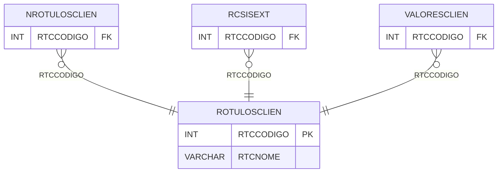

# ROTULOSCLIEN - Documentação Completa de Relacionamentos

## 📊 Informações Gerais

- **Nome da Tabela**: ROTULOSCLIEN (Rótulos Cliente)
- **Total de Registros**: 11
- **Total de Colunas**: 2
- **Chave Primária**: RTCCODIGO
- **Chaves Estrangeiras**: 0
- **Índices**: 0
- **Tabelas Dependentes**: 3
- **Banco de Dados**: Firebird

## 📝 Descrição

**ROTULOSCLIEN** é uma tabela mestre que armazena informações sobre rótulos/tags de clientes. Com apenas **11 registros**, esta tabela define rótulos disponíveis para classificação de clientes, incluindo nome do rótulo.

Esta tabela é essencial para:
- **Rótulos**: Gerenciar rótulos de clientes
- **Classificação**: Classificar clientes por rótulos
- **Rastreamento**: Rastrear rótulos disponíveis
- **Relatórios**: Gerar relatórios de clientes por rótulo

---

## 🔑 Estrutura de Colunas

| Coluna | Tipo | Descrição |
|--------|------|-----------|
| **RTCCODIGO** 🔑 | INT | Código do rótulo (PK) |
| **RTCNOME** | VARCHAR(37) | Nome do rótulo |

---

## 📊 Tabelas que Referenciam Esta

Esta tabela é referenciada por 3 tabelas:

### NROTULOSCLIEN - Número Rótulos Cliente
**Volume:** Variável

**Relacionamento:**
```
NROTULOSCLIEN.RTCCODIGO → ROTULOSCLIEN.RTCCODIGO (N:1)
Constraint: FKROTULOSCLIEN
```

### RCSISEXT - Rótulo Cliente Sistema Externo
**Volume:** Variável

**Relacionamento:**
```
RCSISEXT.RTCCODIGO → ROTULOSCLIEN.RTCCODIGO (N:1)
Constraint: FK_RCSISEXT
```

### VALORESCLIEN - Valores Cliente
**Volume:** Variável

**Relacionamento:**
```
VALORESCLIEN.RTCCODIGO → ROTULOSCLIEN.RTCCODIGO (N:1)
Constraint: ROTULOSCLIEN_VALORESCLIEN
```

---

## 🗺️ Diagrama de Relacionamentos



---

## 💡 Exemplos de Uso

### Consulta Básica

```sql
SELECT RTCCODIGO, RTCNOME
FROM ROTULOSCLIEN
WHERE RTCCODIGO = ?;
```

---

## ⚡ Performance e Otimização

### Índices Recomendados

#### 1. Índice na Chave Primária (Já existe implicitamente)
```sql
-- Índice primário já existe implicitamente
```

---

## 📊 Estatísticas e Insights

- **Total de Registros**: 11
- **Rótulos**: 11 rótulos de clientes cadastrados

---

**Documentação gerada em**: 2025-01-27

**Banco de dados**: Firebird
