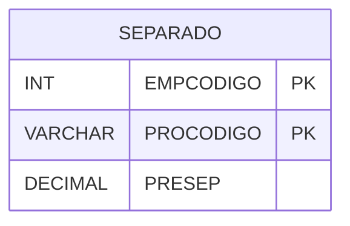

# SEPARADO - Documentação Completa de Relacionamentos

## 📊 Informações Gerais

- **Nome da Tabela**: SEPARADO (Produtos Separados)
- **Total de Registros**: 1.068.822
- **Total de Colunas**: 3
- **Chave Primária**: EMPCODIGO, PROCODIGO (composite)
- **Chaves Estrangeiras**: 0
- **Índices**: 0
- **Tabelas Dependentes**: 0
- **Banco de Dados**: Firebird

## 📝 Descrição

**SEPARADO** é uma tabela intermediária de grande volume que armazena informações sobre produtos separados. Com **1.068.822 registros**, esta tabela registra produtos que foram separados, incluindo empresa, produto e quantidade separada.

Esta tabela é essencial para:
- **Estoque**: Gerenciar produtos separados
- **Controle**: Controlar separação de produtos
- **Rastreamento**: Rastrear produtos separados por empresa e produto
- **Relatórios**: Gerar relatórios de produtos separados

---

## 🔑 Estrutura de Colunas

| Coluna | Tipo | Descrição |
|--------|------|-----------|
| **EMPCODIGO** 🔑 | INT | Código da empresa (PK) |
| **PROCODIGO** 🔑 | VARCHAR(14) | Código do produto (PK) |
| **PRESEP** | DECIMAL(18,2) | Quantidade separada |

---

## 🗺️ Diagrama de Relacionamentos



---

## 💡 Exemplos de Uso

### Consulta Básica

```sql
SELECT EMPCODIGO, PROCODIGO, PRESEP
FROM SEPARADO
WHERE EMPCODIGO = ? AND PROCODIGO = ?;
```

---

## ⚡ Performance e Otimização

### Índices Recomendados

#### 1. Índice Composto na Chave Primária (Já existe implicitamente)
```sql
-- Índice primário já existe implicitamente
```

---

## 📊 Estatísticas e Insights

- **Total de Registros**: 1.068.822
- **Produtos Separados**: 1.068.822 registros de produtos separados

---

**Documentação gerada em**: 2025-01-27

**Banco de dados**: Firebird
