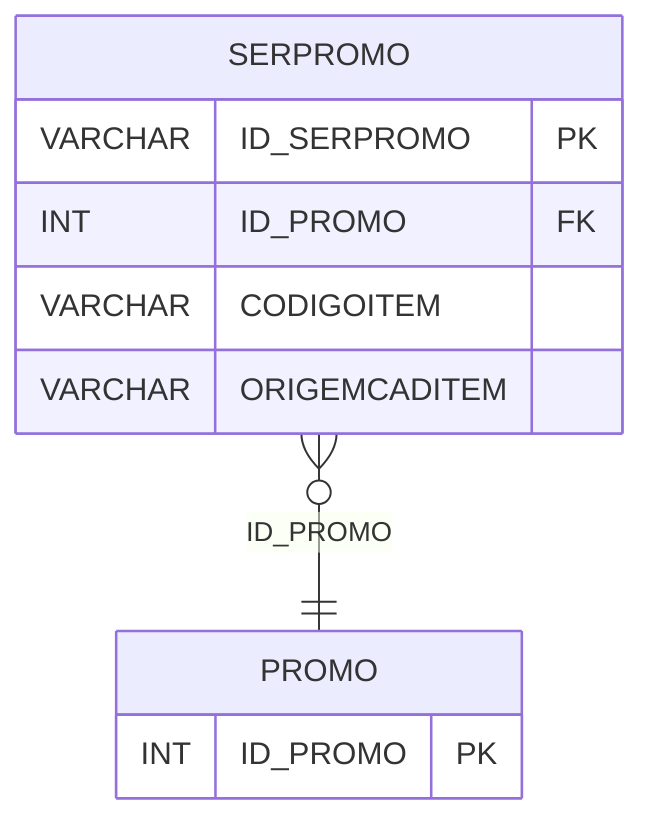

# SERPROMO - Documentação Completa de Relacionamentos

## 📊 Informações Gerais

- **Nome da Tabela**: SERPROMO (Serviço Promoção)
- **Total de Registros**: 466
- **Total de Colunas**: 4
- **Chave Primária**: ID_SERPROMO
- **Chaves Estrangeiras**: 1
- **Índices**: 0
- **Tabelas Dependentes**: 0
- **Banco de Dados**: Firebird

## 📝 Descrição

**SERPROMO** é uma tabela intermediária que armazena informações sobre serviços em promoções. Com **466 registros**, esta tabela registra serviços associados a promoções, incluindo código da promoção, código do item e origem do cadastro do item.

Esta tabela é essencial para:
- **Promoções**: Gerenciar serviços em promoções
- **Rastreamento**: Rastrear serviços por promoção
- **Relatórios**: Gerar relatórios de serviços em promoções

---

## 🔑 Estrutura de Colunas

| Coluna | Tipo | Descrição |
|--------|------|-----------|
| **ID_SERPROMO** 🔑 | VARCHAR(16) | ID do serviço promoção (PK) |
| **ID_PROMO** 🔗 | INT | ID da promoção (FK → PROMO) |
| **CODIGOITEM** | VARCHAR(37) | Código do item |
| **ORIGEMCADITEM** | VARCHAR(37) | Origem do cadastro do item |

---

## 🔗 Relacionamentos - Nível 1 (Diretos)

### PROMO - Promoção (FK Obrigatória)
**Volume:** Variável

**Relacionamento:**
```
SERPROMO.ID_PROMO → PROMO.ID_PROMO (N:1)
Constraint: XFK_SERPROMO_PROMO
```

---

## 🗺️ Diagrama de Relacionamentos



---

## 💡 Exemplos de Uso

### Consulta Básica

```sql
SELECT ID_SERPROMO, ID_PROMO, CODIGOITEM, ORIGEMCADITEM
FROM SERPROMO
WHERE ID_SERPROMO = ?;
```

---

## ⚡ Performance e Otimização

### Índices Recomendados

#### 1. Índice na Chave Primária (Já existe implicitamente)
```sql
-- Índice primário já existe implicitamente
```

---

## 📊 Estatísticas e Insights

- **Total de Registros**: 466
- **Serviços em Promoções**: 466 serviços associados a promoções

---

**Documentação gerada em**: 2025-01-27

**Banco de dados**: Firebird
