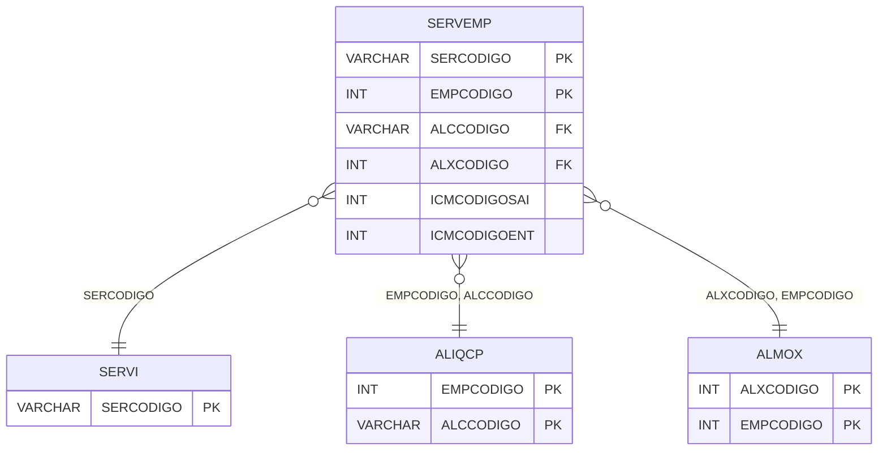

# SERVEMP - Documentação Completa de Relacionamentos

## 📊 Informações Gerais

- **Nome da Tabela**: SERVEMP (Serviço Empresa)
- **Total de Registros**: 68
- **Total de Colunas**: 36
- **Chave Primária**: SERCODIGO, EMPCODIGO (composite)
- **Chaves Estrangeiras**: 5
- **Índices**: 0
- **Tabelas Dependentes**: 0
- **Banco de Dados**: Firebird

## 📝 Descrição

**SERVEMP** é uma tabela intermediária que armazena informações sobre configurações de serviços por empresa. Com **68 registros**, esta tabela registra configurações específicas de serviços para cada empresa, incluindo códigos de impostos (ICMS, IPI, PIS, COFINS), códigos de atividade, percentuais de consumo, configurações de ISS, códigos de serviços, bases de cálculo, alíquotas de retenção e outras informações fiscais e operacionais.

Esta tabela é essencial para:
- **Serviços**: Gerenciar configurações de serviços por empresa
- **Fiscal**: Controlar informações fiscais de serviços por empresa
- **Rastreamento**: Rastrear configurações por serviço e empresa
- **Relatórios**: Gerar relatórios de configurações de serviços

---

## 🔑 Estrutura de Colunas (Principais)

| Coluna | Tipo | Descrição |
|--------|------|-----------|
| **SERCODIGO** 🔑 🔗 | VARCHAR(14) | Código do serviço (PK, FK → SERVI) |
| **EMPCODIGO** 🔑 🔗 | INT | Código da empresa (PK, FK → ALIQCP, ALMOX) |
| **ALCCODIGO** 🔗 | VARCHAR(14) | Código da alíquota (FK → ALIQCP) |
| **ALXCODIGO** 🔗 | INT | Código do almoxarifado (FK → ALMOX) |
| **ICMCODIGOSAI** | INT | Código ICMS saída |
| **ICMCODIGOENT** | INT | Código ICMS entrada |
| **SVEPCOCUSTO** | DECIMAL(18,2) | Percentual de custo |
| **IPICODIGOSAI** | INT | Código IPI saída |
| **IPICODIGOENT** | INT | Código IPI entrada |
| **PISCODIGOSAI** | INT | Código PIS saída |
| **PISCODIGOENT** | INT | Código PIS entrada |
| **COFCODIGOSAI** | INT | Código COFINS saída |
| **COFCODIGOENT** | INT | Código COFINS entrada |
| **COD_ATV** | VARCHAR(14) | Código de atividade |
| **SERPCINSUMO** | DECIMAL(18,2) | Percentual de consumo |
| **SVEICMSISS** | VARCHAR(14) | ICMS ISS |
| **SVECODSERV** | VARCHAR(37) | Código do serviço |
| **SVECODBCCALCCRED** | VARCHAR(37) | Código base cálculo crédito |
| **SVEPCBSISS** | DECIMAL(18,2) | Percentual base ISS |
| **SVEALRETISS** | DECIMAL(18,2) | Alíquota retenção ISS |
| **SVERETISS** | VARCHAR(14) | Retenção ISS |
| **SVEPCBASEPISRET** | DECIMAL(18,2) | Percentual base PIS retenção |
| **SVEPCPISRET** | DECIMAL(18,2) | Percentual PIS retenção |
| **SVEPCBASECOFINSRET** | DECIMAL(18,2) | Percentual base COFINS retenção |
| **SVEPCCOFINSRET** | DECIMAL(18,2) | Percentual COFINS retenção |
| **SVEPCBASECSLLRET** | DECIMAL(18,2) | Percentual base CSLL retenção |
| **SVEPCCSLLRET** | DECIMAL(18,2) | Percentual CSLL retenção |
| **SVEPCBASEIRRET** | DECIMAL(18,2) | Percentual base IR retenção |
| **SVEPCIRRET** | DECIMAL(18,2) | Percentual IR retenção |
| **SVEINCIDEISS** | VARCHAR(14) | Incide ISS |
| **IBSCODIGOSAI** | INT | Código IBS saída |
| **IBSCODIGOENT** | INT | Código IBS entrada |
| **CBSCODIGOSAI** | INT | Código CBS saída |
| **CBSCODIGOENT** | INT | Código CBS entrada |
| **ISCODIGOSAI** | INT | Código IS saída |
| **ISCODIGOENT** | INT | Código IS entrada |

---

## 🔗 Relacionamentos - Nível 1 (Diretos)

### SERVI - Serviço (FK Obrigatória)
**Volume:** 13 registros

**Relacionamento:**
```
SERVEMP.SERCODIGO → SERVI.SERCODIGO (N:1)
Constraint: SERVI_SERVEMP
```

### ALIQCP - Alíquota CP (FK Opcional)
**Volume:** Variável

**Relacionamento:**
```
SERVEMP.EMPCODIGO → ALIQCP.EMPCODIGO (N:1)
SERVEMP.ALCCODIGO → ALIQCP.ALCCODIGO (N:1)
Constraint: ALIQCP_SERVEMP
```

### ALMOX - Almoxarifado (FK Opcional)
**Volume:** Variável

**Relacionamento:**
```
SERVEMP.ALXCODIGO → ALMOX.ALXCODIGO (N:1)
SERVEMP.EMPCODIGO → ALMOX.EMPCODIGO (N:1)
Constraint: ALMOX_SERVEMP
```

---

## 🗺️ Diagrama de Relacionamentos



---

## 💡 Exemplos de Uso

### Consulta Básica

```sql
SELECT SERCODIGO, EMPCODIGO, ALCCODIGO, ALXCODIGO, ICMCODIGOSAI, ICMCODIGOENT
FROM SERVEMP
WHERE SERCODIGO = ? AND EMPCODIGO = ?;
```

---

## ⚡ Performance e Otimização

### Índices Recomendados

#### 1. Índice Composto na Chave Primária (Já existe implicitamente)
```sql
-- Índice primário já existe implicitamente
```

---

## 📊 Estatísticas e Insights

- **Total de Registros**: 68
- **Configurações**: 68 configurações de serviços por empresa

---

**Documentação gerada em**: 2025-01-27

**Banco de dados**: Firebird
