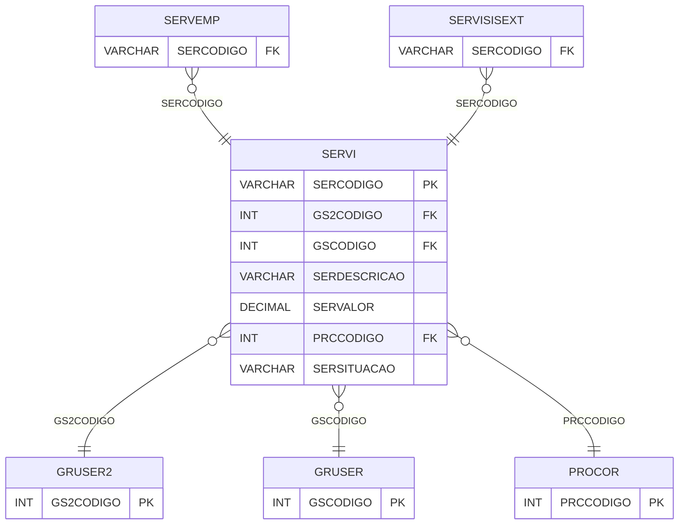

# SERVI - Documentação Completa de Relacionamentos

## 📊 Informações Gerais

- **Nome da Tabela**: SERVI (Serviços)
- **Total de Registros**: 13
- **Total de Colunas**: 51
- **Chave Primária**: SERCODIGO
- **Chaves Estrangeiras**: 3
- **Índices**: 0
- **Tabelas Dependentes**: 47
- **Banco de Dados**: Firebird

## 📝 Descrição

**SERVI** é uma tabela mestre que armazena informações sobre serviços do sistema. Com apenas **13 registros**, esta tabela é referenciada por **47 outras tabelas**, sendo uma das tabelas mais importantes do sistema. Armazena informações completas sobre serviços, incluindo grupos, descrição, valor, código de fábrica, modelo, unidade, tipo, tempo, percentuais de impostos, situação e muitas outras informações operacionais e fiscais.

Esta tabela é essencial para:
- **Serviços**: Gerenciar serviços do sistema
- **Vendas**: Controlar serviços vendidos
- **Fiscal**: Gerenciar informações fiscais de serviços
- **Relatórios**: Gerar relatórios de serviços

---

## 🔑 Estrutura de Colunas (Principais)

| Coluna | Tipo | Descrição |
|--------|------|-----------|
| **SERCODIGO** 🔑 | VARCHAR(14) | Código do serviço (PK) |
| **GS2CODIGO** 🔗 | INT | Código do grupo 2 (FK → GRUSER2) |
| **GSCODIGO** 🔗 | INT | Código do grupo (FK → GRUSER) |
| **SERDESCRICAO** | VARCHAR(37) | Descrição do serviço |
| **SERVALOR** | DECIMAL(18,2) | Valor do serviço |
| **SERCODFABRICA** | VARCHAR(37) | Código de fábrica |
| **SERMODFABRICA** | VARCHAR(37) | Modelo de fábrica |
| **SERUN** | VARCHAR(14) | Unidade |
| **MDCODIGO** | INT | Código da marca |
| **SERTIPO** | VARCHAR(14) | Tipo do serviço |
| **SERTEMPO** | DECIMAL(18,2) | Tempo |
| **SERTEMPOCOB** | DECIMAL(18,2) | Tempo de cobrança |
| **SERPCINSS** | DECIMAL(18,2) | Percentual INSS |
| **SERINTERNET** | VARCHAR(14) | Internet |
| **SERPCIR** | DECIMAL(18,2) | Percentual IR |
| **SERPCBSPIS** | DECIMAL(18,2) | Percentual base PIS |
| **SERPCBSCOFINS** | DECIMAL(18,2) | Percentual base COFINS |
| **SERDTPVFUT** | TIMESTAMP | Data valor futuro |
| **SERPCOVENFUT** | DECIMAL(18,2) | Percentual venda futuro |
| **SERDTREAJUSTE** | TIMESTAMP | Data reajuste |
| **SERPCBSCSLL** | DECIMAL(18,2) | Percentual base CSLL |
| **SEREXPORTA** | VARCHAR(14) | Exporta |
| **SERPCIPI** | DECIMAL(18,2) | Percentual IPI |
| **SERPCIPIS** | DECIMAL(18,2) | Percentual IPIS |
| **SERQTDMAXPD** | DECIMAL(18,2) | Quantidade máxima pedido |
| **SERVENDESEMLENTE** | VARCHAR(14) | Vende sem lente |
| **SERTIPOPRISMA** | VARCHAR(14) | Tipo prisma |
| **SERCODCLASS** | VARCHAR(14) | Código classificação |
| **OBRIGADADOSCOMPL** | VARCHAR(14) | Obriga dados complementares |
| **SERALIQTOTTRIB** | DECIMAL(18,2) | Alíquota total tributação |
| **SERSITUACAO** | VARCHAR(14) | Situação |
| **SERULTALTERACAO** | TIMESTAMP | Última alteração |
| **PRCCODIGO** 🔗 | INT | Código da cor (FK → PROCOR) |
| **SERALIQTOTTRIBUF** | DECIMAL(18,2) | Alíquota total tributação UF |
| **SERALIQTOTTRIBMUN** | DECIMAL(18,2) | Alíquota total tributação Município |
| **SEROBRIGACOR** | VARCHAR(14) | Obriga cor |
| **SEROBRIGAARMACAO** | VARCHAR(14) | Obriga armação |
| **COR** | VARCHAR(37) | Cor |
| **SERTPSERVREINF** | VARCHAR(37) | Tipo serviço REINF |
| **COR_COLORACAO** | VARCHAR(37) | Cor coloração |
| **SERALTDESC** | VARCHAR(14) | Altera descrição |
| **SERQTDMINPD** | DECIMAL(18,2) | Quantidade mínima pedido |
| **SERVARIAVEL** | VARCHAR(14) | Variável |
| **SERREINFIR** | VARCHAR(37) | REINF IR |
| **SERREINFINSS** | VARCHAR(37) | REINF INSS |
| **SERREINFPIS** | VARCHAR(37) | REINF PIS |
| **SERREINFCOFINS** | VARCHAR(37) | REINF COFINS |
| **SERREINFCSLL** | VARCHAR(37) | REINF CSLL |
| **DESCRICAO_COR** | VARCHAR(37) | Descrição cor |
| **DESCRICAO_TRATAMENTO** | VARCHAR(37) | Descrição tratamento |
| **SERDTCAD** | DATE | Data cadastro |

---

## 🔗 Relacionamentos - Nível 1 (Diretos)

### GRUSER2 - Grupo Usuário 2 (FK Obrigatória)
**Volume:** Variável

**Relacionamento:**
```
SERVI.GS2CODIGO → GRUSER2.GS2CODIGO (N:1)
Constraint: GRUSER2_SERVI
```

### GRUSER - Grupo Usuário (FK Obrigatória)
**Volume:** Variável

**Relacionamento:**
```
SERVI.GSCODIGO → GRUSER.GSCODIGO (N:1)
Constraint: GRUSER_SERVI
```

### PROCOR - Produto Cor (FK Opcional)
**Volume:** Variável

**Relacionamento:**
```
SERVI.PRCCODIGO → PROCOR.PRCCODIGO (N:1)
Constraint: PROCOR_SERVI
```

---

## 📊 Tabelas que Referenciam Esta

Esta tabela é referenciada por 47 tabelas, incluindo:

### SERVEMP - Serviço Empresa
**Volume:** 68 registros

**Relacionamento:**
```
SERVEMP.SERCODIGO → SERVI.SERCODIGO (N:1)
Constraint: SERVI_SERVEMP
```

### SERVISISEXT - Serviço Sistema Externo
**Volume:** Variável

**Relacionamento:**
```
SERVISISEXT.SERCODIGO → SERVI.SERCODIGO (N:1)
Constraint: SERVI_SERVISISEXT
```

---

## 🗺️ Diagrama de Relacionamentos



---

## 💡 Exemplos de Uso

### Consulta Básica

```sql
SELECT SERCODIGO, GS2CODIGO, GSCODIGO, SERDESCRICAO, SERVALOR, SERTIPO, SERSITUACAO
FROM SERVI
WHERE SERCODIGO = ?;
```

---

## ⚡ Performance e Otimização

### Índices Recomendados

#### 1. Índice na Chave Primária (Já existe implicitamente)
```sql
-- Índice primário já existe implicitamente
```

---

## 📊 Estatísticas e Insights

- **Total de Registros**: 13
- **Serviços**: 13 serviços cadastrados no sistema
- **Referências**: Referenciado por 47 outras tabelas

---

**Documentação gerada em**: 2025-01-27

**Banco de dados**: Firebird
