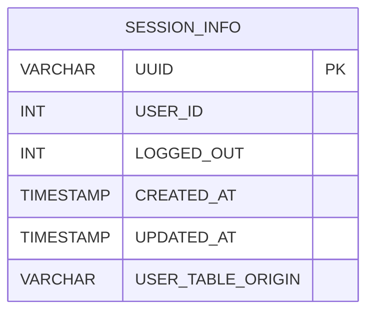

# SESSION_INFO - Documentação Completa de Relacionamentos

## 📊 Informações Gerais

- **Nome da Tabela**: SESSION_INFO (Informações de Sessão)
- **Total de Registros**: 14.251
- **Total de Colunas**: 6
- **Chave Primária**: UUID
- **Chaves Estrangeiras**: 0
- **Índices**: 0
- **Tabelas Dependentes**: 0
- **Banco de Dados**: Firebird

## 📝 Descrição

**SESSION_INFO** é uma tabela intermediária que armazena informações sobre sessões de usuários. Com **14.251 registros**, esta tabela registra informações de sessões, incluindo UUID da sessão, ID do usuário, flag de logout, data de criação, data de atualização e tabela de origem do usuário.

Esta tabela é essencial para:
- **Sessões**: Gerenciar sessões de usuários
- **Rastreamento**: Rastrear sessões ativas e encerradas
- **Relatórios**: Gerar relatórios de sessões

---

## 🔑 Estrutura de Colunas

| Coluna | Tipo | Descrição |
|--------|------|-----------|
| **UUID** 🔑 | VARCHAR(37) | UUID da sessão (PK) |
| **USER_ID** | INT | ID do usuário |
| **LOGGED_OUT** | INT | Flag de logout |
| **CREATED_AT** | TIMESTAMP | Data de criação |
| **UPDATED_AT** | TIMESTAMP | Data de atualização |
| **USER_TABLE_ORIGIN** | VARCHAR(37) | Tabela de origem do usuário |

---

## 🗺️ Diagrama de Relacionamentos



---

## 💡 Exemplos de Uso

### Consulta Básica

```sql
SELECT UUID, USER_ID, LOGGED_OUT, CREATED_AT, UPDATED_AT, USER_TABLE_ORIGIN
FROM SESSION_INFO
WHERE UUID = ?;
```

---

## ⚡ Performance e Otimização

### Índices Recomendados

#### 1. Índice na Chave Primária (Já existe implicitamente)
```sql
-- Índice primário já existe implicitamente
```

#### 2. Índice em USER_ID e CREATED_AT
```sql
CREATE INDEX IDX_SESSION_INFO_USER_CREATED 
ON SESSION_INFO (USER_ID, CREATED_AT);
```

**Justificativa:** Facilita buscas por usuário e período.

---

## 📊 Estatísticas e Insights

- **Total de Registros**: 14.251
- **Sessões**: 14.251 sessões de usuários cadastradas

---

**Documentação gerada em**: 2025-01-27

**Banco de dados**: Firebird
