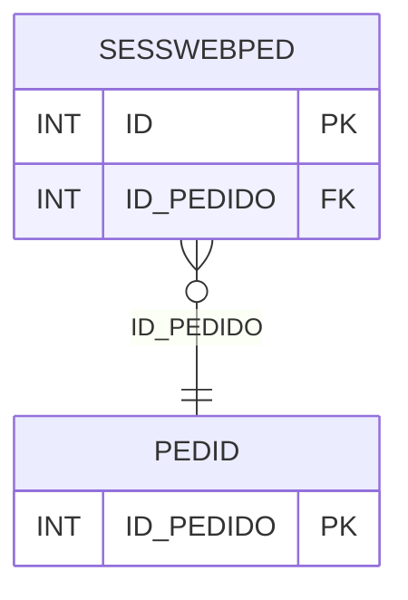

# SESSWEBPED - Documentação Completa de Relacionamentos

## 📊 Informações Gerais

- **Nome da Tabela**: SESSWEBPED (Sessão Web Pedido)
- **Total de Registros**: 837.325
- **Total de Colunas**: 2
- **Chave Primária**: ID
- **Chaves Estrangeiras**: 1
- **Índices**: 0
- **Tabelas Dependentes**: 0
- **Banco de Dados**: Firebird

## 📝 Descrição

**SESSWEBPED** é uma tabela intermediária de grande volume que armazena informações sobre sessões web de pedidos. Com **837.325 registros**, esta tabela registra associações entre sessões web e pedidos, permitindo rastrear pedidos criados através de sessões web.

Esta tabela é essencial para:
- **Web**: Gerenciar sessões web de pedidos
- **Rastreamento**: Rastrear pedidos por sessão web
- **Relatórios**: Gerar relatórios de pedidos web

---

## 🔑 Estrutura de Colunas

| Coluna | Tipo | Descrição |
|--------|------|-----------|
| **ID** 🔑 | INT | ID da sessão web pedido (PK) |
| **ID_PEDIDO** 🔗 | INT | ID do pedido (FK → PEDID) |

---

## 🔗 Relacionamentos - Nível 1 (Diretos)

### PEDID - Pedido (FK Obrigatória)
**Volume:** 3.099.176 registros

**Relacionamento:**
```
SESSWEBPED.ID_PEDIDO → PEDID.ID_PEDIDO (N:1)
Constraint: PEDID_SESSWEBPED
```

**Proporção:** ~0.27 sessões por pedido em média (837.325 / 3.099.176)

---

## 🗺️ Diagrama de Relacionamentos



---

## 💡 Exemplos de Uso

### Consulta Básica

```sql
SELECT ID, ID_PEDIDO
FROM SESSWEBPED
WHERE ID = ?;
```

---

## ⚡ Performance e Otimização

### Índices Recomendados

#### 1. Índice na Chave Primária (Já existe implicitamente)
```sql
-- Índice primário já existe implicitamente
```

#### 2. Índice em ID_PEDIDO
```sql
CREATE INDEX IDX_SESSWEBPED_PEDIDO 
ON SESSWEBPED (ID_PEDIDO);
```

**Justificativa:** Facilita buscas por pedido.

---

## 📊 Estatísticas e Insights

- **Total de Registros**: 837.325
- **Sessões Web**: 837.325 sessões web de pedidos cadastradas

---

**Documentação gerada em**: 2025-01-27

**Banco de dados**: Firebird
