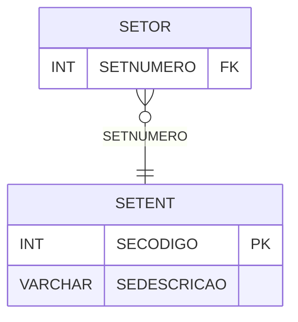

# SETENT - Documentação Completa de Relacionamentos

## 📊 Informações Gerais

- **Nome da Tabela**: SETENT (Setor Entidade)
- **Total de Registros**: 1
- **Total de Colunas**: 2
- **Chave Primária**: SECODIGO
- **Chaves Estrangeiras**: 0
- **Índices**: 0
- **Tabelas Dependentes**: 1
- **Banco de Dados**: Firebird

## 📝 Descrição

**SETENT** é uma tabela mestre que armazena informações sobre entidades de setores. Com apenas **1 registro**, esta tabela define a entidade principal de setores do sistema, incluindo descrição.

Esta tabela é essencial para:
- **Entidades**: Gerenciar entidades de setores
- **Organização**: Organizar setores por entidade
- **Rastreamento**: Rastrear entidades disponíveis
- **Relatórios**: Gerar relatórios de entidades

---

## 🔑 Estrutura de Colunas

| Coluna | Tipo | Descrição |
|--------|------|-----------|
| **SECODIGO** 🔑 | INT | Código da entidade (PK) |
| **SEDESCRICAO** | VARCHAR(37) | Descrição da entidade |

---

## 📊 Tabelas que Referenciam Esta

Esta tabela é referenciada por 1 tabela:

### SETOR - Setor
**Volume:** 25 registros

**Relacionamento:**
```
SETOR.SETNUMERO → SETENT.SECODIGO (N:1)
Constraint: SETENT_SETOR
```

---

## 🗺️ Diagrama de Relacionamentos



---

## 💡 Exemplos de Uso

### Consulta Básica

```sql
SELECT SECODIGO, SEDESCRICAO
FROM SETENT
WHERE SECODIGO = ?;
```

---

## ⚡ Performance e Otimização

### Índices Recomendados

#### 1. Índice na Chave Primária (Já existe implicitamente)
```sql
-- Índice primário já existe implicitamente
```

---

## 📊 Estatísticas e Insights

- **Total de Registros**: 1
- **Entidades**: 1 entidade de setor cadastrada

---

**Documentação gerada em**: 2025-01-27

**Banco de dados**: Firebird
