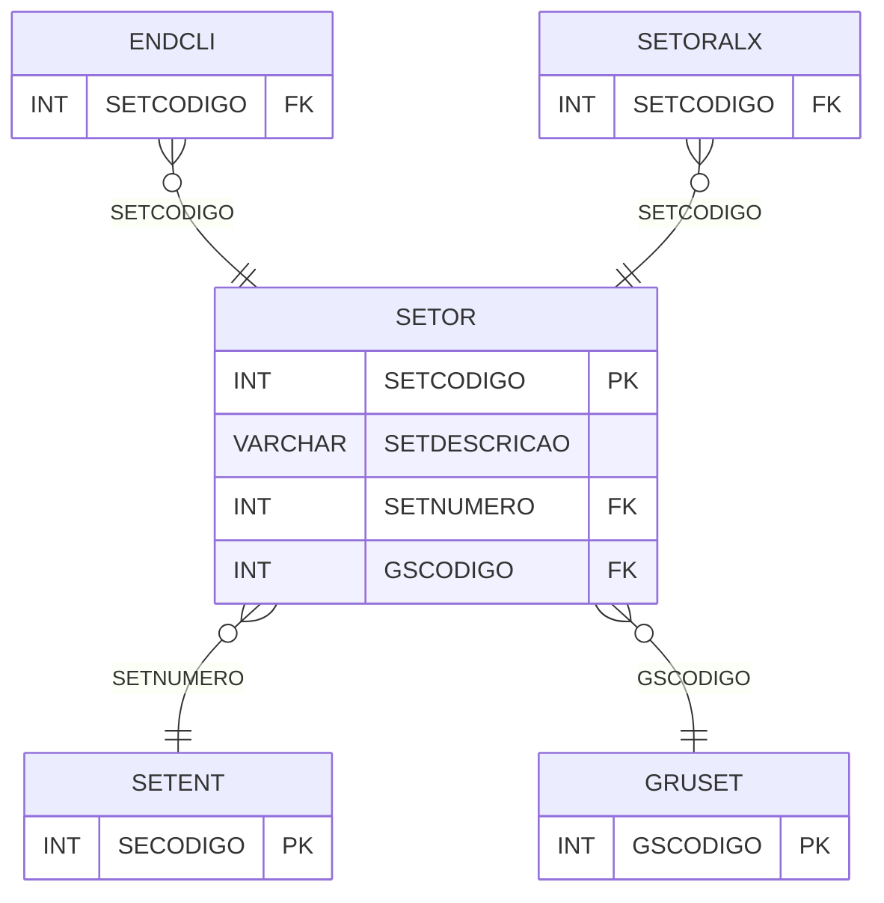

# SETOR - Documentação Completa de Relacionamentos

## 📊 Informações Gerais

- **Nome da Tabela**: SETOR
- **Total de Registros**: 25
- **Total de Colunas**: 9
- **Chave Primária**: SETCODIGO
- **Chaves Estrangeiras**: 2
- **Índices**: 0
- **Tabelas Dependentes**: 2
- **Banco de Dados**: Firebird

## 📝 Descrição

**SETOR** é uma tabela mestre que armazena informações sobre setores do sistema. Com **25 registros**, esta tabela define setores disponíveis no sistema, incluindo descrição, número da entidade, grupo de setor, etiquetas, permissões e integração.

Esta tabela é essencial para:
- **Setores**: Gerenciar setores do sistema
- **Organização**: Organizar setores por entidade e grupo
- **Rastreamento**: Rastrear setores disponíveis
- **Relatórios**: Gerar relatórios de setores

---

## 🔑 Estrutura de Colunas

| Coluna | Tipo | Descrição |
|--------|------|-----------|
| **SETCODIGO** 🔑 | INT | Código do setor (PK) |
| **SETDESCRICAO** | VARCHAR(37) | Descrição do setor |
| **SETNUMERO** 🔗 | INT | Número da entidade (FK → SETENT) |
| **GSCODIGO** 🔗 | INT | Código do grupo de setor (FK → GRUSET) |
| **SETETGHRENTRE** | VARCHAR(37) | Etiqueta entrega |
| **SETETGHRADC** | INT | Etiqueta adição |
| **SETETGHROP1** | VARCHAR(14) | Etiqueta operação 1 |
| **SETPERMSOLCOLARO** | VARCHAR(14) | Permissão solicitar colar |
| **SETINTROUTEASY** | VARCHAR(14) | Integração Routeasy |

---

## 🔗 Relacionamentos - Nível 1 (Diretos)

### SETENT - Setor Entidade (FK Obrigatória)
**Volume:** 1 registro

**Relacionamento:**
```
SETOR.SETNUMERO → SETENT.SECODIGO (N:1)
Constraint: SETENT_SETOR
```

### GRUSET - Grupo Setor (FK Obrigatória)
**Volume:** Variável

**Relacionamento:**
```
SETOR.GSCODIGO → GRUSET.GSCODIGO (N:1)
Constraint: GRUSET_SETOR
```

---

## 📊 Tabelas que Referenciam Esta

Esta tabela é referenciada por 2 tabelas:

### ENDCLI - Endereço Cliente
**Volume:** Variável

**Relacionamento:**
```
ENDCLI.SETCODIGO → SETOR.SETCODIGO (N:1)
Constraint: SETOR_ENDCLI
```

### SETORALX - Setor Almoxarifado
**Volume:** Variável

**Relacionamento:**
```
SETORALX.SETCODIGO → SETOR.SETCODIGO (N:1)
Constraint: SETOR_SETORALX
```

---

## 🗺️ Diagrama de Relacionamentos



---

## 💡 Exemplos de Uso

### Consulta Básica

```sql
SELECT SETCODIGO, SETDESCRICAO, SETNUMERO, GSCODIGO, SETETGHRENTRE
FROM SETOR
WHERE SETCODIGO = ?;
```

---

## ⚡ Performance e Otimização

### Índices Recomendados

#### 1. Índice na Chave Primária (Já existe implicitamente)
```sql
-- Índice primário já existe implicitamente
```

---

## 📊 Estatísticas e Insights

- **Total de Registros**: 25
- **Setores**: 25 setores cadastrados no sistema

---

**Documentação gerada em**: 2025-01-27

**Banco de dados**: Firebird
