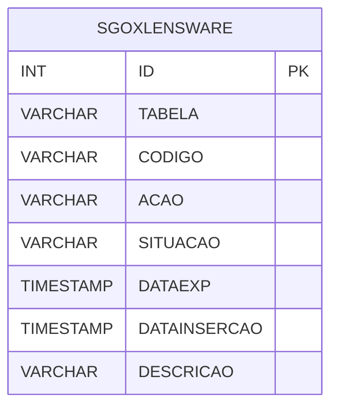

# SGOXLENSWARE - Documentação Completa de Relacionamentos

## 📊 Informações Gerais

- **Nome da Tabela**: SGOXLENSWARE (SGO X Lensware)
- **Total de Registros**: 753
- **Total de Colunas**: 8
- **Chave Primária**: ID
- **Chaves Estrangeiras**: 0
- **Índices**: 1
- **Tabelas Dependentes**: 0
- **Banco de Dados**: Firebird

## 📝 Descrição

**SGOXLENSWARE** é uma tabela intermediária que armazena informações sobre integração com o sistema Lensware. Com **753 registros**, esta tabela registra operações de integração, incluindo tabela, código, ação, situação, data de exportação, data de inserção e descrição.

Esta tabela é essencial para:
- **Integração**: Gerenciar integração com Lensware
- **Rastreamento**: Rastrear operações de integração
- **Relatórios**: Gerar relatórios de integração

---

## 🔑 Estrutura de Colunas

| Coluna | Tipo | Descrição |
|--------|------|-----------|
| **ID** 🔑 | INT | ID do registro (PK) |
| **TABELA** | VARCHAR(37) | Nome da tabela |
| **CODIGO** | VARCHAR(14) | Código do registro |
| **ACAO** | VARCHAR(14) | Ação realizada |
| **SITUACAO** | VARCHAR(14) | Situação do registro |
| **DATAEXP** | TIMESTAMP | Data de exportação |
| **DATAINSERCAO** | TIMESTAMP | Data de inserção |
| **DESCRICAO** | VARCHAR(37) | Descrição |

---

## 📇 Índices

| Nome do Índice | Colunas | Único |
|----------------|---------|-------|
| IND_DATAEXP | DATAEXP | Não |

---

## 🗺️ Diagrama de Relacionamentos



---

## 💡 Exemplos de Uso

### Consulta Básica

```sql
SELECT ID, TABELA, CODIGO, ACAO, SITUACAO, DATAEXP, DATAINSERCAO, DESCRICAO
FROM SGOXLENSWARE
WHERE ID = ?;
```

---

## ⚡ Performance e Otimização

### Índices Recomendados

#### 1. Índice na Chave Primária (Já existe implicitamente)
```sql
-- Índice primário já existe implicitamente
```

#### 2. Índice Existente
O índice em DATAEXP já está criado e é adequado.

---

## 📊 Estatísticas e Insights

- **Total de Registros**: 753
- **Operações de Integração**: 753 operações de integração com Lensware

---

**Documentação gerada em**: 2025-01-27

**Banco de dados**: Firebird
