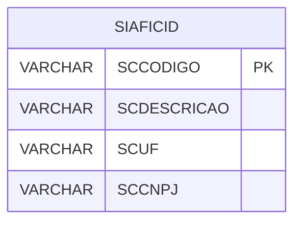

# SIAFICID - Documentação Completa de Relacionamentos

## 📊 Informações Gerais

- **Nome da Tabela**: SIAFICID (SIAFI Cidade)
- **Total de Registros**: 5.563
- **Total de Colunas**: 4
- **Chave Primária**: SCCODIGO
- **Chaves Estrangeiras**: 0
- **Índices**: 0
- **Tabelas Dependentes**: 0
- **Banco de Dados**: Firebird

## 📝 Descrição

**SIAFICID** é uma tabela mestre que armazena informações sobre cidades do sistema SIAFI (Sistema Integrado de Administração Financeira). Com **5.563 registros**, esta tabela registra cidades cadastradas no SIAFI, incluindo código, descrição, UF e CNPJ.

Esta tabela é essencial para:
- **SIAFI**: Gerenciar cidades do SIAFI
- **Integração**: Integração com sistema SIAFI
- **Rastreamento**: Rastrear cidades cadastradas
- **Relatórios**: Gerar relatórios de cidades SIAFI

---

## 🔑 Estrutura de Colunas

| Coluna | Tipo | Descrição |
|--------|------|-----------|
| **SCCODIGO** 🔑 | VARCHAR(37) | Código da cidade (PK) |
| **SCDESCRICAO** | VARCHAR(37) | Descrição da cidade |
| **SCUF** | VARCHAR(14) | UF da cidade |
| **SCCNPJ** | VARCHAR(37) | CNPJ da cidade |

---

## 🗺️ Diagrama de Relacionamentos



---

## 💡 Exemplos de Uso

### Consulta Básica

```sql
SELECT SCCODIGO, SCDESCRICAO, SCUF, SCCNPJ
FROM SIAFICID
WHERE SCCODIGO = ?;
```

---

## ⚡ Performance e Otimização

### Índices Recomendados

#### 1. Índice na Chave Primária (Já existe implicitamente)
```sql
-- Índice primário já existe implicitamente
```

#### 2. Índice em SCUF
```sql
CREATE INDEX IDX_SIAFICID_UF 
ON SIAFICID (SCUF);
```

**Justificativa:** Facilita buscas por UF.

---

## 📊 Estatísticas e Insights

- **Total de Registros**: 5.563
- **Cidades**: 5.563 cidades cadastradas no SIAFI

---

**Documentação gerada em**: 2025-01-27

**Banco de dados**: Firebird

