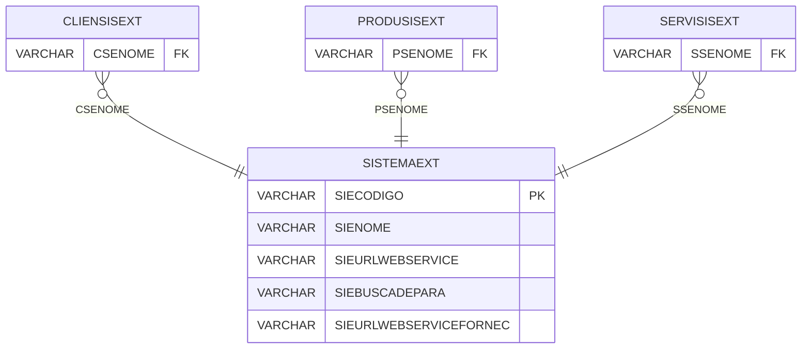

# SISTEMAEXT - Documentação Completa de Relacionamentos

## 📊 Informações Gerais

- **Nome da Tabela**: SISTEMAEXT (Sistema Externo)
- **Total de Registros**: 26
- **Total de Colunas**: 5
- **Chave Primária**: SIECODIGO
- **Chaves Estrangeiras**: 0
- **Índices**: 0
- **Tabelas Dependentes**: 21
- **Banco de Dados**: Firebird

## 📝 Descrição

**SISTEMAEXT** é uma tabela mestre que armazena informações sobre sistemas externos integrados. Com **26 registros**, esta tabela é referenciada por **21 outras tabelas**, sendo uma tabela central para integrações. Armazena informações sobre sistemas externos, incluindo código, nome, URL do web service, busca de para e URL do web service de fornecedor.

Esta tabela é essencial para:
- **Integrações**: Gerenciar sistemas externos integrados
- **Web Services**: Controlar URLs de web services
- **Rastreamento**: Rastrear sistemas externos disponíveis
- **Relatórios**: Gerar relatórios de integrações

---

## 🔑 Estrutura de Colunas

| Coluna | Tipo | Descrição |
|--------|------|-----------|
| **SIECODIGO** 🔑 | VARCHAR(14) | Código do sistema externo (PK) |
| **SIENOME** | VARCHAR(37) | Nome do sistema externo |
| **SIEURLWEBSERVICE** | VARCHAR(37) | URL do web service |
| **SIEBUSCADEPARA** | VARCHAR(37) | Busca de para |
| **SIEURLWEBSERVICEFORNEC** | VARCHAR(37) | URL do web service de fornecedor |

---

## 📊 Tabelas que Referenciam Esta

Esta tabela é referenciada por 21 tabelas, incluindo:

### CLIENSISEXT - Cliente Sistema Externo
**Volume:** Variável

**Relacionamento:**
```
CLIENSISEXT.CSENOME → SISTEMAEXT.SIECODIGO (N:1)
Constraint: SISTEMAEXT_CLIENSISEXT
```

### PRODUSISEXT - Produto Sistema Externo
**Volume:** Variável

**Relacionamento:**
```
PRODUSISEXT.PSENOME → SISTEMAEXT.SIECODIGO (N:1)
Constraint: SISTEMAEXT_PRODUSISEXT
```

### SERVISISEXT - Serviço Sistema Externo
**Volume:** Variável

**Relacionamento:**
```
SERVISISEXT.SSENOME → SISTEMAEXT.SIECODIGO (N:1)
Constraint: SISTEMAEXT_SERVISISEXT
```

---

## 🗺️ Diagrama de Relacionamentos



---

## 💡 Exemplos de Uso

### Consulta Básica

```sql
SELECT SIECODIGO, SIENOME, SIEURLWEBSERVICE, SIEBUSCADEPARA, SIEURLWEBSERVICEFORNEC
FROM SISTEMAEXT
WHERE SIECODIGO = ?;
```

---

## ⚡ Performance e Otimização

### Índices Recomendados

#### 1. Índice na Chave Primária (Já existe implicitamente)
```sql
-- Índice primário já existe implicitamente
```

---

## 📊 Estatísticas e Insights

- **Total de Registros**: 26
- **Sistemas Externos**: 26 sistemas externos cadastrados
- **Referências**: Referenciada por 21 outras tabelas

---

**Documentação gerada em**: 2025-01-27

**Banco de dados**: Firebird
