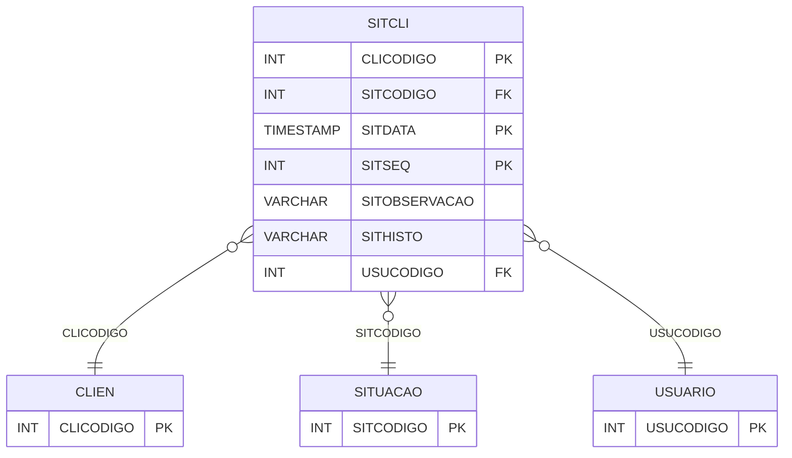

# SITCLI - Documentação Completa de Relacionamentos

## 📊 Informações Gerais

- **Nome da Tabela**: SITCLI (Situação Cliente)
- **Total de Registros**: 11.256
- **Total de Colunas**: 7
- **Chave Primária**: CLICODIGO, SITDATA, SITSEQ (composite)
- **Chaves Estrangeiras**: 3
- **Índices**: 0
- **Tabelas Dependentes**: 0
- **Banco de Dados**: Firebird

## 📝 Descrição

**SITCLI** é uma tabela intermediária que armazena informações sobre histórico de situações de clientes. Com **11.256 registros**, esta tabela registra mudanças de situação de clientes ao longo do tempo, incluindo cliente, código da situação, data da situação, observação, histórico, sequencial e usuário responsável.

Esta tabela é essencial para:
- **Histórico**: Gerenciar histórico de situações de clientes
- **Auditoria**: Rastrear mudanças de situação
- **Rastreamento**: Rastrear situações por cliente e período
- **Relatórios**: Gerar relatórios de histórico de situações

---

## 🔑 Estrutura de Colunas

| Coluna | Tipo | Descrição |
|--------|------|-----------|
| **CLICODIGO** 🔑 🔗 | INT | Código do cliente (PK, FK → CLIEN) |
| **SITCODIGO** 🔗 | INT | Código da situação (FK → SITUACAO) |
| **SITDATA** 🔑 | TIMESTAMP | Data da situação (PK) |
| **SITOBSERVACAO** | VARCHAR(37) | Observação |
| **SITHISTO** | VARCHAR(261) | Histórico |
| **SITSEQ** 🔑 | INT | Sequencial (PK) |
| **USUCODIGO** 🔗 | INT | Código do usuário (FK → USUARIO) |

---

## 🔗 Relacionamentos - Nível 1 (Diretos)

### CLIEN - Cliente (FK Obrigatória)
**Volume:** Variável

**Relacionamento:**
```
SITCLI.CLICODIGO → CLIEN.CLICODIGO (N:1)
Constraint: CLIEN_SITCLI
```

### SITUACAO - Situação (FK Obrigatória)
**Volume:** Variável

**Relacionamento:**
```
SITCLI.SITCODIGO → SITUACAO.SITCODIGO (N:1)
Constraint: SITUACAO_SITCLI
```

### USUARIO - Usuário (FK Opcional)
**Volume:** 297 registros

**Relacionamento:**
```
SITCLI.USUCODIGO → USUARIO.USUCODIGO (N:1)
Constraint: USUARIO_SITCLI
```

---

## 🗺️ Diagrama de Relacionamentos



---

## 💡 Exemplos de Uso

### Consulta Básica

```sql
SELECT CLICODIGO, SITCODIGO, SITDATA, SITSEQ, SITOBSERVACAO, SITHISTO, USUCODIGO
FROM SITCLI
WHERE CLICODIGO = ? AND SITDATA = ? AND SITSEQ = ?;
```

---

## ⚡ Performance e Otimização

### Índices Recomendados

#### 1. Índice Composto na Chave Primária (Já existe implicitamente)
```sql
-- Índice primário já existe implicitamente
```

#### 2. Índice em CLICODIGO e SITDATA
```sql
CREATE INDEX IDX_SITCLI_CLI_DATA 
ON SITCLI (CLICODIGO, SITDATA);
```

**Justificativa:** Facilita buscas por cliente e período.

---

## 📊 Estatísticas e Insights

- **Total de Registros**: 11.256
- **Histórico de Situações**: 11.256 registros de histórico de situações de clientes

---

**Documentação gerada em**: 2025-01-27

**Banco de dados**: Firebird
